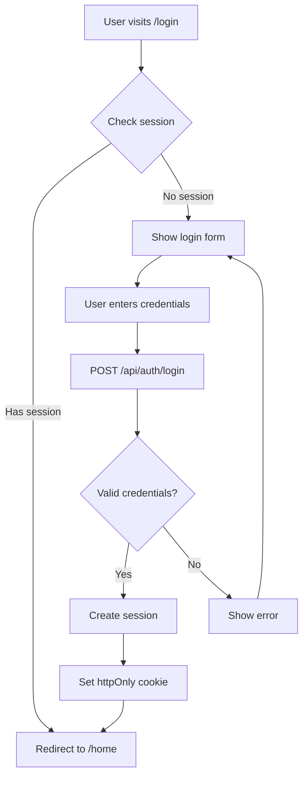

# Authentication Flow

## Overview

- **Entry:** `/login` page
- **Exit:** `/home` dashboard
- **Status:** Complete

## Flow Diagram



## API Calls

| Step | Method | Endpoint | Request | Response |
|------|--------|----------|---------|----------|
| 1 | POST | `/api/auth/login` | `{username, password}` | `{user, session}` |
| 2 | GET | `/api/auth/me` | Cookie | `{user}` |
| 3 | POST | `/api/auth/logout` | Cookie | `{success}` |

## State Transitions

```
Initial → Authenticating → Authenticated → Logout → Initial
                ↓
              Error
```

## Error Handling

| Error | Message | Recovery |
|-------|---------|----------|
| Invalid credentials | "Invalid username or password" | Retry |
| Missing fields | "Username and password required" | Fix form |
| Server error | "Failed to login" | Retry later |

## Security Features

- Session cookies: httpOnly, secure, SameSite=Lax
- Password hashing: bcrypt (salt 10)
- Session expiry: 7 days
- Input sanitization: XSS prevention

## Implementation Files

- **Frontend:** `app/login/page.tsx`
- **Backend:** `server/routes/auth.ts`
- **Provider:** `components/providers/auth-provider.tsx`
