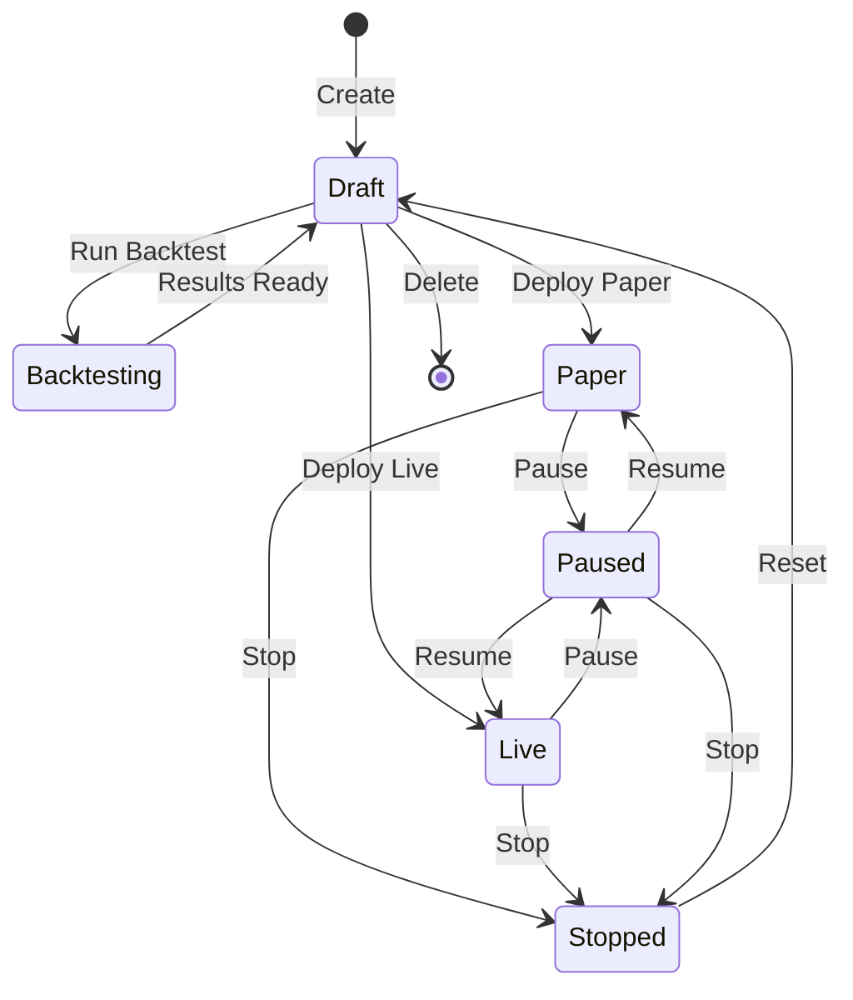

# Strategy Management Flow

## Overview

Complete CRUD lifecycle for trading strategies with deployment states.

## State Machine

## Flows

### Create Strategy
1. User clicks "New Strategy"
2. Opens StrategyWizard
3. Select template
4. Configure parameters
5. POST `/api/strategies`
6. Strategy created (status: draft)

### Run Backtest
1. Configure backtest params
2. POST `/api/backtests/run`
3. Status: running → completed
4. View results in metrics grid

### Deploy Strategy
1. Click "Paper Trade" or "Go Live"
2. POST `/api/strategies/:id/deploy`
3. Validation: requires successful backtest
4. Status: draft → paper/live

### Pause/Resume
1. Click Pause → POST `/api/strategies/:id/pause`
2. Status: paper/live → paused
3. Click Resume → POST `/api/strategies/:id/resume`
4. Status: paused → paper/live

### Stop Strategy
1. Click Stop → POST `/api/strategies/:id/stop`
2. Cancels open orders
3. Status: any → stopped

### Delete Strategy
1. Confirm in AlertDialog
2. DELETE `/api/strategies/:id`
3. Cascades to backtests

## API Endpoints

| Action | Method | Endpoint |
|--------|--------|----------|
| List | GET | `/api/strategies` |
| Create | POST | `/api/strategies` |
| Read | GET | `/api/strategies/:id` |
| Update | PUT | `/api/strategies/:id` |
| Delete | DELETE | `/api/strategies/:id` |
| Deploy | POST | `/api/strategies/:id/deploy` |
| Pause | POST | `/api/strategies/:id/pause` |
| Resume | POST | `/api/strategies/:id/resume` |
| Stop | POST | `/api/strategies/:id/stop` |

## Validation Rules

- **Deploy requires:** At least one successful backtest
- **Edit only:** Draft or Stopped status
- **Delete:** Any status (with confirmation)

## Implementation Files

- **Frontend:** `app/strategies/`, `components/wizard/`
- **Backend:** `server/routes/strategies.ts`
- **Hooks:** `lib/api/hooks/useStrategies.ts`
