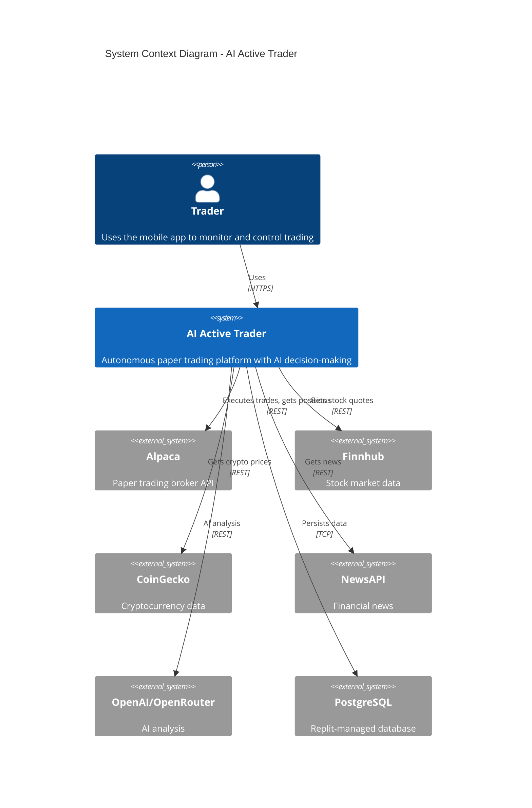
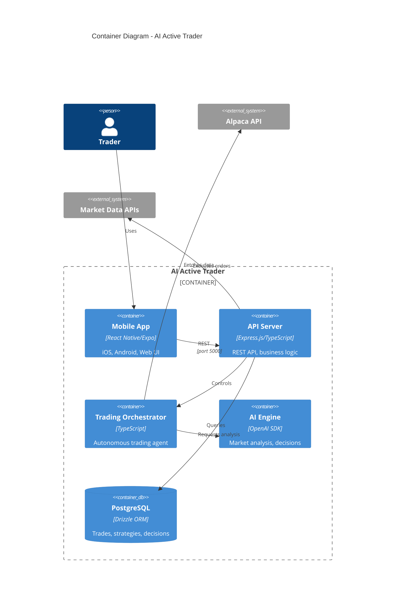
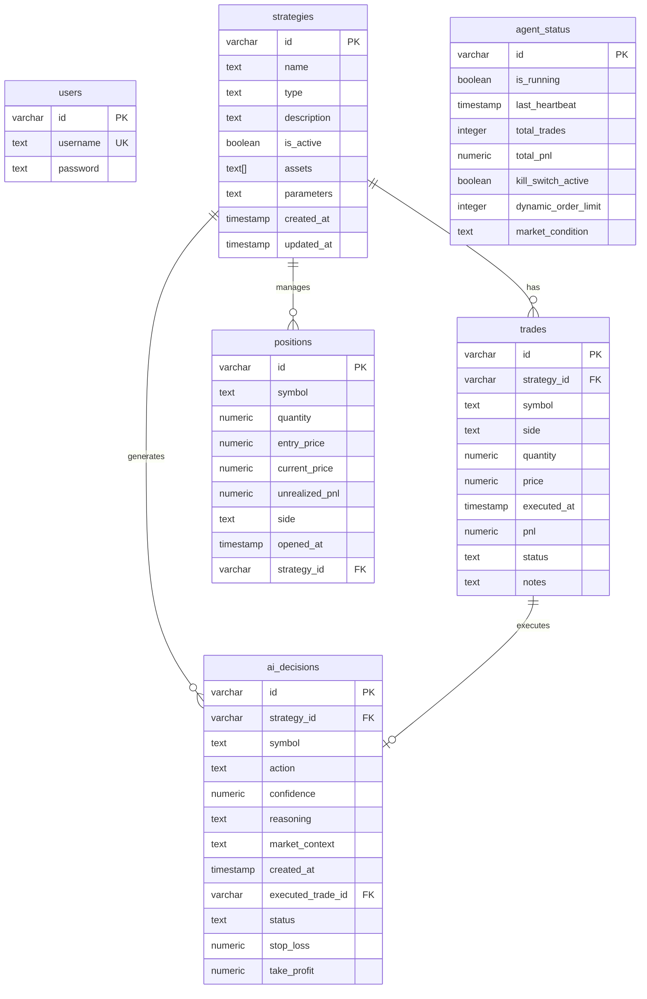
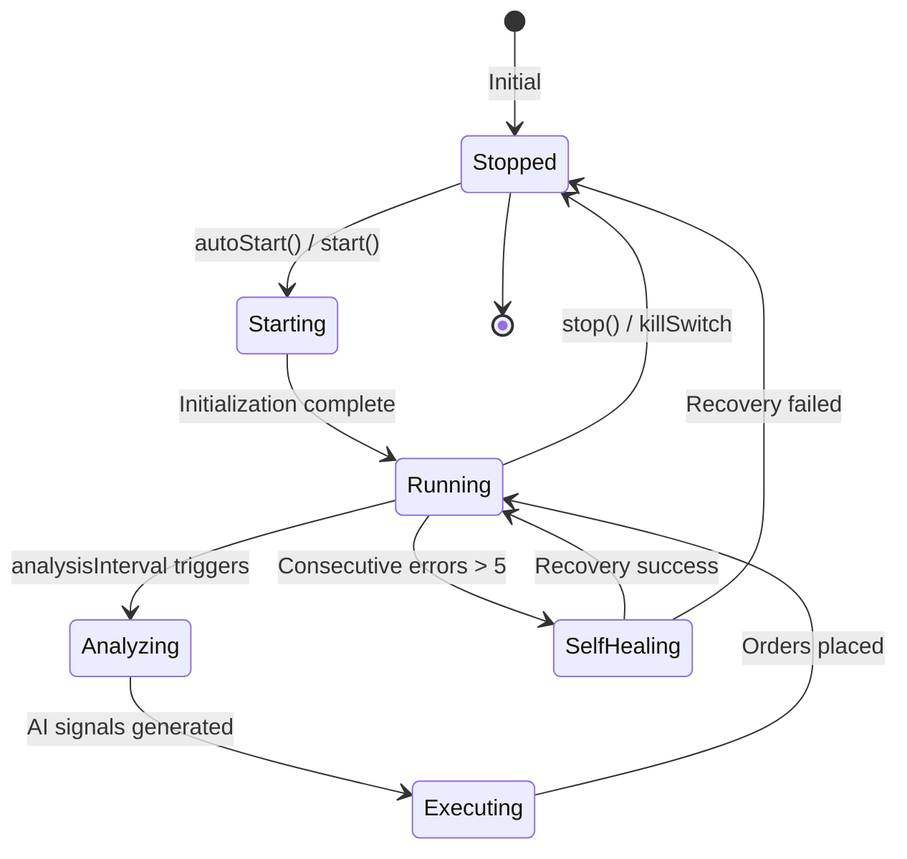

# AI Active Trader - Application Overview

> **This document provides the product overview and business context for AI Active Trader.**  
> For the complete documentation index, see [INDEX.md](INDEX.md).

| Topic | Canonical Document |
|-------|-------------------|
| System architecture & C4 diagrams | [ARCHITECTURE.md](ARCHITECTURE.md) |
| AI/LLM providers & model routing | [AI_MODELS_AND_PROVIDERS.md](AI_MODELS_AND_PROVIDERS.md) |
| External API connectors | [CONNECTORS_AND_INTEGRATIONS.md](CONNECTORS_AND_INTEGRATIONS.md) |
| P&L formulas & metrics | [FINANCIAL_METRICS.md](FINANCIAL_METRICS.md) |
| REST API endpoints | [API_REFERENCE.md](API_REFERENCE.md) |
| Trading agent runtime | [ORCHESTRATOR_AND_AGENT_RUNTIME.md](ORCHESTRATOR_AND_AGENT_RUNTIME.md) |

---

## Table of Contents

### Core Sections
1. [Introduction & Purpose](#1-introduction--purpose)
2. [Business Context & Main Features](#2-business-context--main-features)
3. [System Overview](#3-system-overview)
4. [Architecture Views & Diagrams](#4-architecture-views--diagrams)
5. [Tech Stack & Dependencies](#5-tech-stack--dependencies)
6. [Codebase Layout](#6-codebase-layout--module-responsibilities)
7. [Data Model & Storage](#7-data-model--storage)
8. [External Integrations](#8-external-integrations)
9. [Runtime & Deployment](#9-runtime-environments-deployment--hosting)
10. [Configuration & Secrets](#10-configuration-secrets--environment-management)

### Operations & Quality
11. [Testing Strategy](#11-testing-strategy--quality-gates)
12. [Observability & Logging](#12-observability-logging--monitoring)
13. [Security Considerations](#13-security--compliance-considerations)
14. [Bug-Fix Strategy](#14-bug-fix--stabilization-strategy)
15. [Extensibility Guide](#15-extensibility--how-to-addmodify-features-safely)
16. [Scaling Strategy](#16-scaling--performance-strategy)
17. [Cost Management](#17-cost--tokencredit-management)
18. [Known Issues & TODOs](#18-known-issues-limitations--todos)
19. [Further Documentation](#19-further-documentation--adrs)

### Deep Dives & References
20. [Complete API Reference](#20-complete-api-reference)
21. [Orchestrator Deep Dive](#21-orchestrator-deep-dive)
22. [Onboarding & Developer Guide](#22-onboarding--developer-guide)
23. [Troubleshooting Guide](#23-troubleshooting-guide)
24. [Sprint Planning Recommendations](#24-sprint-planning-recommendations)

### Appendices
- [Appendix A: Database Schema](#appendix-a-database-schema-shabordschemats)
- [Appendix B: Design Guidelines](#appendix-b-design-guidelines-summary)
- [Appendix C: Project Context](#appendix-c-project-context-replitmd-summary)
- [Appendix D: IStorage Interface](#appendix-d-istorage-interface)
- [Appendix E: Environment Variables](#appendix-e-environment-variables-reference)

---

## 1. Introduction & Purpose

**AI Active Trader** is an autonomous paper trading platform that uses AI to analyze market conditions and execute trading decisions. It supports both US equities (via Alpaca) and cryptocurrencies, providing users with:

- Real-time position monitoring with live P&L
- AI-powered trade recommendations with explainable reasoning
- Configurable trading strategies with risk controls
- A mobile-first interface (React Native/Expo) with web support

**Target Users:** Individual traders who want to test AI-driven trading strategies in a paper trading environment before committing real capital.

**Core Problem Solved:** Eliminates the complexity of building and testing trading algorithms by providing a pre-built, AI-enhanced trading agent with full transparency into decisions.

---

## 2. Business Context & Main Features

| Feature | Business Purpose | User Journey |
|---------|------------------|--------------|
| **Dashboard** | At-a-glance portfolio health | Open app → see total P&L, positions, market overview |
| **Autonomous Trading Agent** | Hands-off AI trading | Enable agent → agent analyzes markets → executes trades → user reviews results |
| **Strategy Builder** | Customizable trading approaches | Create strategy → configure parameters → assign assets → activate |
| **Position Tracking** | Real-time portfolio visibility | View all open positions with live unrealized P&L from Alpaca |
| **AI Decision Log** | Transparency into AI reasoning | Review each AI decision with confidence score, reasoning, and outcome |
| **Analytics** | Performance measurement | View win rate, total P&L, trade history, equity curve |
| **Risk Controls** | Capital protection | Set position limits, daily loss limits, kill switch |

---

## 3. System Overview

### End-to-End Flow

1. **User Interaction** → React Native app (Expo) on mobile/web
2. **API Request** → Express.js backend on port 5000
3. **Data Fetching** → Connectors query Alpaca, Finnhub, CoinGecko, NewsAPI
4. **AI Analysis** → OpenAI/OpenRouter analyzes market conditions
5. **Trade Execution** → Orchestrator places orders via Alpaca Paper Trading API
6. **Persistence** → PostgreSQL stores trades, strategies, AI decisions
7. **Response** → Updated data flows back to UI via TanStack Query

### System Context Diagram (C4 Level 1)



---

## 4. Architecture Views & Diagrams

### Container Diagram (C4 Level 2)



### Communication Patterns

| Pattern | Usage |
|---------|-------|
| **REST API** | All client-server communication |
| **Polling** | TanStack Query refetches data at intervals |
| **Background Jobs** | Orchestrator runs analysis/position cycles on timers |
| **Synchronous Calls** | All external API integrations are synchronous with retry logic |

---

## 5. Tech Stack & Dependencies

### Core Technologies

| Layer | Technology | Version |
|-------|------------|---------|
| **Frontend** | React Native + Expo | SDK 54 |
| **Navigation** | React Navigation | v7 |
| **State** | TanStack Query | v5 |
| **Backend** | Express.js + TypeScript | v4.21 |
| **ORM** | Drizzle ORM | v0.39 |
| **Database** | PostgreSQL | Neon-backed |
| **AI** | OpenAI SDK | v6 |
| **Runtime** | Node.js | v20+ |

### Dependency Groups (from package.json)

| Group | Key Packages |
|-------|--------------|
| **Core Runtime** | express, drizzle-orm, pg, openai, zod |
| **React Native** | expo, react-native, react-native-reanimated, react-native-gesture-handler |
| **Navigation** | @react-navigation/native, @react-navigation/bottom-tabs, @react-navigation/native-stack |
| **UI** | expo-blur, expo-glass-effect, expo-haptics, lightweight-charts |
| **Dev Tools** | typescript, tsx, eslint, prettier, drizzle-kit |

### Package Management

```bash
npm install          # Install dependencies
npm run db:push      # Push schema changes to database
```

---

## 6. Codebase Layout & Module Responsibilities

```
├── client/                    # React Native Expo app
│   ├── App.tsx               # App entry point with providers
│   ├── components/           # Reusable UI components
│   │   ├── Card.tsx          # Elevation-based card system
│   │   ├── ErrorBoundary.tsx # Error handling wrapper
│   │   └── PriceChart.tsx    # TradingView-style charts
│   ├── screens/              # App screens
│   │   ├── DashboardScreen.tsx    # Main portfolio view
│   │   ├── AnalyticsScreen.tsx    # Performance metrics
│   │   ├── StrategiesScreen.tsx   # Strategy management
│   │   └── StrategyWizard/        # Multi-step strategy creation
│   ├── navigation/           # React Navigation setup
│   ├── hooks/               # Custom React hooks
│   ├── lib/                 # Utilities (query-client.ts)
│   └── constants/           # Theme, colors, spacing
│
├── server/                   # Express.js backend
│   ├── index.ts             # Server entry point
│   ├── routes.ts            # All API routes (~2500 lines)
│   ├── storage.ts           # Database access layer (IStorage pattern)
│   ├── db.ts                # Drizzle database connection
│   ├── autonomous/
│   │   └── orchestrator.ts  # Core trading agent (~1300 lines)
│   ├── ai/
│   │   ├── decision-engine.ts       # AI trade decisions
│   │   ├── market-condition-analyzer.ts  # Market analysis
│   │   └── openrouter-provider.ts   # Free model fallback
│   ├── connectors/
│   │   ├── alpaca.ts        # Broker integration
│   │   ├── finnhub.ts       # Stock quotes
│   │   ├── coingecko.ts     # Crypto prices
│   │   └── newsapi.ts       # Financial news
│   ├── strategies/          # Trading strategy implementations
│   ├── trading/             # Order execution logic
│   └── orchestration/       # Coordinator, events, logging
│
├── shared/
│   └── schema.ts            # Drizzle schema + Zod types
│
├── docs/                    # Documentation
│   └── APP_OVERVIEW.md      # This file
│
├── scripts/                 # Build scripts
└── assets/                  # Static assets
```

### Key Entry Points

| File | Purpose |
|------|---------|
| `client/App.tsx` | React Native app root |
| `server/index.ts` | Express server startup |
| `server/routes.ts` | All API endpoints |
| `server/autonomous/orchestrator.ts` | Trading agent core logic |
| `shared/schema.ts` | Database schema (single source of truth) |

---

## 7. Data Model & Storage

### Entity Relationship Diagram



### Data Freshness

| Entity | Source of Truth | Sync Strategy |
|--------|-----------------|---------------|
| **Positions** | Alpaca API | Live fetch, background sync to DB |
| **Account Balance** | Alpaca API | Live fetch on each request |
| **Trades** | Database | Written on execution, immutable |
| **AI Decisions** | Database | Written on generation |
| **Strategies** | Database | User-managed |

### Schema Management

```bash
# Push schema changes (safe, non-destructive)
npm run db:push

# Force push if needed (use carefully)
npm run db:push --force
```

**Important:** Never change ID column types (serial ↔ varchar). This breaks migrations.

---

## 8. External Integrations

| Service | Purpose | Location | Key Operations |
|---------|---------|----------|----------------|
| **Alpaca** | Paper trading broker | `server/connectors/alpaca.ts` | Orders, positions, account, portfolio history |
| **Finnhub** | Stock quotes | `server/connectors/finnhub.ts` | Real-time quotes, multi-symbol batch |
| **CoinGecko** | Crypto data | `server/connectors/coingecko.ts` | Prices, markets, trending |
| **NewsAPI** | Financial news | `server/connectors/newsapi.ts` | Headlines, search |
| **OpenAI** | AI analysis | `server/ai/decision-engine.ts` | Trade decisions, market analysis |
| **OpenRouter** | Free model fallback | `server/ai/openrouter-provider.ts` | Fallback when OpenAI quota exceeded |

### API Call Patterns

- All integrations use **synchronous REST calls** with retry logic
- **Rate limiting** handled via exponential backoff
- **Caching** implemented in `server/lib/api-cache.ts` for Finnhub and CoinGecko
- **Error handling** returns stale cache data when API fails

---

## 9. Runtime Environments, Deployment & Hosting

### Development (Replit)

```bash
# Start both Expo and Express servers
npm run all:dev

# Start individually
npm run expo:dev      # Expo on port 8081
npm run server:dev    # Express on port 5000
```

### Port Configuration

| Service | Port | Notes |
|---------|------|-------|
| Express API | 5000 | Must bind to 0.0.0.0 |
| Expo Dev Server | 8081 | Metro bundler |

### Production Build

```bash
npm run server:build  # Bundle server with esbuild
npm run server:prod   # Run production server
npm run expo:static:build  # Build static Expo bundle
```

### Deployment

- **Platform:** Replit (container-based)
- **Database:** Replit-managed PostgreSQL (Neon-backed)
- **Static Files:** Served from Express
- **Mobile:** Expo Go for testing, static bundles for production

---

## 10. Configuration, Secrets & Environment Management

### Required Environment Variables

| Variable | Purpose | Where to Set |
|----------|---------|--------------|
| `DATABASE_URL` | PostgreSQL connection | Replit Secrets (auto-set) |
| `ALPACA_API_KEY` | Alpaca API key | Replit Secrets |
| `ALPACA_SECRET_KEY` | Alpaca secret | Replit Secrets |
| `FINNHUB_API_KEY` | Stock data | Replit Secrets |
| `NEWS_API_KEY` | News data | Replit Secrets |
| `COINMARKETCAP_API_KEY` | Crypto data | Replit Secrets (optional) |
| `SESSION_SECRET` | Auth sessions | Replit Secrets |

### Auto-Set by Replit

| Variable | Purpose |
|----------|---------|
| `REPLIT_DEV_DOMAIN` | Development URL |
| `REPLIT_INTERNAL_APP_DOMAIN` | Production URL |

### Security Rules

- **Never** hardcode secrets in source code
- **Never** log or expose secrets in responses
- Use Replit Secrets panel for all sensitive values
- All API keys stored server-side only

---

## 11. Testing Strategy & Quality Gates

### Current State

**Testing Framework:** Not yet implemented

### Recommended Approach

| Test Type | Tool | Coverage Target |
|-----------|------|-----------------|
| Unit Tests | Vitest | P&L calculations, order logic |
| Integration | Vitest + supertest | API endpoints |
| E2E | Playwright (via `run_test` tool) | Critical user flows |

### Running Tests

```bash
# When implemented:
npm run test        # Run all tests
npm run test:watch  # Watch mode
```

### Manual Testing

Use Replit's `run_test` tool for Playwright-based E2E testing of web UI.

---

## 12. Observability, Logging & Monitoring

### Current Logging

- **Console logging** with prefixed tags: `[Orchestrator]`, `[MarketAnalyzer]`, `[AI]`
- **Request logging** via Express middleware (method, path, status, duration)
- **Error logging** with stack traces

### Log Locations

- Workflow logs: Viewable in Replit's workflow panel
- Browser console: Captured by Replit's browser dev tools

### Recommended Improvements

1. Add structured JSON logging
2. Implement log levels (DEBUG, INFO, WARN, ERROR)
3. Add request tracing with correlation IDs

---

## 13. Security & Compliance Considerations

### Authentication

- Session-based auth with `bcryptjs` password hashing
- Session cookies with `cookie-parser`
- Auto-expiring sessions

### Data Security

| Data Type | Handling |
|-----------|----------|
| Passwords | bcrypt hashed, never stored plain |
| API Keys | Server-side only, never sent to client |
| Trading Data | Paper trading only, no real funds |

### Input Validation

- Zod schemas for all API inputs
- Type safety via TypeScript

### Rate Limiting

- Exponential backoff on external APIs
- 429 handling with automatic retry

---

## 14. Bug-Fix & Stabilization Strategy

### Priority Order

1. **Critical:** P&L calculation accuracy, trade execution correctness
2. **High:** Position sync with Alpaca, AI decision logging
3. **Medium:** UI responsiveness, error handling
4. **Low:** Polish, performance optimization

### Known Fragile Areas

| Area | Risk | Mitigation |
|------|------|------------|
| `orchestrator.ts` | Complex state management | Add comprehensive logging |
| Alpaca integration | 403 errors on held positions | Check available qty before selling |
| OpenAI calls | Rate limits | OpenRouter fallback implemented |
| P&L calculations | Numeric precision | Use `safeParseFloat` utility |

### Debugging Workflow

1. Check workflow logs for errors
2. Look for `[Orchestrator]` or `[AI]` prefixed messages
3. Verify Alpaca position state matches expectations
4. Test API endpoints directly with curl

---

## 15. Extensibility & How to Add/Modify Features Safely

### Adding a New Trading Strategy

1. Create strategy file in `server/strategies/`
2. Implement the strategy interface
3. Register in `server/strategies/index.ts`
4. Add UI options in Strategy Wizard

### Adding a New Data Connector

1. Create connector in `server/connectors/`
2. Implement caching pattern from existing connectors
3. Add API routes in `server/routes.ts`
4. Update frontend queries

### Modifying Database Schema

```bash
# 1. Update shared/schema.ts
# 2. Push changes
npm run db:push

# 3. Update storage.ts if needed
```

### Adding a New Screen

1. Create screen in `client/screens/`
2. Add to appropriate navigator in `client/navigation/`
3. Add API endpoints if needed

---

## 16. Scaling & Performance Strategy

### Current Bottlenecks

| Bottleneck | Impact | Solution |
|------------|--------|----------|
| External APIs | Rate limits | Caching, retry with backoff |
| Database | Single connection | Connection pooling (via Drizzle) |
| AI calls | Latency, cost | OpenRouter fallback, caching |

### Scaling Guidelines

| Approach | When to Use |
|----------|-------------|
| **Vertical** | More memory for larger portfolios |
| **Horizontal** | Multiple users (requires session store) |
| **Caching** | Reduce API calls for market data |

### Rate Limits

| Service | Limit | Handling |
|---------|-------|----------|
| Alpaca | 200 req/min | Built-in client throttling |
| Finnhub | 60 req/min | Cache with stale-while-revalidate |
| NewsAPI | 100 req/day | 5-minute backoff on 429 |
| OpenAI | Token-based | OpenRouter fallback |

---

## 17. Cost & Token/Credit Management

### Replit Credits

- **Minimize restarts:** Use HMR for code changes
- **Batch operations:** Avoid repeated API calls in development
- **Use this doc:** Reference APP_OVERVIEW.md to reduce codebase scanning

### External API Costs

| Service | Cost Model | Optimization |
|---------|------------|--------------|
| OpenAI | Per token | Use smaller models, cache responses |
| Alpaca | Free (paper) | No cost concerns |
| Finnhub | Free tier | Stay within 60/min |
| CoinGecko | Free tier | Cache 60s minimum |
| NewsAPI | Free tier | 100 req/day limit |

### AI Cost Control

- **OpenRouter fallback:** Free models used when OpenAI rate-limited
- **Model selection:** Configurable in `decision-engine.ts`
- **Response caching:** AI suggestions cached per symbol

---

## 18. Known Issues, Limitations & TODOs

### Critical

| Issue | Description | Impact |
|-------|-------------|--------|
| Historical trade prices | 245 trades have price=0 from before fix | P&L history incomplete |

### Major

| Issue | Description | Status |
|-------|-------------|--------|
| 403 on position sells | Alpaca rejects sells when shares held by pending orders | Expected behavior, not a bug |
| NewsAPI rate limits | 100/day limit causes frequent 429s | Backoff implemented |

### Minor / Tech Debt

| Item | Description |
|------|-------------|
| No automated tests | Manual testing only |
| No structured logging | Console.log with prefixes |
| Hard-coded defaults | Some risk limits in DEFAULT_RISK_LIMITS |

### Planned Features

- [ ] Real trading mode (disabled by design)
- [ ] Multi-user support
- [ ] Push notifications
- [ ] Advanced charting

---

## 19. Further Documentation & ADRs

### Related Documents

| Document | Location | Purpose |
|----------|----------|---------|
| **Agent Execution Guide** | `docs/AGENT_EXECUTION_GUIDE.md` | How AI agents must operate in this repo |
| **Financial Metrics** | `docs/FINANCIAL_METRICS.md` | P&L formulas, calculations, business logic |
| **Architecture** | `docs/ARCHITECTURE.md` | System design, data flows, integrations |
| **Testing** | `docs/TESTING.md` | Test strategy, commands, scenarios |
| replit.md | `/replit.md` | Project context and environment |
| Design Guidelines | `/design_guidelines.md` | UI/UX standards |

> **For AI Agents:** Before making any changes, you MUST read `docs/AGENT_EXECUTION_GUIDE.md` first. It defines the mandatory workflow for all tasks.

### Architecture Decisions

Key decisions are documented in `docs/ARCHITECTURE.md` and `replit.md`:

- **Monorepo structure:** Simplifies type sharing
- **Schema-first development:** Single source of truth in shared/schema.ts
- **Adapter pattern:** Swappable data providers
- **Paper trading only:** MVP safety, real trading disabled
- **Layered architecture:** Presentation → API → Domain → Data Access

---

## Quick Reference

### Common Commands

```bash
npm run all:dev       # Start development
npm run db:push       # Push schema changes
npm run lint          # Run linter
npm run format        # Format code
```

### Key API Endpoints

| Endpoint | Method | Purpose |
|----------|--------|---------|
| `/api/positions` | GET | Live Alpaca positions |
| `/api/trades` | GET | Trade history |
| `/api/analytics/summary` | GET | P&L summary |
| `/api/autonomous/state` | GET | Orchestrator state |
| `/api/autonomous/start` | POST | Start trading agent |
| `/api/autonomous/stop` | POST | Stop trading agent |

### Support Channels

- Replit community
- Issue tracking via comments in code

---

## 20. Complete API Reference

### Authentication Endpoints

| Endpoint | Method | Purpose | Auth Required |
|----------|--------|---------|---------------|
| `/api/auth/signup` | POST | Create new user account | No |
| `/api/auth/login` | POST | Login and create session | No |
| `/api/auth/logout` | POST | Destroy session | No |
| `/api/auth/me` | GET | Get current user | Yes |

### Agent Control Endpoints

| Endpoint | Method | Purpose |
|----------|--------|---------|
| `/api/agent/status` | GET | Get agent running status and stats |
| `/api/agent/toggle` | POST | Toggle agent on/off |
| `/api/agent/market-analysis` | GET | Get latest market analysis |
| `/api/agent/market-analysis/refresh` | POST | Force refresh market analysis |
| `/api/agent/dynamic-limits` | GET | Get current dynamic order limits |
| `/api/agent/set-limits` | POST | Update order limits |
| `/api/agent/health` | GET | Health check with uptime info |
| `/api/agent/auto-start` | POST | Enable/disable auto-start |

### Autonomous Orchestrator Endpoints

| Endpoint | Method | Purpose |
|----------|--------|---------|
| `/api/autonomous/state` | GET | Full orchestrator state |
| `/api/autonomous/start` | POST | Start autonomous trading |
| `/api/autonomous/stop` | POST | Stop autonomous trading |
| `/api/autonomous/kill-switch` | POST | Emergency stop all trading |
| `/api/autonomous/risk-limits` | PUT | Update risk parameters |
| `/api/autonomous/mode` | POST | Set mode (autonomous/semi-auto/manual) |
| `/api/autonomous/execution-history` | GET | Get execution history |
| `/api/autonomous/close-position` | POST | Close specific position |
| `/api/autonomous/execute-trades` | POST | Execute pending AI signals |
| `/api/autonomous/open-orders` | GET | Get all open orders |
| `/api/autonomous/cancel-stale-orders` | POST | Cancel old unfilled orders |
| `/api/autonomous/cancel-all-orders` | POST | Cancel all open orders |
| `/api/autonomous/reconcile-positions` | GET | Compare DB vs Alpaca positions |
| `/api/autonomous/sync-positions` | POST | Sync positions from Alpaca to DB |
| `/api/autonomous/close-all-positions` | POST | Liquidate all positions |

### Strategy Endpoints

| Endpoint | Method | Purpose |
|----------|--------|---------|
| `/api/strategies` | GET | List all strategies |
| `/api/strategies/:id` | GET | Get specific strategy |
| `/api/strategies` | POST | Create new strategy |
| `/api/strategies/:id` | PATCH | Update strategy |
| `/api/strategies/:id/toggle` | POST | Activate/deactivate strategy |
| `/api/strategies/:id/start` | POST | Start strategy execution |
| `/api/strategies/:id/stop` | POST | Stop strategy execution |
| `/api/strategies/:id/status` | GET | Get strategy status |
| `/api/strategies/all-schemas` | GET | Get all strategy JSON schemas |
| `/api/strategies/moving-average/schema` | GET | Moving average strategy schema |
| `/api/strategies/moving-average/backtest` | POST | Backtest moving average |
| `/api/strategies/moving-average/ai-validate` | POST | AI validation of MA strategy |
| `/api/strategies/mean-reversion/schema` | GET | Mean reversion schema |
| `/api/strategies/mean-reversion/backtest` | POST | Backtest mean reversion |
| `/api/strategies/momentum/schema` | GET | Momentum strategy schema |
| `/api/strategies/momentum/backtest` | POST | Backtest momentum |

### Trade & Position Endpoints

| Endpoint | Method | Purpose |
|----------|--------|---------|
| `/api/trades` | GET | List trades (with limit) |
| `/api/trades/enriched` | GET | Trades with AI decisions attached |
| `/api/trades/symbols` | GET | Distinct traded symbols |
| `/api/trades/:id` | GET | Get specific trade |
| `/api/trades/:id/enriched` | GET | Trade with AI decision |
| `/api/trades` | POST | Create trade record |
| `/api/positions` | GET | **Primary** - Live Alpaca positions |
| `/api/positions/broker` | GET | Direct broker positions |
| `/api/positions/:id` | GET | Get DB position by ID |
| `/api/positions` | POST | Create position record |
| `/api/positions/:id` | PATCH | Update position |

### Analytics Endpoints

| Endpoint | Method | Purpose |
|----------|--------|---------|
| `/api/analytics/summary` | GET | P&L summary (realized + unrealized) |
| `/api/analytics/performance` | GET | Performance metrics |
| `/api/analytics/equity-curve` | GET | Equity over time |

### AI Decision Endpoints

| Endpoint | Method | Purpose |
|----------|--------|---------|
| `/api/ai-decisions` | GET | List AI decisions |
| `/api/ai-decisions` | POST | Create AI decision |
| `/api/ai/suggest-trades` | POST | Generate AI trade suggestions |

### Alpaca Broker Endpoints

| Endpoint | Method | Purpose |
|----------|--------|---------|
| `/api/alpaca/account` | GET | Account info (balance, equity) |
| `/api/alpaca/positions` | GET | Raw Alpaca positions |
| `/api/alpaca/orders` | GET | All orders |
| `/api/alpaca/orders` | POST | Place new order |
| `/api/alpaca/orders/:orderId` | DELETE | Cancel order |
| `/api/alpaca/assets` | GET | Tradeable assets |
| `/api/alpaca/assets/search` | GET | Search assets |
| `/api/alpaca/bars` | GET | OHLC bar data |
| `/api/alpaca/snapshots` | GET | Latest quotes/trades |
| `/api/alpaca/health` | GET | Alpaca connection health |
| `/api/alpaca/clock` | GET | Market clock |
| `/api/alpaca/market-status` | GET | Market open/closed status |
| `/api/alpaca/portfolio-history` | GET | Historical portfolio values |
| `/api/alpaca/top-stocks` | GET | Top movers (stocks) |
| `/api/alpaca/top-crypto` | GET | Top movers (crypto) |
| `/api/alpaca/top-etfs` | GET | Top ETFs |

### Market Data Endpoints

| Endpoint | Method | Purpose |
|----------|--------|---------|
| `/api/finnhub/quote/:symbol` | GET | Stock quote |
| `/api/finnhub/quotes` | GET | Multiple quotes |
| `/api/coingecko/prices` | GET | Crypto prices |
| `/api/coingecko/markets` | GET | Crypto market data |
| `/api/coingecko/trending` | GET | Trending coins |
| `/api/cmc/listings` | GET | CoinMarketCap listings |
| `/api/cmc/quotes` | GET | CoinMarketCap quotes |
| `/api/cmc/global` | GET | Global crypto metrics |

### News Endpoints

| Endpoint | Method | Purpose |
|----------|--------|---------|
| `/api/news/headlines` | GET | Top financial headlines |
| `/api/news/search` | GET | Search news articles |
| `/api/news/market` | GET | Market-specific news |
| `/api/news/crypto` | GET | Crypto news |
| `/api/news/stock/:symbol` | GET | News for specific stock |

---

## 21. Orchestrator Deep Dive

### Lifecycle & State Machine



### Core Timers

| Timer | Interval | Purpose |
|-------|----------|---------|
| Analysis Timer | 60s | Run market analysis cycle |
| Position Timer | 30s | Check position health, apply exit rules |
| Heartbeat Timer | 30s | Health check, update DB, detect stale state |

### Watchlist Configuration

```typescript
const WATCHLIST = {
  stocks: ["AAPL", "GOOGL", "MSFT", "AMZN", "NVDA", "META", "TSLA"],
  crypto: ["BTC", "ETH", "SOL"],
};
```

### Risk Limits (Defaults)

| Parameter | Default | Description |
|-----------|---------|-------------|
| `maxPositionSizePercent` | 10% | Max single position as % of portfolio |
| `maxTotalExposurePercent` | 50% | Max total market exposure |
| `maxPositionsCount` | 10 | Maximum concurrent positions |
| `dailyLossLimitPercent` | 5% | Daily loss limit (triggers kill switch) |
| `killSwitchActive` | false | Emergency stop flag |

### Self-Healing Mechanism

1. **Heartbeat** runs every 30 seconds
2. **Consecutive errors** tracked (max 5 before self-heal)
3. **Stale detection**: If no analysis for 120s, trigger recovery
4. **Recovery process**:
   - Stop all timers
   - Wait 5 seconds
   - Reset error counters
   - Restart if auto-start enabled

### Order Fill Tracking

- Orders polled every 500ms after submission
- Timeout after 30 seconds
- States tracked: `filled`, `canceled`, `expired`, `rejected`, `suspended`
- Fill data captured: `filled_avg_price`, `filled_qty`

---

## 22. Onboarding & Developer Guide

### First Day Checklist

1. **Read this document** (APP_OVERVIEW.md) completely
2. **Run the app**: `npm run all:dev`
3. **Open web preview**: Port 5000 in browser
4. **Check Alpaca connection**: Visit `/api/alpaca/health`
5. **Review logs**: Check workflow output for `[Orchestrator]` messages
6. **Explore DB**: Use Replit's Database panel to inspect tables

### Understanding the Codebase

**Start here:**
1. `shared/schema.ts` - Understand the data model
2. `server/routes.ts` - See all API endpoints
3. `server/autonomous/orchestrator.ts` - Core trading logic
4. `client/screens/DashboardScreen.tsx` - Main UI

**Key patterns to recognize:**
- **Repository pattern**: `storage.ts` abstracts all DB operations
- **Adapter pattern**: `connectors/` folder has swappable data providers
- **Query invalidation**: Frontend uses TanStack Query with cache keys

### Making Your First Change

**Adding a new API endpoint:**
```typescript
// In server/routes.ts
app.get("/api/my-endpoint", async (req, res) => {
  try {
    const data = await storage.getMyData();
    res.json(data);
  } catch (error) {
    console.error("Error:", error);
    res.status(500).json({ error: "Failed" });
  }
});
```

**Adding a new screen:**
1. Create `client/screens/MyScreen.tsx`
2. Add to navigator in `client/navigation/`
3. Add TanStack Query for data fetching

### Code Review Checklist

- [ ] No hardcoded secrets
- [ ] Error handling with try/catch
- [ ] TypeScript types defined
- [ ] Console.log with `[ModuleName]` prefix
- [ ] Database operations via `storage.ts`
- [ ] Numeric values use `safeParseFloat`

---

## 23. Troubleshooting Guide

### Common Issues & Solutions

| Issue | Symptom | Solution |
|-------|---------|----------|
| **Agent won't start** | "Auto-start blocked" message | Check if kill switch is active in agent_status table |
| **No positions showing** | Empty positions list | Verify Alpaca API keys are correct; check `/api/alpaca/health` |
| **403 on sell orders** | "Insufficient qty" error | Shares are held by pending orders; cancel orders first |
| **P&L shows 0** | No realized P&L | Historical trades (before fix) have price=0; only new trades calculate P&L |
| **News API errors** | 429 Too Many Requests | Daily limit (100/day) exceeded; wait 24h or use cached data |
| **AI not responding** | Timeout errors | OpenAI quota exceeded; system auto-falls back to OpenRouter |
| **Database sync issues** | Stale positions | Call `/api/autonomous/sync-positions` to force sync from Alpaca |

### Debugging Commands

```bash
# Check Alpaca connection
curl http://localhost:5000/api/alpaca/health

# Get current agent state
curl http://localhost:5000/api/autonomous/state

# View open orders
curl http://localhost:5000/api/autonomous/open-orders

# Force position sync
curl -X POST http://localhost:5000/api/autonomous/sync-positions

# Check market status
curl http://localhost:5000/api/alpaca/market-status
```

### Log Analysis

Look for these prefixes in workflow logs:

| Prefix | Module | What to Look For |
|--------|--------|------------------|
| `[Orchestrator]` | Trading agent | State changes, errors, trade execution |
| `[MarketAnalyzer]` | AI analysis | Market conditions, confidence scores |
| `[AI]` | Decision engine | Trade recommendations, reasoning |
| `[Alpaca]` | Broker connector | Order status, API errors |
| `[Bootstrap]` | Startup | User creation, initialization |

### Emergency Procedures

**Kill Switch Activation:**
```bash
curl -X POST http://localhost:5000/api/autonomous/kill-switch \
  -H "Content-Type: application/json" \
  -d '{"active": true}'
```

**Close All Positions:**
```bash
curl -X POST http://localhost:5000/api/autonomous/close-all-positions
```

**Cancel All Orders:**
```bash
curl -X POST http://localhost:5000/api/autonomous/cancel-all-orders
```

---

## 24. Sprint Planning Recommendations

### Sprint 1: Stabilization (1-2 weeks)

| Priority | Task | Effort |
|----------|------|--------|
| P0 | Fix historical trade prices (backfill from Alpaca) | 4h |
| P0 | Add unit tests for P&L calculations | 8h |
| P1 | Implement structured JSON logging | 4h |
| P1 | Add request correlation IDs | 2h |
| P2 | Improve error messages in UI | 4h |

### Sprint 2: Testing & Reliability (1-2 weeks)

| Priority | Task | Effort |
|----------|------|--------|
| P0 | Set up Vitest with basic test suite | 4h |
| P0 | Add integration tests for critical endpoints | 8h |
| P1 | Implement E2E tests with Playwright | 8h |
| P1 | Add retry logic for flaky external APIs | 4h |
| P2 | Create test fixtures for AI decisions | 4h |

### Sprint 3: Features & Polish (2 weeks)

| Priority | Task | Effort |
|----------|------|--------|
| P1 | Push notifications for trade executions | 8h |
| P1 | Advanced charting with indicators | 12h |
| P2 | Strategy performance comparison view | 8h |
| P2 | Export trade history to CSV | 4h |
| P3 | Dark/light mode toggle persistence | 2h |

### Technical Debt Backlog

| Item | Description | Effort |
|------|-------------|--------|
| Remove hardcoded defaults | Move to config/env vars | 2h |
| Consolidate position endpoints | Single source of truth | 4h |
| Add database indexes | Improve query performance | 2h |
| Implement proper session store | For multi-user scaling | 8h |
| Add API versioning | Prepare for breaking changes | 4h |

---

## Appendix A: Database Schema (shared/schema.ts)

```typescript
import { sql } from "drizzle-orm";
import { pgTable, text, varchar, timestamp, numeric, boolean, integer } from "drizzle-orm/pg-core";
import { createInsertSchema } from "drizzle-zod";
import { z } from "zod";

export const users = pgTable("users", {
  id: varchar("id").primaryKey().default(sql`gen_random_uuid()`),
  username: text("username").notNull().unique(),
  password: text("password").notNull(),
});

export const strategies = pgTable("strategies", {
  id: varchar("id").primaryKey().default(sql`gen_random_uuid()`),
  name: text("name").notNull(),
  type: text("type").notNull(),
  description: text("description"),
  isActive: boolean("is_active").default(false).notNull(),
  assets: text("assets").array(),
  parameters: text("parameters"),
  createdAt: timestamp("created_at").defaultNow().notNull(),
  updatedAt: timestamp("updated_at").defaultNow().notNull(),
});

export const trades = pgTable("trades", {
  id: varchar("id").primaryKey().default(sql`gen_random_uuid()`),
  strategyId: varchar("strategy_id").references(() => strategies.id),
  symbol: text("symbol").notNull(),
  side: text("side").notNull(),
  quantity: numeric("quantity").notNull(),
  price: numeric("price").notNull(),
  executedAt: timestamp("executed_at").defaultNow().notNull(),
  pnl: numeric("pnl"),
  status: text("status").default("completed").notNull(),
  notes: text("notes"),
});

export const positions = pgTable("positions", {
  id: varchar("id").primaryKey().default(sql`gen_random_uuid()`),
  symbol: text("symbol").notNull(),
  quantity: numeric("quantity").notNull(),
  entryPrice: numeric("entry_price").notNull(),
  currentPrice: numeric("current_price"),
  unrealizedPnl: numeric("unrealized_pnl"),
  side: text("side").notNull(),
  openedAt: timestamp("opened_at").defaultNow().notNull(),
  strategyId: varchar("strategy_id").references(() => strategies.id),
});

export const aiDecisions = pgTable("ai_decisions", {
  id: varchar("id").primaryKey().default(sql`gen_random_uuid()`),
  strategyId: varchar("strategy_id").references(() => strategies.id),
  symbol: text("symbol").notNull(),
  action: text("action").notNull(),
  confidence: numeric("confidence"),
  reasoning: text("reasoning"),
  marketContext: text("market_context"),
  createdAt: timestamp("created_at").defaultNow().notNull(),
  executedTradeId: varchar("executed_trade_id").references(() => trades.id),
  status: text("status").default("pending").notNull(),
  stopLoss: numeric("stop_loss"),
  takeProfit: numeric("take_profit"),
  entryPrice: numeric("entry_price"),
  filledPrice: numeric("filled_price"),
  filledAt: timestamp("filled_at"),
  skipReason: text("skip_reason"),
});

export const agentStatus = pgTable("agent_status", {
  id: varchar("id").primaryKey().default(sql`gen_random_uuid()`),
  isRunning: boolean("is_running").default(false).notNull(),
  lastHeartbeat: timestamp("last_heartbeat"),
  totalTrades: integer("total_trades").default(0),
  totalPnl: numeric("total_pnl").default("0"),
  winRate: numeric("win_rate"),
  cashBalance: numeric("cash_balance").default("100000"),
  updatedAt: timestamp("updated_at").defaultNow().notNull(),
  killSwitchActive: boolean("kill_switch_active").default(false).notNull(),
  maxPositionSizePercent: numeric("max_position_size_percent").default("10"),
  maxTotalExposurePercent: numeric("max_total_exposure_percent").default("50"),
  maxPositionsCount: integer("max_positions_count").default(10),
  dailyLossLimitPercent: numeric("daily_loss_limit_percent").default("5"),
  dynamicOrderLimit: integer("dynamic_order_limit").default(10),
  minOrderLimit: integer("min_order_limit").default(10),
  maxOrderLimit: integer("max_order_limit").default(50),
  marketCondition: text("market_condition").default("neutral"),
  aiConfidenceScore: numeric("ai_confidence_score").default("0.5"),
  autoStartEnabled: boolean("auto_start_enabled").default(true).notNull(),
  lastMarketAnalysis: timestamp("last_market_analysis"),
});

// Zod schemas for validation
export const insertUserSchema = createInsertSchema(users).pick({ username: true, password: true });
export const insertStrategySchema = createInsertSchema(strategies).omit({ id: true, createdAt: true, updatedAt: true });
export const insertTradeSchema = createInsertSchema(trades).omit({ id: true, executedAt: true });
export const insertPositionSchema = createInsertSchema(positions).omit({ id: true, openedAt: true });
export const insertAiDecisionSchema = createInsertSchema(aiDecisions).omit({ id: true, createdAt: true });

// TypeScript types
export type InsertUser = z.infer<typeof insertUserSchema>;
export type User = typeof users.$inferSelect;
export type InsertStrategy = z.infer<typeof insertStrategySchema>;
export type Strategy = typeof strategies.$inferSelect;
export type InsertTrade = z.infer<typeof insertTradeSchema>;
export type Trade = typeof trades.$inferSelect;
export type InsertPosition = z.infer<typeof insertPositionSchema>;
export type Position = typeof positions.$inferSelect;
export type InsertAiDecision = z.infer<typeof insertAiDecisionSchema>;
export type AiDecision = typeof aiDecisions.$inferSelect;
export type AgentStatus = typeof agentStatus.$inferSelect;
```

---

## Appendix B: Design Guidelines Summary

### Color Palette

| Purpose | Color | Hex |
|---------|-------|-----|
| Primary | Deep Navy | `#0A2463` |
| Primary Light | Bright Blue | `#3E92CC` |
| Primary Dark | Dark Navy | `#001E3C` |
| Success/Profit | Green | `#10B981` |
| Error/Loss | Red | `#EF4444` |
| Warning/Risk | Amber | `#F59E0B` |
| Neutral | Gray | `#6B7280` |
| Background | Light Gray | `#F9FAFB` |
| Surface | White | `#FFFFFF` |
| Crypto Layer | Bitcoin Orange | `#F7931A` |

### Typography Scale

| Style | Size | Weight |
|-------|------|--------|
| H1 | 28px | Bold |
| H2 | 22px | Semibold |
| H3 | 18px | Semibold |
| Body | 16px | Regular |
| Caption | 14px | Regular |
| Small | 12px | Regular |
| Monospace | 16px | Regular (SF Mono/Roboto Mono) |

### Spacing Constants

| Name | Value |
|------|-------|
| xs | 4px |
| sm | 8px |
| md | 12px |
| lg | 16px |
| xl | 20px |

### Component Guidelines

**Cards:**
- Border radius: 12px
- Background: white with 1px border `#E5E7EB`
- Padding: 16px
- No drop shadow (clean interface)

**Touch Targets:**
- Minimum: 44x44px
- Buttons: 48px height minimum
- List items: 56px minimum height

**Floating Action Button:**
- Size: 64px diameter
- Position: Bottom-right, 16px from edges
- Background: Gradient (`#3E92CC` to `#0A2463`)
- States: Idle (blue), Active (pulsing green), Error (red)

### Data Visualization

**Trade Ledger:**
- Profit rows: Light green tint `#D1FAE5`
- Loss rows: Light red tint `#FEE2E2`
- Asset type tags: Pill-shaped (crypto: orange, stock: blue)

**Performance Metrics:**
- Large numbers: 32px, Monospace, Bold
- Percentage changes: Color-coded with symbols
- Win rate: Circular progress with center percentage

---

## Appendix C: Project Context (replit.md Summary)

### Key Architectural Decisions

1. **Monorepo Structure**
   - Single repo with `client/`, `server/`, `shared/` directories
   - Simplifies type sharing and deployment
   - Trade-off: Requires careful build configuration

2. **Schema-First Development**
   - Database schema in `shared/schema.ts` with Zod validation
   - Single source of truth for data models
   - Benefits: Type safety, automatic validation

3. **Adapter Pattern for External Services**
   - Abstract interfaces for market data, news, broker APIs
   - Easy to swap providers without rewriting logic
   - Future-proofing for new data sources

4. **Paper Trading First**
   - Complete system for paper trading, real trading disabled
   - MVP validation without regulatory/financial risk
   - Architecture supports real trading with minimal changes

5. **AI Decision Transparency**
   - All AI decisions logged with reasoning and context
   - Users can understand why the agent made each decision
   - Structured `aiDecisions` table with full context

### Frontend Specifics

- **Framework**: React Native with Expo SDK 54
- **Navigation**: React Navigation v7 (bottom tabs + native stack)
- **State**: TanStack Query for server state, React hooks for local
- **Design**: iOS 26 liquid glass interface style
- **Animations**: Reanimated 4 for native performance

### Backend Specifics

- **Framework**: Express.js with TypeScript
- **ORM**: Drizzle ORM with PostgreSQL
- **Build**: esbuild for production, tsx for development
- **Error Handling**: Centralized with structured responses

### Deployment

- **Platform**: Replit (container-based)
- **Database**: Replit-managed PostgreSQL (Neon-backed)
- **Environment**: Auto-set REPLIT_DEV_DOMAIN, REPLIT_INTERNAL_APP_DOMAIN
- **CORS**: Dynamic origin whitelisting for Replit domains

---

## Appendix D: IStorage Interface

The storage layer abstracts all database operations:

```typescript
export interface IStorage {
  // Users
  getUser(id: string): Promise<User | undefined>;
  getUserByUsername(username: string): Promise<User | undefined>;
  createUser(user: InsertUser): Promise<User>;

  // Strategies
  getStrategies(): Promise<Strategy[]>;
  getStrategy(id: string): Promise<Strategy | undefined>;
  createStrategy(strategy: InsertStrategy): Promise<Strategy>;
  updateStrategy(id: string, updates: Partial<InsertStrategy>): Promise<Strategy | undefined>;
  toggleStrategy(id: string, isActive: boolean): Promise<Strategy | undefined>;

  // Trades
  getTrades(limit?: number): Promise<Trade[]>;
  getTradesFiltered(filters: TradeFilters): Promise<{ trades: EnrichedTrade[]; total: number }>;
  getTrade(id: string): Promise<Trade | undefined>;
  getEnrichedTrade(id: string): Promise<EnrichedTrade | undefined>;
  createTrade(trade: InsertTrade): Promise<Trade>;
  getDistinctSymbols(): Promise<string[]>;

  // Positions
  getPositions(): Promise<Position[]>;
  getPosition(id: string): Promise<Position | undefined>;
  createPosition(position: InsertPosition): Promise<Position>;
  updatePosition(id: string, updates: Partial<InsertPosition>): Promise<Position | undefined>;
  deletePosition(id: string): Promise<boolean>;

  // AI Decisions
  getAiDecisions(limit?: number): Promise<AiDecision[]>;
  createAiDecision(decision: InsertAiDecision): Promise<AiDecision>;
  updateAiDecision(id: string, updates: Partial<InsertAiDecision>): Promise<AiDecision | undefined>;
  getLatestAiDecisionForSymbol(symbol: string, strategyId?: string): Promise<AiDecision | undefined>;

  // Agent Status
  getAgentStatus(): Promise<AgentStatus | undefined>;
  updateAgentStatus(updates: Partial<AgentStatus>): Promise<AgentStatus>;
}
```

---

## Appendix E: Environment Variables Reference

### Required Secrets (Set in Replit Secrets Panel)

```bash
# Database (auto-set by Replit)
DATABASE_URL=postgresql://...

# Alpaca Paper Trading
ALPACA_API_KEY=your_paper_trading_key
ALPACA_SECRET_KEY=your_paper_trading_secret

# Market Data
FINNHUB_API_KEY=your_finnhub_key
NEWS_API_KEY=your_newsapi_key
COINMARKETCAP_API_KEY=your_cmc_key  # Optional

# Security
SESSION_SECRET=random_secure_string
```

### Auto-Set by Replit Runtime

```bash
REPLIT_DEV_DOMAIN=your-repl.username.repl.co
REPLIT_INTERNAL_APP_DOMAIN=your-repl.replit.app
NODE_ENV=development  # or production
```

### Feature Flags (Not yet implemented)

```bash
# Future configuration
ENABLE_REAL_TRADING=false  # Always false in MVP
AI_MODEL=gpt-4o-mini       # OpenAI model selection
MAX_DAILY_TRADES=100       # Rate limiting
```

---

## Current State (December 2025)

This section documents the current implementation state and evolution of the platform.

### Microservices Architecture

The platform has evolved from the monolith described above to an event-driven microservices architecture. Both architectures currently coexist during the migration phase.

| Architecture | Location | Status |
|--------------|----------|--------|
| Legacy Monolith | `server/` | Active, being deprecated |
| Microservices | `services/` | Production-ready |

**Microservices:**

| Service | Port | Purpose |
|---------|------|---------|
| API Gateway | 3000 | Authentication, rate limiting, routing |
| Trading Engine | 3001 | Orders, positions, risk management |
| AI Decision | 3002 | LLM router, circuit breakers, decision logging |
| Market Data | 3003 | Multi-connector routing, caching |
| Analytics | 3004 | P&L, equity curves, metrics |
| Orchestrator | 3005 | Cycle management, saga coordination |

### Shared Libraries (`services/shared/`)

Professional-grade shared libraries have been added:

| Library | Purpose |
|---------|---------|
| Algorithm Framework | Base trading algorithm with portfolio/risk management |
| Backtesting Engine | Event-driven simulation with realistic fill/slippage models |
| Transaction Cost Analysis | Implementation shortfall, market impact, execution quality |
| Market Regime Detection | HMM and BOCD for trend/volatility identification |
| Sentiment Fusion | Multi-source fusion (news, social, technical) |
| Strategy Versioning | A/B testing, semantic versioning, rollback |
| LLM Governance | Pre-trade validation, position limits, cooldowns |

### Infrastructure Updates

| Component | Location | Purpose |
|-----------|----------|---------|
| NATS JetStream | `services/shared/events/` | Event-driven messaging |
| OpenTelemetry | `services/shared/common/telemetry.ts` | Distributed tracing |
| Feature Flags | `services/shared/common/feature-flags.ts` | Strangler fig pattern |
| Dual-Write | `services/shared/repositories/` | Migration data consistency |
| CI/CD | `.github/workflows/` | GitHub Actions pipelines |
| Kubernetes | `infrastructure/k8s/` | Deployment manifests |
| Vault | `infrastructure/vault/` | Secrets management |

### Test Coverage

Comprehensive test suites have been added:
- Feature flags: 23 tests
- Trading engine persistence: 13 tests
- Dual-write repositories: 11 tests
- NATS JetStream: 9 tests
- OpenTelemetry: 16 tests
- Numeric utilities: 39 tests

---

## Enhancements Compared to Previous Version

### Architecture Enhancements

| Previous (v2.0) | Current (v3.0) |
|-----------------|----------------|
| Monolithic Express server | 6 standalone microservices + legacy monolith |
| Console.log with prefixes | OpenTelemetry distributed tracing |
| Direct database access | Dual-write repositories for safe migration |
| Single provider AI | Intelligent LLM Router with circuit breakers |
| No inter-service events | NATS JetStream event bus |
| Manual deployment | Kubernetes + GitHub Actions CI/CD |

### New Capabilities

1. **Professional Algorithm Framework**: Inspired by LEAN, NautilusTrader, Freqtrade
2. **Backtesting Engine**: Event-driven with factory pattern for isolated instances
3. **Transaction Cost Analysis (TCA)**: Execution quality scoring (A-F grades)
4. **Portfolio Construction**: Black-Litterman, Risk Parity, HRP methods
5. **Market Regime Detection**: HMM and BOCD for adaptive strategies
6. **Sentiment Fusion**: Multi-source intelligence combining news, social, technical
7. **Strategy Versioning**: A/B testing, branching, rollback support
8. **LLM Governance**: Pre-trade validation with position limits and cooldowns

### Infrastructure Improvements

1. **Health Checks**: `/health/live`, `/health/ready`, `/health/startup` endpoints
2. **API Contracts**: OpenAPI 3.1 specifications in `contracts/`
3. **Vault Integration**: HashiCorp Vault for production secrets
4. **Docker Compose**: Local development environment in `services/docker-compose.yml`

---

## Old vs New - Summary of Changes

| Area | Old Approach | New Approach |
|------|--------------|--------------|
| **Architecture** | Monolith in `server/` | Microservices in `services/` + legacy coexistence |
| **Communication** | Direct function calls | NATS JetStream + REST APIs |
| **Database** | Single shared connection | Per-service schemas with dual-write migration |
| **AI Integration** | Single OpenAI/OpenRouter client | LLM Router with multi-provider support |
| **Observability** | `console.log` with prefixes | OpenTelemetry distributed tracing |
| **Configuration** | Environment variables only | Feature flags + Vault secrets |
| **Deployment** | Manual Replit | Kubernetes + GitHub Actions |
| **Testing** | Limited coverage | 100+ automated tests |
| **Risk Management** | Basic limits | Adaptive risk with LLM governance |

---

## Document Changelog

| Date | Version | Author | Changes |
|------|---------|--------|---------|
| Dec 2024 | 1.0 | Agent | Initial comprehensive documentation |
| Dec 2024 | 2.0 | Agent | Enhanced with appendices, API reference, troubleshooting guide |
| Dec 2025 | 3.0 | Agent | Added microservices architecture, shared libraries, current state sections |

---

*Last updated: December 2025*  
*Baseline Version: 2.0 (December 2024)*
