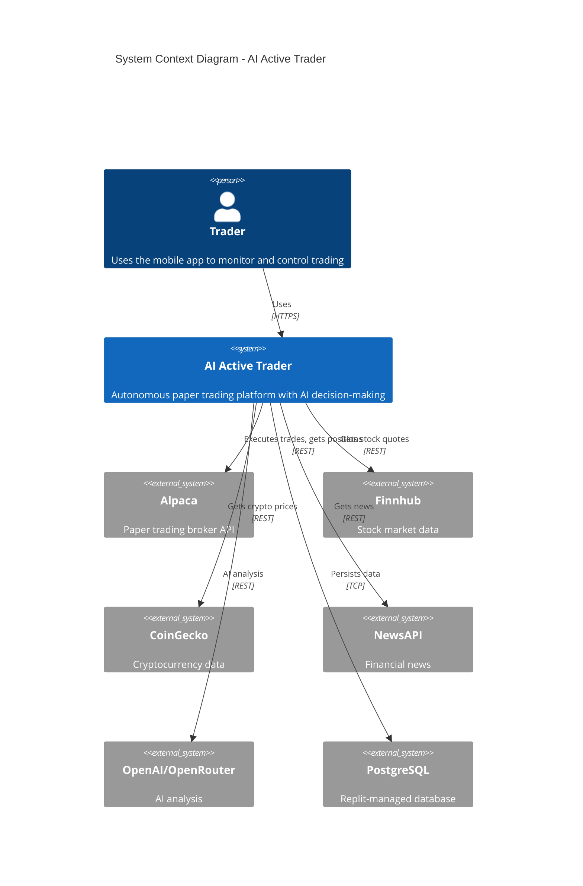
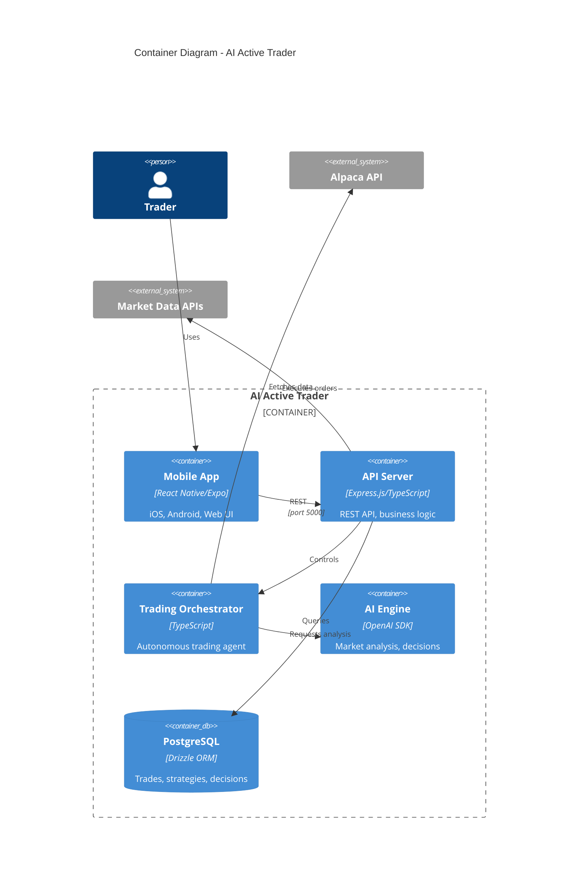
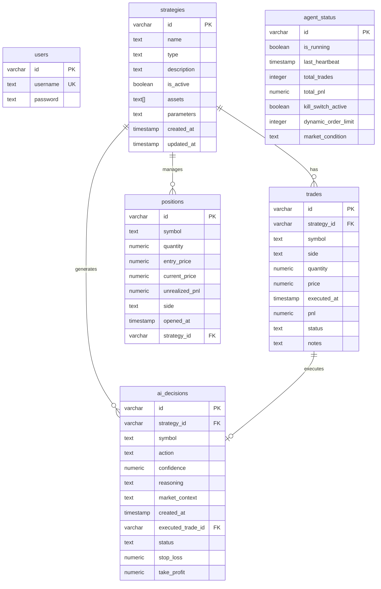

# AI Active Trader - Application Overview

> **This document is the canonical entry point for all engineers joining this project.** It provides a complete technical handover covering architecture, operations, and development practices.

---

## Table of Contents

1. [Introduction & Purpose](#1-introduction--purpose)
2. [Business Context & Main Features](#2-business-context--main-features)
3. [System Overview](#3-system-overview)
4. [Architecture Views & Diagrams](#4-architecture-views--diagrams)
5. [Tech Stack & Dependencies](#5-tech-stack--dependencies)
6. [Codebase Layout](#6-codebase-layout--module-responsibilities)
7. [Data Model & Storage](#7-data-model--storage)
8. [External Integrations](#8-external-integrations)
9. [Runtime & Deployment](#9-runtime-environments-deployment--hosting)
10. [Configuration & Secrets](#10-configuration-secrets--environment-management)
11. [Testing Strategy](#11-testing-strategy--quality-gates)
12. [Observability & Logging](#12-observability-logging--monitoring)
13. [Security Considerations](#13-security--compliance-considerations)
14. [Bug-Fix Strategy](#14-bug-fix--stabilization-strategy)
15. [Extensibility Guide](#15-extensibility--how-to-addmodify-features-safely)
16. [Scaling Strategy](#16-scaling--performance-strategy)
17. [Cost Management](#17-cost--tokencredit-management)
18. [Known Issues & TODOs](#18-known-issues-limitations--todos)
19. [Further Documentation](#19-further-documentation--adrs)

---

## 1. Introduction & Purpose

**AI Active Trader** is an autonomous paper trading platform that uses AI to analyze market conditions and execute trading decisions. It supports both US equities (via Alpaca) and cryptocurrencies, providing users with:

- Real-time position monitoring with live P&L
- AI-powered trade recommendations with explainable reasoning
- Configurable trading strategies with risk controls
- A mobile-first interface (React Native/Expo) with web support

**Target Users:** Individual traders who want to test AI-driven trading strategies in a paper trading environment before committing real capital.

**Core Problem Solved:** Eliminates the complexity of building and testing trading algorithms by providing a pre-built, AI-enhanced trading agent with full transparency into decisions.

---

## 2. Business Context & Main Features

| Feature | Business Purpose | User Journey |
|---------|------------------|--------------|
| **Dashboard** | At-a-glance portfolio health | Open app → see total P&L, positions, market overview |
| **Autonomous Trading Agent** | Hands-off AI trading | Enable agent → agent analyzes markets → executes trades → user reviews results |
| **Strategy Builder** | Customizable trading approaches | Create strategy → configure parameters → assign assets → activate |
| **Position Tracking** | Real-time portfolio visibility | View all open positions with live unrealized P&L from Alpaca |
| **AI Decision Log** | Transparency into AI reasoning | Review each AI decision with confidence score, reasoning, and outcome |
| **Analytics** | Performance measurement | View win rate, total P&L, trade history, equity curve |
| **Risk Controls** | Capital protection | Set position limits, daily loss limits, kill switch |

---

## 3. System Overview

### End-to-End Flow

1. **User Interaction** → React Native app (Expo) on mobile/web
2. **API Request** → Express.js backend on port 5000
3. **Data Fetching** → Connectors query Alpaca, Finnhub, CoinGecko, NewsAPI
4. **AI Analysis** → OpenAI/OpenRouter analyzes market conditions
5. **Trade Execution** → Orchestrator places orders via Alpaca Paper Trading API
6. **Persistence** → PostgreSQL stores trades, strategies, AI decisions
7. **Response** → Updated data flows back to UI via TanStack Query

### System Context Diagram (C4 Level 1)



---

## 4. Architecture Views & Diagrams

### Container Diagram (C4 Level 2)



### Communication Patterns

| Pattern | Usage |
|---------|-------|
| **REST API** | All client-server communication |
| **Polling** | TanStack Query refetches data at intervals |
| **Background Jobs** | Orchestrator runs analysis/position cycles on timers |
| **Synchronous Calls** | All external API integrations are synchronous with retry logic |

---

## 5. Tech Stack & Dependencies

### Core Technologies

| Layer | Technology | Version |
|-------|------------|---------|
| **Frontend** | React Native + Expo | SDK 54 |
| **Navigation** | React Navigation | v7 |
| **State** | TanStack Query | v5 |
| **Backend** | Express.js + TypeScript | v4.21 |
| **ORM** | Drizzle ORM | v0.39 |
| **Database** | PostgreSQL | Neon-backed |
| **AI** | OpenAI SDK | v6 |
| **Runtime** | Node.js | v20+ |

### Dependency Groups (from package.json)

| Group | Key Packages |
|-------|--------------|
| **Core Runtime** | express, drizzle-orm, pg, openai, zod |
| **React Native** | expo, react-native, react-native-reanimated, react-native-gesture-handler |
| **Navigation** | @react-navigation/native, @react-navigation/bottom-tabs, @react-navigation/native-stack |
| **UI** | expo-blur, expo-glass-effect, expo-haptics, lightweight-charts |
| **Dev Tools** | typescript, tsx, eslint, prettier, drizzle-kit |

### Package Management

```bash
npm install          # Install dependencies
npm run db:push      # Push schema changes to database
```

---

## 6. Codebase Layout & Module Responsibilities

```
├── client/                    # React Native Expo app
│   ├── App.tsx               # App entry point with providers
│   ├── components/           # Reusable UI components
│   │   ├── Card.tsx          # Elevation-based card system
│   │   ├── ErrorBoundary.tsx # Error handling wrapper
│   │   └── PriceChart.tsx    # TradingView-style charts
│   ├── screens/              # App screens
│   │   ├── DashboardScreen.tsx    # Main portfolio view
│   │   ├── AnalyticsScreen.tsx    # Performance metrics
│   │   ├── StrategiesScreen.tsx   # Strategy management
│   │   └── StrategyWizard/        # Multi-step strategy creation
│   ├── navigation/           # React Navigation setup
│   ├── hooks/               # Custom React hooks
│   ├── lib/                 # Utilities (query-client.ts)
│   └── constants/           # Theme, colors, spacing
│
├── server/                   # Express.js backend
│   ├── index.ts             # Server entry point
│   ├── routes.ts            # All API routes (~2500 lines)
│   ├── storage.ts           # Database access layer (IStorage pattern)
│   ├── db.ts                # Drizzle database connection
│   ├── autonomous/
│   │   └── orchestrator.ts  # Core trading agent (~1300 lines)
│   ├── ai/
│   │   ├── decision-engine.ts       # AI trade decisions
│   │   ├── market-condition-analyzer.ts  # Market analysis
│   │   └── openrouter-provider.ts   # Free model fallback
│   ├── connectors/
│   │   ├── alpaca.ts        # Broker integration
│   │   ├── finnhub.ts       # Stock quotes
│   │   ├── coingecko.ts     # Crypto prices
│   │   └── newsapi.ts       # Financial news
│   ├── strategies/          # Trading strategy implementations
│   ├── trading/             # Order execution logic
│   └── orchestration/       # Coordinator, events, logging
│
├── shared/
│   └── schema.ts            # Drizzle schema + Zod types
│
├── docs/                    # Documentation
│   └── APP_OVERVIEW.md      # This file
│
├── scripts/                 # Build scripts
└── assets/                  # Static assets
```

### Key Entry Points

| File | Purpose |
|------|---------|
| `client/App.tsx` | React Native app root |
| `server/index.ts` | Express server startup |
| `server/routes.ts` | All API endpoints |
| `server/autonomous/orchestrator.ts` | Trading agent core logic |
| `shared/schema.ts` | Database schema (single source of truth) |

---

## 7. Data Model & Storage

### Entity Relationship Diagram



### Data Freshness

| Entity | Source of Truth | Sync Strategy |
|--------|-----------------|---------------|
| **Positions** | Alpaca API | Live fetch, background sync to DB |
| **Account Balance** | Alpaca API | Live fetch on each request |
| **Trades** | Database | Written on execution, immutable |
| **AI Decisions** | Database | Written on generation |
| **Strategies** | Database | User-managed |

### Schema Management

```bash
# Push schema changes (safe, non-destructive)
npm run db:push

# Force push if needed (use carefully)
npm run db:push --force
```

**Important:** Never change ID column types (serial ↔ varchar). This breaks migrations.

---

## 8. External Integrations

| Service | Purpose | Location | Key Operations |
|---------|---------|----------|----------------|
| **Alpaca** | Paper trading broker | `server/connectors/alpaca.ts` | Orders, positions, account, portfolio history |
| **Finnhub** | Stock quotes | `server/connectors/finnhub.ts` | Real-time quotes, multi-symbol batch |
| **CoinGecko** | Crypto data | `server/connectors/coingecko.ts` | Prices, markets, trending |
| **NewsAPI** | Financial news | `server/connectors/newsapi.ts` | Headlines, search |
| **OpenAI** | AI analysis | `server/ai/decision-engine.ts` | Trade decisions, market analysis |
| **OpenRouter** | Free model fallback | `server/ai/openrouter-provider.ts` | Fallback when OpenAI quota exceeded |

### API Call Patterns

- All integrations use **synchronous REST calls** with retry logic
- **Rate limiting** handled via exponential backoff
- **Caching** implemented in `server/lib/api-cache.ts` for Finnhub and CoinGecko
- **Error handling** returns stale cache data when API fails

---

## 9. Runtime Environments, Deployment & Hosting

### Development (Replit)

```bash
# Start both Expo and Express servers
npm run all:dev

# Start individually
npm run expo:dev      # Expo on port 8081
npm run server:dev    # Express on port 5000
```

### Port Configuration

| Service | Port | Notes |
|---------|------|-------|
| Express API | 5000 | Must bind to 0.0.0.0 |
| Expo Dev Server | 8081 | Metro bundler |

### Production Build

```bash
npm run server:build  # Bundle server with esbuild
npm run server:prod   # Run production server
npm run expo:static:build  # Build static Expo bundle
```

### Deployment

- **Platform:** Replit (container-based)
- **Database:** Replit-managed PostgreSQL (Neon-backed)
- **Static Files:** Served from Express
- **Mobile:** Expo Go for testing, static bundles for production

---

## 10. Configuration, Secrets & Environment Management

### Required Environment Variables

| Variable | Purpose | Where to Set |
|----------|---------|--------------|
| `DATABASE_URL` | PostgreSQL connection | Replit Secrets (auto-set) |
| `ALPACA_API_KEY` | Alpaca API key | Replit Secrets |
| `ALPACA_SECRET_KEY` | Alpaca secret | Replit Secrets |
| `FINNHUB_API_KEY` | Stock data | Replit Secrets |
| `NEWS_API_KEY` | News data | Replit Secrets |
| `COINMARKETCAP_API_KEY` | Crypto data | Replit Secrets (optional) |
| `SESSION_SECRET` | Auth sessions | Replit Secrets |

### Auto-Set by Replit

| Variable | Purpose |
|----------|---------|
| `REPLIT_DEV_DOMAIN` | Development URL |
| `REPLIT_INTERNAL_APP_DOMAIN` | Production URL |

### Security Rules

- **Never** hardcode secrets in source code
- **Never** log or expose secrets in responses
- Use Replit Secrets panel for all sensitive values
- All API keys stored server-side only

---

## 11. Testing Strategy & Quality Gates

### Current State

**Testing Framework:** Not yet implemented

### Recommended Approach

| Test Type | Tool | Coverage Target |
|-----------|------|-----------------|
| Unit Tests | Vitest | P&L calculations, order logic |
| Integration | Vitest + supertest | API endpoints |
| E2E | Playwright (via `run_test` tool) | Critical user flows |

### Running Tests

```bash
# When implemented:
npm run test        # Run all tests
npm run test:watch  # Watch mode
```

### Manual Testing

Use Replit's `run_test` tool for Playwright-based E2E testing of web UI.

---

## 12. Observability, Logging & Monitoring

### Current Logging

- **Console logging** with prefixed tags: `[Orchestrator]`, `[MarketAnalyzer]`, `[AI]`
- **Request logging** via Express middleware (method, path, status, duration)
- **Error logging** with stack traces

### Log Locations

- Workflow logs: Viewable in Replit's workflow panel
- Browser console: Captured by Replit's browser dev tools

### Recommended Improvements

1. Add structured JSON logging
2. Implement log levels (DEBUG, INFO, WARN, ERROR)
3. Add request tracing with correlation IDs

---

## 13. Security & Compliance Considerations

### Authentication

- Session-based auth with `bcryptjs` password hashing
- Session cookies with `cookie-parser`
- Auto-expiring sessions

### Data Security

| Data Type | Handling |
|-----------|----------|
| Passwords | bcrypt hashed, never stored plain |
| API Keys | Server-side only, never sent to client |
| Trading Data | Paper trading only, no real funds |

### Input Validation

- Zod schemas for all API inputs
- Type safety via TypeScript

### Rate Limiting

- Exponential backoff on external APIs
- 429 handling with automatic retry

---

## 14. Bug-Fix & Stabilization Strategy

### Priority Order

1. **Critical:** P&L calculation accuracy, trade execution correctness
2. **High:** Position sync with Alpaca, AI decision logging
3. **Medium:** UI responsiveness, error handling
4. **Low:** Polish, performance optimization

### Known Fragile Areas

| Area | Risk | Mitigation |
|------|------|------------|
| `orchestrator.ts` | Complex state management | Add comprehensive logging |
| Alpaca integration | 403 errors on held positions | Check available qty before selling |
| OpenAI calls | Rate limits | OpenRouter fallback implemented |
| P&L calculations | Numeric precision | Use `safeParseFloat` utility |

### Debugging Workflow

1. Check workflow logs for errors
2. Look for `[Orchestrator]` or `[AI]` prefixed messages
3. Verify Alpaca position state matches expectations
4. Test API endpoints directly with curl

---

## 15. Extensibility & How to Add/Modify Features Safely

### Adding a New Trading Strategy

1. Create strategy file in `server/strategies/`
2. Implement the strategy interface
3. Register in `server/strategies/index.ts`
4. Add UI options in Strategy Wizard

### Adding a New Data Connector

1. Create connector in `server/connectors/`
2. Implement caching pattern from existing connectors
3. Add API routes in `server/routes.ts`
4. Update frontend queries

### Modifying Database Schema

```bash
# 1. Update shared/schema.ts
# 2. Push changes
npm run db:push

# 3. Update storage.ts if needed
```

### Adding a New Screen

1. Create screen in `client/screens/`
2. Add to appropriate navigator in `client/navigation/`
3. Add API endpoints if needed

---

## 16. Scaling & Performance Strategy

### Current Bottlenecks

| Bottleneck | Impact | Solution |
|------------|--------|----------|
| External APIs | Rate limits | Caching, retry with backoff |
| Database | Single connection | Connection pooling (via Drizzle) |
| AI calls | Latency, cost | OpenRouter fallback, caching |

### Scaling Guidelines

| Approach | When to Use |
|----------|-------------|
| **Vertical** | More memory for larger portfolios |
| **Horizontal** | Multiple users (requires session store) |
| **Caching** | Reduce API calls for market data |

### Rate Limits

| Service | Limit | Handling |
|---------|-------|----------|
| Alpaca | 200 req/min | Built-in client throttling |
| Finnhub | 60 req/min | Cache with stale-while-revalidate |
| NewsAPI | 100 req/day | 5-minute backoff on 429 |
| OpenAI | Token-based | OpenRouter fallback |

---

## 17. Cost & Token/Credit Management

### Replit Credits

- **Minimize restarts:** Use HMR for code changes
- **Batch operations:** Avoid repeated API calls in development
- **Use this doc:** Reference APP_OVERVIEW.md to reduce codebase scanning

### External API Costs

| Service | Cost Model | Optimization |
|---------|------------|--------------|
| OpenAI | Per token | Use smaller models, cache responses |
| Alpaca | Free (paper) | No cost concerns |
| Finnhub | Free tier | Stay within 60/min |
| CoinGecko | Free tier | Cache 60s minimum |
| NewsAPI | Free tier | 100 req/day limit |

### AI Cost Control

- **OpenRouter fallback:** Free models used when OpenAI rate-limited
- **Model selection:** Configurable in `decision-engine.ts`
- **Response caching:** AI suggestions cached per symbol

---

## 18. Known Issues, Limitations & TODOs

### Critical

| Issue | Description | Impact |
|-------|-------------|--------|
| Historical trade prices | 245 trades have price=0 from before fix | P&L history incomplete |

### Major

| Issue | Description | Status |
|-------|-------------|--------|
| 403 on position sells | Alpaca rejects sells when shares held by pending orders | Expected behavior, not a bug |
| NewsAPI rate limits | 100/day limit causes frequent 429s | Backoff implemented |

### Minor / Tech Debt

| Item | Description |
|------|-------------|
| No automated tests | Manual testing only |
| No structured logging | Console.log with prefixes |
| Hard-coded defaults | Some risk limits in DEFAULT_RISK_LIMITS |

### Planned Features

- [ ] Real trading mode (disabled by design)
- [ ] Multi-user support
- [ ] Push notifications
- [ ] Advanced charting

---

## 19. Further Documentation & ADRs

### Related Documents

| Document | Location | Purpose |
|----------|----------|---------|
| replit.md | `/replit.md` | Project context and architecture |
| Design Guidelines | `/design_guidelines.md` | UI/UX standards |

### Architecture Decisions

Key decisions are documented inline in `replit.md`:

- **Monorepo structure:** Simplifies type sharing
- **Schema-first development:** Single source of truth in shared/schema.ts
- **Adapter pattern:** Swappable data providers
- **Paper trading only:** MVP safety, real trading disabled

---

## Quick Reference

### Common Commands

```bash
npm run all:dev       # Start development
npm run db:push       # Push schema changes
npm run lint          # Run linter
npm run format        # Format code
```

### Key API Endpoints

| Endpoint | Method | Purpose |
|----------|--------|---------|
| `/api/positions` | GET | Live Alpaca positions |
| `/api/trades` | GET | Trade history |
| `/api/analytics/summary` | GET | P&L summary |
| `/api/autonomous/state` | GET | Orchestrator state |
| `/api/autonomous/start` | POST | Start trading agent |
| `/api/autonomous/stop` | POST | Stop trading agent |

### Support Channels

- Replit community
- Issue tracking via comments in code

---

*Last updated: December 2024*
