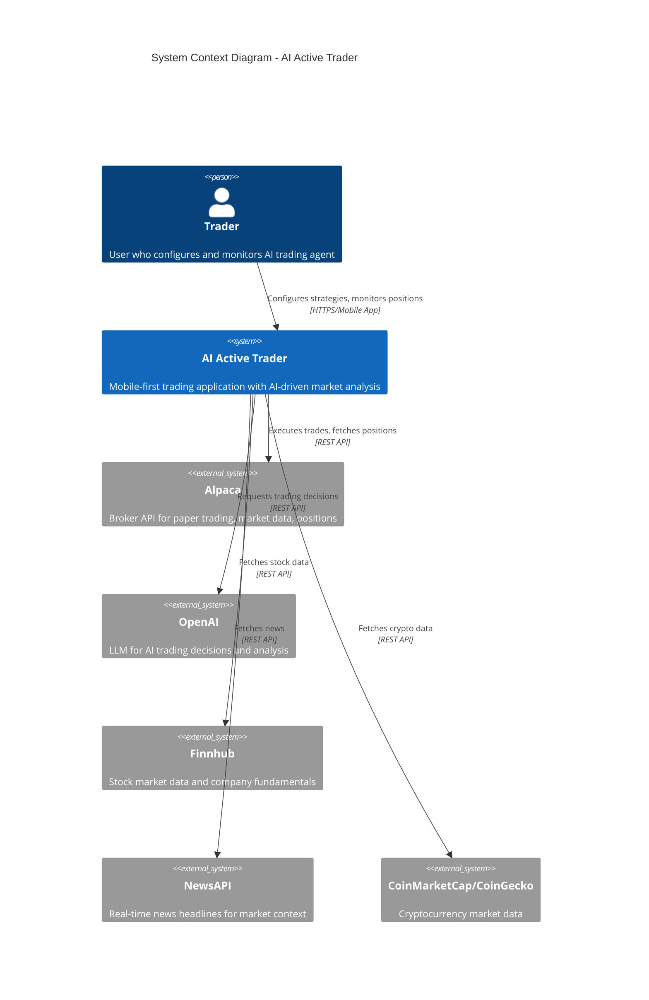
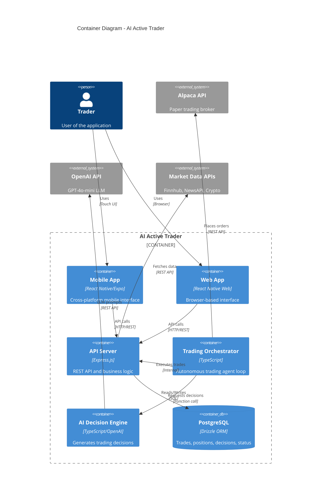

# System Architecture Documentation

> **Purpose**  
> This document describes the system architecture, component relationships, data flows, and integration patterns for the AI Active Trader application.

---

## Table of Contents

1. [High-Level Architecture](#1-high-level-architecture)
2. [Layered Architecture](#2-layered-architecture)
3. [Component Breakdown](#3-component-breakdown)
4. [Data Flow Diagrams](#4-data-flow-diagrams)
5. [External Integrations](#5-external-integrations)
6. [Database Design](#6-database-design)
7. [Orchestrator Architecture](#7-orchestrator-architecture)
8. [Security Architecture](#8-security-architecture)
9. [Deployment Architecture](#9-deployment-architecture)
10. [Observability Architecture](#10-observability-architecture)
11. [Microservices Architecture (December 2025)](#11-microservices-architecture-december-2025)
12. [Current State (December 2025)](#12-current-state-december-2025)
13. [Enhancements Compared to Previous Version](#13-enhancements-compared-to-previous-version)
14. [Old vs New - Summary of Changes](#14-old-vs-new---summary-of-changes)

---

## 1. High-Level Architecture

### 1.1 System Context Diagram (Mermaid)



### 1.2 Container Diagram (Mermaid)



### 1.3 ASCII Architecture Diagram

```
┌─────────────────────────────────────────────────────────────────────┐
│                         CLIENT LAYER                                 │
│  ┌─────────────────┐  ┌─────────────────┐  ┌─────────────────┐     │
│  │   Dashboard     │  │   Strategies    │  │   Trade History │     │
│  │   Screen        │  │   Screen        │  │   Screen        │     │
│  └────────┬────────┘  └────────┬────────┘  └────────┬────────┘     │
│           │                    │                    │               │
│           └────────────────────┼────────────────────┘               │
│                                │                                    │
│                    ┌───────────▼───────────┐                        │
│                    │   TanStack Query      │                        │
│                    │   (State Management)  │                        │
│                    └───────────┬───────────┘                        │
└────────────────────────────────┼────────────────────────────────────┘
                                 │ HTTP/REST
                                 ▼
┌─────────────────────────────────────────────────────────────────────┐
│                         SERVER LAYER                                 │
│  ┌─────────────────────────────────────────────────────────────┐   │
│  │                    Express.js API                            │   │
│  │  /api/positions  /api/trades  /api/autonomous  /api/alpaca   │   │
│  └─────────────────────────────────────────────────────────────┘   │
│                                │                                    │
│  ┌─────────────────────────────┼─────────────────────────────────┐ │
│  │                      DOMAIN LAYER                              │ │
│  │  ┌──────────────┐  ┌───────▼───────┐  ┌──────────────────┐   │ │
│  │  │   AI         │  │  Orchestrator │  │  Paper Trading   │   │ │
│  │  │   Decision   │  │  (Autonomous) │  │  Engine          │   │ │
│  │  │   Engine     │  └───────┬───────┘  └──────────────────┘   │ │
│  │  └──────────────┘          │                                  │ │
│  └────────────────────────────┼──────────────────────────────────┘ │
│                               │                                     │
│  ┌────────────────────────────┼──────────────────────────────────┐ │
│  │                     DATA ACCESS LAYER                          │ │
│  │  ┌──────────────┐  ┌───────▼───────┐  ┌──────────────────┐   │ │
│  │  │   Storage    │  │   Connectors  │  │   AI Clients     │   │ │
│  │  │   (Drizzle)  │  │   (Alpaca)    │  │   (OpenAI)       │   │ │
│  │  └──────┬───────┘  └───────────────┘  └──────────────────┘   │ │
│  └─────────┼─────────────────────────────────────────────────────┘ │
└────────────┼────────────────────────────────────────────────────────┘
             │
             ▼
┌─────────────────────────────────────────────────────────────────────┐
│                      EXTERNAL SERVICES                               │
│  ┌──────────┐  ┌──────────┐  ┌──────────┐  ┌──────────┐            │
│  │PostgreSQL│  │  Alpaca  │  │  OpenAI  │  │ Finnhub  │            │
│  │ Database │  │   API    │  │   API    │  │   API    │            │
│  └──────────┘  └──────────┘  └──────────┘  └──────────┘            │
└─────────────────────────────────────────────────────────────────────┘
```

---

## 2. Layered Architecture

### 2.1 Layer Responsibilities

| Layer | Responsibility | Key Files |
|-------|---------------|-----------|
| **Presentation** | UI rendering, user interaction | `client/screens/*.tsx`, `client/components/*.tsx` |
| **API** | HTTP endpoints, request/response handling | `server/routes.ts` |
| **Domain** | Business logic, trading rules, AI decisions | `server/autonomous/`, `server/ai/`, `server/trading/` |
| **Data Access** | Database operations, external API calls | `server/storage.ts`, `server/connectors/` |
| **External** | Third-party services | Alpaca, OpenAI, Finnhub, NewsAPI |

### 2.2 Dependency Rules

```
Presentation → API → Domain → Data Access → External
     ↓          ↓       ↓          ↓
   (uses)    (uses)  (uses)     (uses)
```

**Rules:**
1. Higher layers may depend on lower layers
2. Lower layers MUST NOT depend on higher layers
3. Cross-layer calls go through defined interfaces
4. Shared types live in `shared/` directory

---

## 3. Component Breakdown

### 3.1 Client Components

```
client/
├── App.tsx                    # Root component with providers
├── navigation/
│   ├── RootNavigator.tsx      # Main navigation structure
│   └── BottomTabNavigator.tsx # Tab bar navigation
├── screens/
│   ├── DashboardScreen.tsx    # Main dashboard (positions, P&L)
│   ├── StrategiesScreen.tsx   # Strategy management
│   ├── TradesScreen.tsx       # Trade history
│   └── SettingsScreen.tsx     # App settings
├── components/
│   ├── Card.tsx               # Reusable card component
│   ├── ThemedText.tsx         # Themed typography
│   └── ErrorBoundary.tsx      # Error handling
└── lib/
    └── query-client.ts        # TanStack Query configuration
```

### 3.2 Server Components

```
server/
├── index.ts                   # Express app entry point
├── routes.ts                  # API endpoint definitions (~2500 lines)
├── storage.ts                 # Database operations (IStorage)
├── db.ts                      # Drizzle ORM connection
├── autonomous/
│   └── orchestrator.ts        # Trading agent core logic
├── ai/
│   ├── decision-engine.ts     # AI trade recommendations
│   └── market-condition-analyzer.ts  # Market analysis
├── trading/
│   └── paper-trading-engine.ts # Paper trading execution
├── connectors/
│   ├── alpaca.ts              # Alpaca broker API
│   ├── finnhub.ts             # Stock market data
│   └── news.ts                # News API integration
└── utils/
    └── numeric.ts             # Safe numeric operations
```

### 3.3 Shared Components

```
shared/
└── schema.ts                  # Database schema + Zod validation
    ├── users                  # User authentication
    ├── strategies             # Trading strategies
    ├── trades                 # Trade history
    ├── positions              # Open positions
    ├── aiDecisions            # AI decision log
    └── agentStatus            # Agent runtime state
```

---

## 4. Data Flow Diagrams

### 4.1 Trade Execution Flow

```
┌─────────────┐     ┌─────────────┐     ┌─────────────┐
│   Market    │     │    AI       │     │   Trade     │
│   Data      │────▶│  Decision   │────▶│  Execution  │
│   (Alpaca)  │     │   Engine    │     │             │
└─────────────┘     └─────────────┘     └──────┬──────┘
                                               │
                    ┌─────────────┐             │
                    │  Alpaca     │◀────────────┘
                    │  Orders API │
                    └──────┬──────┘
                           │
                           ▼
                    ┌─────────────┐     ┌─────────────┐
                    │   Order     │────▶│  Database   │
                    │   Fill      │     │  (trades,   │
                    │   Tracking  │     │  positions) │
                    └─────────────┘     └─────────────┘
```

### 4.2 Dashboard Data Flow

```
┌─────────────────────────────────────────────────────────┐
│                    DashboardScreen                       │
│  ┌─────────────┐  ┌─────────────┐  ┌─────────────┐     │
│  │  Positions  │  │  Analytics  │  │  Agent      │     │
│  │  Widget     │  │  Widget     │  │  Status     │     │
│  └──────┬──────┘  └──────┬──────┘  └──────┬──────┘     │
└─────────┼────────────────┼────────────────┼─────────────┘
          │                │                │
          ▼                ▼                ▼
    useQuery          useQuery         useQuery
    [/api/positions]  [/api/analytics] [/api/agent/status]
          │                │                │
          └────────────────┼────────────────┘
                           │
                           ▼
                    ┌─────────────┐
                    │  Express    │
                    │  Server     │
                    └──────┬──────┘
                           │
          ┌────────────────┼────────────────┐
          ▼                ▼                ▼
    ┌──────────┐    ┌──────────┐    ┌──────────┐
    │  Alpaca  │    │  Storage │    │ Orchestr │
    │  API     │    │  (DB)    │    │  ator    │
    └──────────┘    └──────────┘    └──────────┘
```

### 4.3 Orchestrator Cycle

```
┌────────────────────────────────────────────────────────────┐
│                    ORCHESTRATOR LOOP                        │
│                                                             │
│  ┌──────────────┐                                          │
│  │  Heartbeat   │◀──────────────────────────────────┐     │
│  │  (30s)       │                                    │     │
│  └──────┬───────┘                                    │     │
│         │                                            │     │
│         ▼                                            │     │
│  ┌──────────────┐     ┌──────────────┐              │     │
│  │  Analysis    │────▶│  AI Decision │              │     │
│  │  Cycle (60s) │     │  Generation  │              │     │
│  └──────────────┘     └──────┬───────┘              │     │
│                              │                       │     │
│                              ▼                       │     │
│                       ┌──────────────┐              │     │
│                       │  Risk Check  │              │     │
│                       └──────┬───────┘              │     │
│                              │                       │     │
│         ┌────────────────────┼────────────────────┐ │     │
│         ▼                    ▼                    ▼ │     │
│  ┌────────────┐       ┌────────────┐       ┌──────────┐  │
│  │   SKIP     │       │   EXECUTE  │       │   HOLD   │──┘
│  │   (limits) │       │   Order    │       │          │
│  └────────────┘       └──────┬─────┘       └──────────┘
│                              │
│                              ▼
│                       ┌──────────────┐
│                       │  Update DB   │
│                       │  Log Trade   │
│                       └──────────────┘
└────────────────────────────────────────────────────────────┘
```

---

## 5. External Integrations

### 5.1 Integration Map

```
┌─────────────────────────────────────────────────────────────────┐
│                         AI ACTIVE TRADER                         │
│                                                                  │
│  ┌──────────────────────────────────────────────────────────┐  │
│  │                    BROKER LAYER                           │  │
│  │  ┌──────────────────────────────────────────────────┐    │  │
│  │  │              Alpaca (Paper Trading)               │    │  │
│  │  │  • Account info    • Order execution              │    │  │
│  │  │  • Positions       • Market data (stocks/crypto)  │    │  │
│  │  │  • Historical bars • Asset information            │    │  │
│  │  └──────────────────────────────────────────────────┘    │  │
│  └──────────────────────────────────────────────────────────┘  │
│                                                                  │
│  ┌──────────────────────────────────────────────────────────┐  │
│  │                    AI LAYER                               │  │
│  │  ┌────────────────────┐  ┌────────────────────┐         │  │
│  │  │      OpenAI        │  │    OpenRouter      │         │  │
│  │  │   (Primary LLM)    │  │    (Fallback)      │         │  │
│  │  │   gpt-4o-mini      │  │   Various models   │         │  │
│  │  └────────────────────┘  └────────────────────┘         │  │
│  └──────────────────────────────────────────────────────────┘  │
│                                                                  │
│  ┌──────────────────────────────────────────────────────────┐  │
│  │                  MARKET DATA LAYER                        │  │
│  │  ┌──────────┐  ┌──────────┐  ┌──────────┐  ┌──────────┐ │  │
│  │  │ Finnhub  │  │ NewsAPI  │  │CoinMktCap│  │CoinGecko │ │  │
│  │  │ Stocks   │  │ Headlines│  │  Crypto  │  │  Crypto  │ │  │
│  │  └──────────┘  └──────────┘  └──────────┘  └──────────┘ │  │
│  └──────────────────────────────────────────────────────────┘  │
└─────────────────────────────────────────────────────────────────┘
```

### 5.2 Integration Details

| Service | Purpose | Rate Limits | Fallback |
|---------|---------|-------------|----------|
| **Alpaca** | Broker, market data | 200 req/min | None (critical) |
| **OpenAI** | AI decisions | Token-based | OpenRouter |
| **Finnhub** | Stock quotes | 60 req/min | Alpaca data |
| **NewsAPI** | Headlines | 100 req/day | Cached data |
| **CoinMarketCap** | Crypto data | 333 req/day | CoinGecko |
| **CoinGecko** | Crypto data | 50 req/min | None |

### 5.3 Adapter Pattern

All external services implement adapters for swappability:

```typescript
// Example: Broker Adapter Interface
interface IBrokerConnector {
  getAccount(): Promise<Account>;
  getPositions(): Promise<Position[]>;
  placeOrder(order: OrderRequest): Promise<Order>;
  cancelOrder(orderId: string): Promise<void>;
}

// Alpaca implementation
class AlpacaConnector implements IBrokerConnector {
  // ... implementation
}
```

---

## 6. Database Design

### 6.1 Entity Relationship Diagram

```
┌─────────────┐       ┌─────────────┐       ┌─────────────┐
│   users     │       │  strategies │       │   trades    │
├─────────────┤       ├─────────────┤       ├─────────────┤
│ id (PK)     │       │ id (PK)     │◀──────│ strategyId  │
│ username    │       │ name        │       │ id (PK)     │
│ password    │       │ type        │       │ symbol      │
└─────────────┘       │ description │       │ side        │
                      │ isActive    │       │ quantity    │
                      │ assets[]    │       │ price       │
                      │ parameters  │       │ pnl         │
                      │ createdAt   │       │ executedAt  │
                      │ updatedAt   │       │ status      │
                      └─────────────┘       │ notes       │
                             │              └─────────────┘
                             │                     │
                             ▼                     ▼
                      ┌─────────────┐       ┌─────────────┐
                      │  positions  │       │ aiDecisions │
                      ├─────────────┤       ├─────────────┤
                      │ id (PK)     │       │ id (PK)     │
                      │ symbol      │       │ strategyId  │
                      │ quantity    │       │ symbol      │
                      │ entryPrice  │       │ action      │
                      │ currentPrice│       │ confidence  │
                      │ unrealizedPnl       │ reasoning   │
                      │ side        │       │ marketContext
                      │ strategyId  │       │ executedTradeId
                      │ openedAt    │       │ status      │
                      └─────────────┘       │ stopLoss    │
                                            │ takeProfit  │
                                            │ createdAt   │
                                            └─────────────┘
                                                   │
                                                   │
                      ┌─────────────┐              │
                      │ agentStatus │◀─────────────┘
                      ├─────────────┤
                      │ id (PK)     │
                      │ isRunning   │
                      │ lastHeartbeat
                      │ totalTrades │
                      │ totalPnl    │
                      │ cashBalance │
                      │ killSwitchActive
                      │ riskLimits  │
                      │ autoStartEnabled
                      └─────────────┘
```

### 6.2 Data Types

| Field Pattern | PostgreSQL Type | TypeScript Type |
|---------------|-----------------|-----------------|
| IDs | `varchar` with UUID default | `string` |
| Prices, quantities | `numeric` | `string` (parsed to `number`) |
| Timestamps | `timestamp` | `Date` |
| Flags | `boolean` | `boolean` |
| JSON data | `text` | `string` (JSON serialized) |
| Arrays | `text[]` | `string[]` |

---

## 7. Orchestrator Architecture

### 7.1 State Machine

```
                    ┌─────────────────────────────────────┐
                    │              STOPPED                 │
                    │  • All timers inactive               │
                    │  • Waiting for start command         │
                    └─────────────────┬───────────────────┘
                                      │
                                      │ start() / autoStart()
                                      ▼
                    ┌─────────────────────────────────────┐
                    │              STARTING                │
                    │  • Initialize market analyzer        │
                    │  • Load risk limits from DB          │
                    │  • Start heartbeat timer             │
                    └─────────────────┬───────────────────┘
                                      │
                                      │ success
                                      ▼
    ┌───────────────┬─────────────────────────────────────┬───────────────┐
    │               │              RUNNING                 │               │
    │               │  • Analysis timer active (60s)       │               │
    │  killSwitch   │  • Position timer active (30s)       │  5 errors     │
    │     ─────────▶│  • Heartbeat timer active (30s)      │◀─────────     │
    │               │  • Processing market signals         │               │
    │               └─────────────────┬───────────────────┘               │
    │                                 │                                    │
    │                                 │ stop()                             │
    │                                 ▼                                    │
    │               ┌─────────────────────────────────────┐               │
    │               │             STOPPING                 │               │
    │               │  • Cancel all timers                 │               │
    │               │  • Update DB status                  │               │
    │               └─────────────────┬───────────────────┘               │
    │                                 │                                    │
    │                                 ▼                                    │
    │               ┌─────────────────────────────────────┐               │
    └──────────────▶│              STOPPED                 │◀──────────────┘
                    └─────────────────────────────────────┘
                                      │
                                      │ self-heal (if autoStart enabled)
                                      ▼
                    ┌─────────────────────────────────────┐
                    │            SELF-HEALING              │
                    │  • Wait 5 seconds                    │
                    │  • Reset error counters              │
                    │  • Restart if autoStart enabled      │
                    └─────────────────────────────────────┘
```

### 7.2 Timer Configuration

| Timer | Interval | Purpose | Failure Handling |
|-------|----------|---------|------------------|
| Analysis | 60s | Run AI market analysis, generate signals | Increment error counter |
| Position | 30s | Check positions, apply stop-loss/take-profit | Log and continue |
| Heartbeat | 30s | Health check, detect stale state | Trigger self-heal if stale |

### 7.3 Risk Controls

```typescript
interface RiskLimits {
  maxPositionSizePercent: number;    // Default: 10%
  maxTotalExposurePercent: number;   // Default: 50%
  maxPositionsCount: number;         // Default: 10
  dailyLossLimitPercent: number;     // Default: 5%
  killSwitchActive: boolean;         // Default: false
}
```

---

## 8. Security Architecture

### 8.1 Secret Management

```
┌─────────────────────────────────────────────────────────────┐
│                    REPLIT SECRETS PANEL                      │
│  ┌─────────────────────────────────────────────────────┐   │
│  │  ALPACA_API_KEY         ●●●●●●●●●●●●●●●●           │   │
│  │  ALPACA_SECRET_KEY      ●●●●●●●●●●●●●●●●           │   │
│  │  FINNHUB_API_KEY        ●●●●●●●●●●●●●●●●           │   │
│  │  NEWS_API_KEY           ●●●●●●●●●●●●●●●●           │   │
│  │  SESSION_SECRET         ●●●●●●●●●●●●●●●●           │   │
│  │  DATABASE_URL           (auto-set by Replit)        │   │
│  └─────────────────────────────────────────────────────┘   │
└───────────────────────────────┬─────────────────────────────┘
                                │
                                │ process.env
                                ▼
                    ┌─────────────────────────────────────┐
                    │           SERVER PROCESS             │
                    │  • Secrets loaded at startup         │
                    │  • Never logged or returned to UI    │
                    │  • Never committed to repository     │
                    └─────────────────────────────────────┘
```

### 8.2 Authentication Flow

```
┌──────────┐     POST /api/auth/login     ┌──────────┐
│  Client  │─────────────────────────────▶│  Server  │
└──────────┘                              └────┬─────┘
                                               │
                                               ▼
                                    ┌─────────────────────┐
                                    │  Validate password  │
                                    │  (bcrypt compare)   │
                                    └──────────┬──────────┘
                                               │
                                               ▼
                                    ┌─────────────────────┐
                                    │  Create session     │
                                    │  (express-session)  │
                                    └──────────┬──────────┘
                                               │
     Set-Cookie: session=xxx                   │
┌──────────┐◀──────────────────────────────────┘
│  Client  │
└──────────┘
```

---

## 9. Deployment Architecture

### 9.1 Replit Deployment

```
┌─────────────────────────────────────────────────────────────┐
│                    REPLIT CONTAINER                          │
│                                                              │
│  ┌────────────────────┐    ┌────────────────────┐          │
│  │   Express Server   │    │   Expo Metro       │          │
│  │   Port 5000        │    │   Port 8081        │          │
│  └─────────┬──────────┘    └─────────┬──────────┘          │
│            │                         │                      │
│            └───────────┬─────────────┘                      │
│                        │                                    │
│                        ▼                                    │
│            ┌────────────────────────┐                       │
│            │   Replit Proxy         │                       │
│            │   (HTTPS termination)  │                       │
│            └───────────┬────────────┘                       │
│                        │                                    │
└────────────────────────┼────────────────────────────────────┘
                         │
                         ▼
              ┌────────────────────────┐
              │   *.replit.app         │
              │   (Public domain)      │
              └────────────────────────┘
```

### 9.2 Database Connection

```
┌─────────────────────────────────────────────────────────────┐
│                    REPLIT CONTAINER                          │
│  ┌────────────────────┐                                     │
│  │   Drizzle ORM      │                                     │
│  │   (Connection Pool)│                                     │
│  └─────────┬──────────┘                                     │
│            │                                                 │
│            │ DATABASE_URL (auto-set)                         │
│            ▼                                                 │
└────────────┼─────────────────────────────────────────────────┘
             │
             │ Encrypted connection
             ▼
┌─────────────────────────────────────────────────────────────┐
│                  NEON POSTGRESQL                             │
│  ┌────────────────────────────────────────────────────┐    │
│  │  Database: ai_active_trader                         │    │
│  │  • users, strategies, trades, positions             │    │
│  │  • aiDecisions, agentStatus                         │    │
│  └────────────────────────────────────────────────────┘    │
└─────────────────────────────────────────────────────────────┘
```

---

## 10. Observability Architecture

### 10.1 Logging Infrastructure

```
┌─────────────────────────────────────────────────────────────┐
│                    LOGGING SYSTEM                            │
│                                                              │
│  ┌────────────────────┐    ┌────────────────────┐          │
│  │   Request Logger   │    │   Cycle Logger     │          │
│  │   (Middleware)     │    │   (Orchestrator)   │          │
│  └─────────┬──────────┘    └─────────┬──────────┘          │
│            │                         │                      │
│            └───────────┬─────────────┘                      │
│                        │                                    │
│                        ▼                                    │
│            ┌────────────────────────┐                       │
│            │   Centralized Logger   │                       │
│            │   server/utils/logger  │                       │
│            └───────────┬────────────┘                       │
│                        │                                    │
│            ┌───────────┴───────────┐                        │
│            │                       │                        │
│            ▼                       ▼                        │
│  ┌─────────────────┐    ┌─────────────────┐                │
│  │  Console Output │    │  In-Memory      │                │
│  │  (stdout/stderr)│    │  Buffer (2000)  │                │
│  └─────────────────┘    └─────────────────┘                │
└─────────────────────────────────────────────────────────────┘
```

### 10.2 Correlation ID Flow

```
┌──────────┐     ┌──────────────┐     ┌──────────────────┐
│  Client  │────▶│ Request ID   │────▶│ API Handler      │
│  Request │     │ Middleware   │     │ (with requestId) │
└──────────┘     └──────────────┘     └────────┬─────────┘
                                               │
                       ┌───────────────────────┘
                       ▼
              ┌─────────────────┐
              │ All log entries │
              │ include same    │
              │ requestId       │
              └─────────────────┘
```

### 10.3 Log Categories

| Category | Symbol | Component |
|----------|--------|-----------|
| TRADE | Trade operations | Orchestrator, Trade Execution |
| STRATEGY | Strategy signals | Strategy Evaluation |
| MARKET | Market data | Connectors (Alpaca, Finnhub) |
| AI | AI decisions | OpenAI Integration |
| CONNECTOR | External APIs | All external services |
| SYSTEM | Server lifecycle | Express, Startup/Shutdown |

### 10.4 Log Access API

```
GET /api/logs
├── ?limit=100      # Number of entries
├── ?level=error    # Minimum level filter
└── Response: LogEntry[]

LogEntry {
  timestamp: ISO 8601
  level: debug|info|warn|error|critical
  category: TRADE|STRATEGY|MARKET|AI|CONNECTOR|SYSTEM
  requestId?: string
  message: string
  data?: object
}
```

See [OBSERVABILITY.md](./OBSERVABILITY.md) for complete logging documentation.

---

## Architectural Decisions Log

| Date | Decision | Rationale |
|------|----------|-----------|
| 2024 | Monorepo structure | Simplifies type sharing between client/server |
| 2024 | Drizzle ORM | Type-safe, performant, good DX |
| 2024 | TanStack Query | Best-in-class server state management |
| 2024 | Paper trading only | MVP validation without financial risk |
| 2024 | Alpaca as primary | Best paper trading API, supports stocks + crypto |
| 2024 | OpenAI + fallback | Reliable AI with OpenRouter as backup |
| 2024 | Centralized logger | Production readiness with correlation IDs |
| 2025 | Microservices migration | Event-driven architecture for scalability |
| 2025 | NATS JetStream | Reliable async messaging between services |
| 2025 | Feature flags | Strangler fig pattern for gradual migration |
| 2025 | OpenTelemetry | Distributed tracing across microservices |

---

## 11. Microservices Architecture (December 2025)

The platform is transitioning from a monolith to an event-driven microservices architecture using the Strangler Fig pattern. This section documents the current state of the migration.

### 11.1 Target Microservices Architecture

```
┌─────────────────────────────────────────────────────────────────────────────┐
│                           MICROSERVICES LAYER                                 │
│                                                                               │
│  ┌──────────────┐  ┌──────────────┐  ┌──────────────┐  ┌──────────────┐    │
│  │ API Gateway  │  │ Trading      │  │ AI Decision  │  │ Market Data  │    │
│  │ :3000        │  │ Engine :3001 │  │ Service:3002 │  │ Service:3003 │    │
│  └──────┬───────┘  └──────┬───────┘  └──────┬───────┘  └──────┬───────┘    │
│         │                 │                 │                 │             │
│         │                 │                 │                 │             │
│  ┌──────┴─────────────────┴─────────────────┴─────────────────┴──────┐     │
│  │                        NATS JetStream                              │     │
│  │                     (Event Bus / Message Broker)                   │     │
│  └──────┬─────────────────┬─────────────────┬─────────────────┬──────┘     │
│         │                 │                 │                 │             │
│  ┌──────┴───────┐  ┌──────┴───────┐  ┌──────┴───────┐  ┌──────┴───────┐    │
│  │ Analytics    │  │ Orchestrator │  │ Event Bridge │  │ Intelligence │    │
│  │ Service:3004 │  │ Service:3005 │  │ Service:3006 │  │ Fabric       │    │
│  └──────────────┘  └──────────────┘  └──────────────┘  └──────────────┘    │
│                                                                               │
└───────────────────────────────────────────────────────────────────────────────┘
                                      │
                                      ▼
┌─────────────────────────────────────────────────────────────────────────────┐
│                           SHARED LIBRARIES                                    │
│  services/shared/                                                             │
│  ┌──────────────┐  ┌──────────────┐  ┌──────────────┐  ┌──────────────┐    │
│  │ Algorithm    │  │ Backtesting  │  │ Analytics    │  │ Data         │    │
│  │ Framework    │  │ Engine       │  │ (TCA)        │  │ Processing   │    │
│  └──────────────┘  └──────────────┘  └──────────────┘  └──────────────┘    │
│  ┌──────────────┐  ┌──────────────┐  ┌──────────────┐  ┌──────────────┐    │
│  │ Strategies   │  │ Events       │  │ Common       │  │ Repositories │    │
│  │ (Versioning) │  │ (Sourcing)   │  │ (Telemetry)  │  │ (Dual-Write) │    │
│  └──────────────┘  └──────────────┘  └──────────────┘  └──────────────┘    │
└─────────────────────────────────────────────────────────────────────────────┘
```

### 11.2 Service Registry

| Service | Port | Responsibility | Status |
|---------|------|----------------|--------|
| **api-gateway** | 3000 | Auth, rate limiting, routing, tenant mgmt | Ready |
| **trading-engine** | 3001 | Orders, positions, risk management | Ready |
| **ai-decision** | 3002 | LLM routing, data fusion, decisions | Ready |
| **market-data** | 3003 | Data ingestion, caching, streaming | Ready |
| **analytics** | 3004 | P&L calculations, metrics, reports | Ready |
| **orchestrator** | 3005 | Trading cycles, sagas, scheduling | Ready |
| **event-bridge** | 3006 | External integrations, n8n webhooks | Ready |
| **intelligence-fabric** | - | RAG cache, vector store, prompt registry | Ready |

### 11.3 Event-Driven Communication (NATS JetStream)

```
┌─────────────────────────────────────────────────────────────────────┐
│                    EVENT STREAMS                                      │
│                                                                       │
│  ┌─────────────────────────────────────────────────────────────┐    │
│  │  MARKET_DATA Stream                                          │    │
│  │  • market.quote.{symbol}    - Real-time price quotes         │    │
│  │  • market.bar.{symbol}      - OHLCV candles                  │    │
│  │  • market.news.{symbol}     - News events                    │    │
│  └─────────────────────────────────────────────────────────────┘    │
│                                                                       │
│  ┌─────────────────────────────────────────────────────────────┐    │
│  │  TRADING Stream                                               │    │
│  │  • order.created            - New order submitted            │    │
│  │  • order.filled             - Order executed                 │    │
│  │  • position.opened          - New position opened            │    │
│  │  • position.closed          - Position closed                │    │
│  └─────────────────────────────────────────────────────────────┘    │
│                                                                       │
│  ┌─────────────────────────────────────────────────────────────┐    │
│  │  AI_DECISIONS Stream                                          │    │
│  │  • decision.requested       - Analysis requested             │    │
│  │  • decision.generated       - AI decision produced           │    │
│  │  • decision.executed        - Trade executed from decision   │    │
│  └─────────────────────────────────────────────────────────────┘    │
│                                                                       │
│  ┌─────────────────────────────────────────────────────────────┐    │
│  │  SYSTEM Stream                                                │    │
│  │  • heartbeat.{service}      - Service health checks          │    │
│  │  • error.{service}          - Error notifications            │    │
│  │  • metric.{service}         - Performance metrics            │    │
│  └─────────────────────────────────────────────────────────────┘    │
└─────────────────────────────────────────────────────────────────────┘
```

### 11.4 Feature Flags for Traffic Splitting

The migration uses feature flags to gradually shift traffic from monolith to microservices:

```typescript
// services/shared/common/feature-flags.ts
interface FeatureFlag {
  name: string;
  enabled: boolean;
  rolloutPercentage: number;  // 0-100
  userWhitelist: string[];
  userBlacklist: string[];
}

// Strangler fig pattern routing
async function routeRequest(userId: string, feature: string) {
  const flag = await getFeatureFlag(feature);
  
  if (!flag.enabled) return 'monolith';
  if (flag.userBlacklist.includes(userId)) return 'monolith';
  if (flag.userWhitelist.includes(userId)) return 'microservice';
  
  const hash = hashUserId(userId);
  return hash < flag.rolloutPercentage ? 'microservice' : 'monolith';
}
```

Current feature flag coverage: **23 tests passing**

### 11.5 Shared Libraries Architecture

```
services/shared/
├── algorithm-framework/          # Trading algorithm base classes
│   ├── alpha-generation.ts       # Signal generation
│   ├── execution.ts              # Order execution logic
│   ├── portfolio-construction.ts # Black-Litterman, Risk Parity, HRP
│   ├── risk-management.ts        # Position sizing, limits
│   └── universe-selection.ts     # Asset filtering
│
├── backtesting/                  # Event-driven simulation engine
│   ├── backtesting-engine.ts     # Core simulation loop
│   ├── fill-model.ts             # Realistic order fills
│   ├── slippage-model.ts         # Slippage simulation
│   ├── commission-model.ts       # Fee structures
│   └── performance-analyzer.ts   # Sharpe, Sortino, drawdown
│
├── analytics/                    # Transaction Cost Analysis
│   └── transaction-cost-analysis.ts  # Implementation shortfall, TCA
│
├── data/                         # Data processing pipelines
│   ├── order-book-analyzer.ts    # Level 2 data, liquidity
│   ├── market-regime-ml.ts       # HMM, BOCD regime detection
│   ├── sentiment-fusion.ts       # Multi-source sentiment
│   └── technical-indicators.ts   # SMA, EMA, RSI, MACD, ATR
│
├── strategies/                   # Strategy management
│   ├── strategy-versioning.ts    # A/B testing, rollback
│   ├── alpha-decay.ts            # Signal half-life estimation
│   └── llm-governance.ts         # Pre-trade validation, limits
│
├── events/                       # Event sourcing infrastructure
│   ├── client.ts                 # NATS JetStream client
│   ├── event-journal.ts          # Audit trail, replay
│   ├── ring-buffer.ts            # High-performance buffer
│   └── schemas.ts                # Event type definitions
│
├── common/                       # Cross-cutting concerns
│   ├── telemetry.ts              # OpenTelemetry integration
│   ├── feature-flags.ts          # Strangler fig routing
│   ├── circuit-breaker.ts        # Fault isolation
│   ├── self-healing-orchestrator.ts  # Exponential backoff
│   ├── service-base.ts           # Base class for services
│   └── health.ts                 # Health check endpoints
│
├── repositories/                 # Data access patterns
│   └── dual-write-repository.ts  # Write to both monolith + microservice
│
└── database/                     # Per-service schemas
    ├── trading-schema.ts         # Trading engine tables
    ├── ai-schema.ts              # AI decision tables
    ├── analytics-schema.ts       # Analytics tables
    └── orchestrator-schema.ts    # Orchestrator tables
```

### 11.6 Dual-Write Repository Pattern

During migration, writes go to both monolith and microservice databases:

```typescript
class DualWriteRepository<T> {
  async create(data: T): Promise<T> {
    // Phase 1: Write to monolith (primary)
    const monolithResult = await this.monolithRepo.create(data);
    
    // Phase 2: Async write to microservice (shadow)
    if (this.featureFlag.microserviceWriteEnabled) {
      this.eventBus.publish('data.created', {
        entity: this.entityName,
        data: monolithResult,
        timestamp: new Date(),
      });
    }
    
    return monolithResult;
  }
}
```

Current dual-write coverage: **11 tests passing**

### 11.7 Observability with OpenTelemetry

```
┌─────────────────────────────────────────────────────────────────────┐
│                    DISTRIBUTED TRACING                                │
│                                                                       │
│  ┌─────────────┐    ┌─────────────┐    ┌─────────────┐             │
│  │ API Gateway │───▶│ Trading Eng │───▶│ AI Decision │             │
│  │  Span A     │    │  Span B     │    │  Span C     │             │
│  └─────────────┘    └──────┬──────┘    └──────┬──────┘             │
│         │                  │                  │                     │
│         │                  │                  │                     │
│         └──────────────────┴──────────────────┘                     │
│                            │                                         │
│                            ▼                                         │
│                  ┌─────────────────────┐                            │
│                  │   OTLP Collector    │                            │
│                  │   :4318 (HTTP)      │                            │
│                  └──────────┬──────────┘                            │
│                             │                                        │
│              ┌──────────────┼──────────────┐                        │
│              ▼              ▼              ▼                        │
│       ┌───────────┐  ┌───────────┐  ┌───────────┐                  │
│       │   Jaeger  │  │   Tempo   │  │  Grafana  │                  │
│       │  (Traces) │  │  (Traces) │  │  (Viz)    │                  │
│       └───────────┘  └───────────┘  └───────────┘                  │
└─────────────────────────────────────────────────────────────────────┘
```

Telemetry integration: **16 tests passing**

---

## 12. Current State (December 2025)

### 12.1 Migration Progress Summary

| Phase | Status | Components |
|-------|--------|------------|
| **Phase 0** | Complete | NATS JetStream (9 tests), OpenTelemetry (16 tests) |
| **Phase 1** | Complete | Service templates, API Gateway, per-service DB schemas |
| **Phase 2** | Complete | Dual-write repos (11 tests), Market Data extraction, Trading Engine persistence (13 tests), Feature flags (23 tests) |
| **Phase 3** | Complete | AI Decision, Analytics, Orchestrator service extraction |
| **Infrastructure** | Ready | GitHub Actions CI/CD, Kubernetes manifests, HashiCorp Vault |

### 12.2 Production Readiness Checklist

| Capability | Monolith | Microservices |
|------------|----------|---------------|
| REST API Endpoints | Yes | Yes (all 6 services) |
| Health Checks | Basic | Comprehensive (live/ready/startup) |
| Database Access | Direct Drizzle | Per-service schemas |
| Event Communication | N/A | NATS JetStream |
| Distributed Tracing | N/A | OpenTelemetry |
| Feature Flags | N/A | Strangler fig pattern |
| Circuit Breakers | N/A | Implemented |
| Secret Management | process.env | HashiCorp Vault ready |

### 12.3 Test Coverage

| Component | Tests | Status |
|-----------|-------|--------|
| Feature flags | 23 | Passing |
| Numeric utilities | 39 | Passing |
| OpenTelemetry | 16 | Passing |
| Trading engine persistence | 13 | Passing |
| Dual-write repositories | 11 | Passing |
| NATS JetStream | 9 | Passing |

---

## 13. Enhancements Compared to Previous Version

| Aspect | Previous (Monolith) | Current (Microservices) |
|--------|---------------------|------------------------|
| **Architecture** | Single Express server | 7+ independent services |
| **Communication** | Internal function calls | NATS JetStream events |
| **Database** | Single shared schema | Per-service schemas |
| **Scaling** | Vertical only | Horizontal per-service |
| **Deployment** | All-or-nothing | Independent service deploys |
| **Tracing** | Request IDs only | Distributed tracing (OTEL) |
| **Resilience** | Try/catch | Circuit breakers, self-healing |
| **Traffic Control** | None | Feature flag routing |
| **Algorithm Framework** | Basic | LEAN-inspired with HRP, TCA |
| **Backtesting** | None | Event-driven simulation |
| **AI Governance** | None | Pre-trade validation, cooldowns |

---

## 14. Old vs New - Summary of Changes

| Category | Before | After |
|----------|--------|-------|
| **Codebase Structure** | `server/` monolith | `server/` + `services/` microservices |
| **External Integrations** | Direct API calls | Adapter pattern with fallbacks |
| **Market Data** | Finnhub only | Multi-provider (Finnhub, Polygon, adapters) |
| **AI Models** | OpenAI only | LLM Router (OpenAI, Groq, Together, AIML) |
| **Event Handling** | Synchronous | Async NATS JetStream |
| **Configuration** | Hardcoded defaults | Environment-driven with Vault |
| **Health Checks** | Single /health endpoint | /health/live, /ready, /startup per service |
| **Logging** | Console with categories | Structured logging with context propagation |
| **Observability** | Basic correlation IDs | Full OpenTelemetry instrumentation |
| **Testing** | Unit tests only | Unit + Integration + Smoke tests |
| **CI/CD** | Manual | GitHub Actions workflows |
| **Deployment** | Replit only | Replit + Kubernetes manifests |

---

*Last Updated: December 2025*  
*Version: 2.0.0 (Microservices Migration)*
