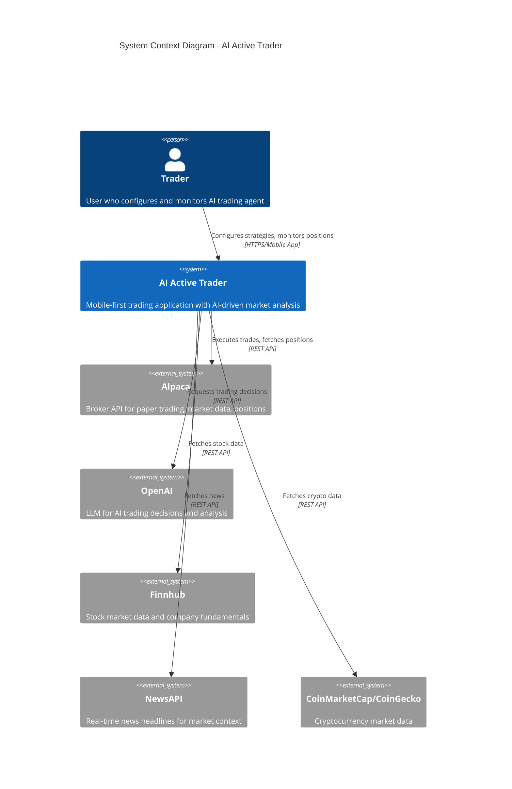
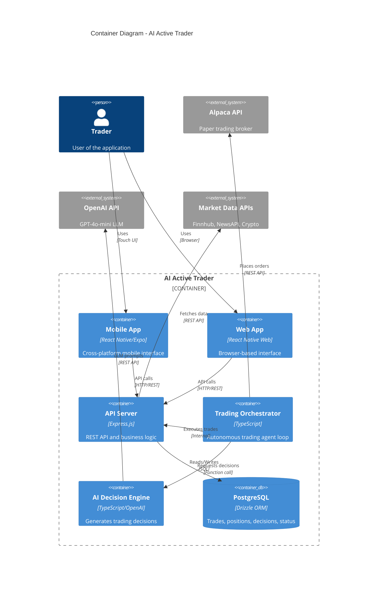

# System Architecture Documentation

> **Purpose**  
> This document describes the system architecture, component relationships, data flows, and integration patterns for the AI Active Trader application.

---

## Table of Contents

1. [High-Level Architecture](#1-high-level-architecture)
2. [Layered Architecture](#2-layered-architecture)
3. [Component Breakdown](#3-component-breakdown)
4. [Data Flow Diagrams](#4-data-flow-diagrams)
5. [External Integrations](#5-external-integrations)
6. [Database Design](#6-database-design)
7. [Orchestrator Architecture](#7-orchestrator-architecture)
8. [Security Architecture](#8-security-architecture)
9. [Deployment Architecture](#9-deployment-architecture)

---

## 1. High-Level Architecture

### 1.1 System Context Diagram (Mermaid)



### 1.2 Container Diagram (Mermaid)



### 1.3 ASCII Architecture Diagram

```
┌─────────────────────────────────────────────────────────────────────┐
│                         CLIENT LAYER                                 │
│  ┌─────────────────┐  ┌─────────────────┐  ┌─────────────────┐     │
│  │   Dashboard     │  │   Strategies    │  │   Trade History │     │
│  │   Screen        │  │   Screen        │  │   Screen        │     │
│  └────────┬────────┘  └────────┬────────┘  └────────┬────────┘     │
│           │                    │                    │               │
│           └────────────────────┼────────────────────┘               │
│                                │                                    │
│                    ┌───────────▼───────────┐                        │
│                    │   TanStack Query      │                        │
│                    │   (State Management)  │                        │
│                    └───────────┬───────────┘                        │
└────────────────────────────────┼────────────────────────────────────┘
                                 │ HTTP/REST
                                 ▼
┌─────────────────────────────────────────────────────────────────────┐
│                         SERVER LAYER                                 │
│  ┌─────────────────────────────────────────────────────────────┐   │
│  │                    Express.js API                            │   │
│  │  /api/positions  /api/trades  /api/autonomous  /api/alpaca   │   │
│  └─────────────────────────────────────────────────────────────┘   │
│                                │                                    │
│  ┌─────────────────────────────┼─────────────────────────────────┐ │
│  │                      DOMAIN LAYER                              │ │
│  │  ┌──────────────┐  ┌───────▼───────┐  ┌──────────────────┐   │ │
│  │  │   AI         │  │  Orchestrator │  │  Paper Trading   │   │ │
│  │  │   Decision   │  │  (Autonomous) │  │  Engine          │   │ │
│  │  │   Engine     │  └───────┬───────┘  └──────────────────┘   │ │
│  │  └──────────────┘          │                                  │ │
│  └────────────────────────────┼──────────────────────────────────┘ │
│                               │                                     │
│  ┌────────────────────────────┼──────────────────────────────────┐ │
│  │                     DATA ACCESS LAYER                          │ │
│  │  ┌──────────────┐  ┌───────▼───────┐  ┌──────────────────┐   │ │
│  │  │   Storage    │  │   Connectors  │  │   AI Clients     │   │ │
│  │  │   (Drizzle)  │  │   (Alpaca)    │  │   (OpenAI)       │   │ │
│  │  └──────┬───────┘  └───────────────┘  └──────────────────┘   │ │
│  └─────────┼─────────────────────────────────────────────────────┘ │
└────────────┼────────────────────────────────────────────────────────┘
             │
             ▼
┌─────────────────────────────────────────────────────────────────────┐
│                      EXTERNAL SERVICES                               │
│  ┌──────────┐  ┌──────────┐  ┌──────────┐  ┌──────────┐            │
│  │PostgreSQL│  │  Alpaca  │  │  OpenAI  │  │ Finnhub  │            │
│  │ Database │  │   API    │  │   API    │  │   API    │            │
│  └──────────┘  └──────────┘  └──────────┘  └──────────┘            │
└─────────────────────────────────────────────────────────────────────┘
```

---

## 2. Layered Architecture

### 2.1 Layer Responsibilities

| Layer | Responsibility | Key Files |
|-------|---------------|-----------|
| **Presentation** | UI rendering, user interaction | `client/screens/*.tsx`, `client/components/*.tsx` |
| **API** | HTTP endpoints, request/response handling | `server/routes.ts` |
| **Domain** | Business logic, trading rules, AI decisions | `server/autonomous/`, `server/ai/`, `server/trading/` |
| **Data Access** | Database operations, external API calls | `server/storage.ts`, `server/connectors/` |
| **External** | Third-party services | Alpaca, OpenAI, Finnhub, NewsAPI |

### 2.2 Dependency Rules

```
Presentation → API → Domain → Data Access → External
     ↓          ↓       ↓          ↓
   (uses)    (uses)  (uses)     (uses)
```

**Rules:**
1. Higher layers may depend on lower layers
2. Lower layers MUST NOT depend on higher layers
3. Cross-layer calls go through defined interfaces
4. Shared types live in `shared/` directory

---

## 3. Component Breakdown

### 3.1 Client Components

```
client/
├── App.tsx                    # Root component with providers
├── navigation/
│   ├── RootNavigator.tsx      # Main navigation structure
│   └── BottomTabNavigator.tsx # Tab bar navigation
├── screens/
│   ├── DashboardScreen.tsx    # Main dashboard (positions, P&L)
│   ├── StrategiesScreen.tsx   # Strategy management
│   ├── TradesScreen.tsx       # Trade history
│   └── SettingsScreen.tsx     # App settings
├── components/
│   ├── Card.tsx               # Reusable card component
│   ├── ThemedText.tsx         # Themed typography
│   └── ErrorBoundary.tsx      # Error handling
└── lib/
    └── query-client.ts        # TanStack Query configuration
```

### 3.2 Server Components

```
server/
├── index.ts                   # Express app entry point
├── routes.ts                  # API endpoint definitions (~2500 lines)
├── storage.ts                 # Database operations (IStorage)
├── db.ts                      # Drizzle ORM connection
├── autonomous/
│   └── orchestrator.ts        # Trading agent core logic
├── ai/
│   ├── decision-engine.ts     # AI trade recommendations
│   └── market-condition-analyzer.ts  # Market analysis
├── trading/
│   └── paper-trading-engine.ts # Paper trading execution
├── connectors/
│   ├── alpaca.ts              # Alpaca broker API
│   ├── finnhub.ts             # Stock market data
│   └── news.ts                # News API integration
└── utils/
    └── numeric.ts             # Safe numeric operations
```

### 3.3 Shared Components

```
shared/
└── schema.ts                  # Database schema + Zod validation
    ├── users                  # User authentication
    ├── strategies             # Trading strategies
    ├── trades                 # Trade history
    ├── positions              # Open positions
    ├── aiDecisions            # AI decision log
    └── agentStatus            # Agent runtime state
```

---

## 4. Data Flow Diagrams

### 4.1 Trade Execution Flow

```
┌─────────────┐     ┌─────────────┐     ┌─────────────┐
│   Market    │     │    AI       │     │   Trade     │
│   Data      │────▶│  Decision   │────▶│  Execution  │
│   (Alpaca)  │     │   Engine    │     │             │
└─────────────┘     └─────────────┘     └──────┬──────┘
                                               │
                    ┌─────────────┐             │
                    │  Alpaca     │◀────────────┘
                    │  Orders API │
                    └──────┬──────┘
                           │
                           ▼
                    ┌─────────────┐     ┌─────────────┐
                    │   Order     │────▶│  Database   │
                    │   Fill      │     │  (trades,   │
                    │   Tracking  │     │  positions) │
                    └─────────────┘     └─────────────┘
```

### 4.2 Dashboard Data Flow

```
┌─────────────────────────────────────────────────────────┐
│                    DashboardScreen                       │
│  ┌─────────────┐  ┌─────────────┐  ┌─────────────┐     │
│  │  Positions  │  │  Analytics  │  │  Agent      │     │
│  │  Widget     │  │  Widget     │  │  Status     │     │
│  └──────┬──────┘  └──────┬──────┘  └──────┬──────┘     │
└─────────┼────────────────┼────────────────┼─────────────┘
          │                │                │
          ▼                ▼                ▼
    useQuery          useQuery         useQuery
    [/api/positions]  [/api/analytics] [/api/agent/status]
          │                │                │
          └────────────────┼────────────────┘
                           │
                           ▼
                    ┌─────────────┐
                    │  Express    │
                    │  Server     │
                    └──────┬──────┘
                           │
          ┌────────────────┼────────────────┐
          ▼                ▼                ▼
    ┌──────────┐    ┌──────────┐    ┌──────────┐
    │  Alpaca  │    │  Storage │    │ Orchestr │
    │  API     │    │  (DB)    │    │  ator    │
    └──────────┘    └──────────┘    └──────────┘
```

### 4.3 Orchestrator Cycle

```
┌────────────────────────────────────────────────────────────┐
│                    ORCHESTRATOR LOOP                        │
│                                                             │
│  ┌──────────────┐                                          │
│  │  Heartbeat   │◀──────────────────────────────────┐     │
│  │  (30s)       │                                    │     │
│  └──────┬───────┘                                    │     │
│         │                                            │     │
│         ▼                                            │     │
│  ┌──────────────┐     ┌──────────────┐              │     │
│  │  Analysis    │────▶│  AI Decision │              │     │
│  │  Cycle (60s) │     │  Generation  │              │     │
│  └──────────────┘     └──────┬───────┘              │     │
│                              │                       │     │
│                              ▼                       │     │
│                       ┌──────────────┐              │     │
│                       │  Risk Check  │              │     │
│                       └──────┬───────┘              │     │
│                              │                       │     │
│         ┌────────────────────┼────────────────────┐ │     │
│         ▼                    ▼                    ▼ │     │
│  ┌────────────┐       ┌────────────┐       ┌──────────┐  │
│  │   SKIP     │       │   EXECUTE  │       │   HOLD   │──┘
│  │   (limits) │       │   Order    │       │          │
│  └────────────┘       └──────┬─────┘       └──────────┘
│                              │
│                              ▼
│                       ┌──────────────┐
│                       │  Update DB   │
│                       │  Log Trade   │
│                       └──────────────┘
└────────────────────────────────────────────────────────────┘
```

---

## 5. External Integrations

### 5.1 Integration Map

```
┌─────────────────────────────────────────────────────────────────┐
│                         AI ACTIVE TRADER                         │
│                                                                  │
│  ┌──────────────────────────────────────────────────────────┐  │
│  │                    BROKER LAYER                           │  │
│  │  ┌──────────────────────────────────────────────────┐    │  │
│  │  │              Alpaca (Paper Trading)               │    │  │
│  │  │  • Account info    • Order execution              │    │  │
│  │  │  • Positions       • Market data (stocks/crypto)  │    │  │
│  │  │  • Historical bars • Asset information            │    │  │
│  │  └──────────────────────────────────────────────────┘    │  │
│  └──────────────────────────────────────────────────────────┘  │
│                                                                  │
│  ┌──────────────────────────────────────────────────────────┐  │
│  │                    AI LAYER                               │  │
│  │  ┌────────────────────┐  ┌────────────────────┐         │  │
│  │  │      OpenAI        │  │    OpenRouter      │         │  │
│  │  │   (Primary LLM)    │  │    (Fallback)      │         │  │
│  │  │   gpt-4o-mini      │  │   Various models   │         │  │
│  │  └────────────────────┘  └────────────────────┘         │  │
│  └──────────────────────────────────────────────────────────┘  │
│                                                                  │
│  ┌──────────────────────────────────────────────────────────┐  │
│  │                  MARKET DATA LAYER                        │  │
│  │  ┌──────────┐  ┌──────────┐  ┌──────────┐  ┌──────────┐ │  │
│  │  │ Finnhub  │  │ NewsAPI  │  │CoinMktCap│  │CoinGecko │ │  │
│  │  │ Stocks   │  │ Headlines│  │  Crypto  │  │  Crypto  │ │  │
│  │  └──────────┘  └──────────┘  └──────────┘  └──────────┘ │  │
│  └──────────────────────────────────────────────────────────┘  │
└─────────────────────────────────────────────────────────────────┘
```

### 5.2 Integration Details

| Service | Purpose | Rate Limits | Fallback |
|---------|---------|-------------|----------|
| **Alpaca** | Broker, market data | 200 req/min | None (critical) |
| **OpenAI** | AI decisions | Token-based | OpenRouter |
| **Finnhub** | Stock quotes | 60 req/min | Alpaca data |
| **NewsAPI** | Headlines | 100 req/day | Cached data |
| **CoinMarketCap** | Crypto data | 333 req/day | CoinGecko |
| **CoinGecko** | Crypto data | 50 req/min | None |

### 5.3 Adapter Pattern

All external services implement adapters for swappability:

```typescript
// Example: Broker Adapter Interface
interface IBrokerConnector {
  getAccount(): Promise<Account>;
  getPositions(): Promise<Position[]>;
  placeOrder(order: OrderRequest): Promise<Order>;
  cancelOrder(orderId: string): Promise<void>;
}

// Alpaca implementation
class AlpacaConnector implements IBrokerConnector {
  // ... implementation
}
```

---

## 6. Database Design

### 6.1 Entity Relationship Diagram

```
┌─────────────┐       ┌─────────────┐       ┌─────────────┐
│   users     │       │  strategies │       │   trades    │
├─────────────┤       ├─────────────┤       ├─────────────┤
│ id (PK)     │       │ id (PK)     │◀──────│ strategyId  │
│ username    │       │ name        │       │ id (PK)     │
│ password    │       │ type        │       │ symbol      │
└─────────────┘       │ description │       │ side        │
                      │ isActive    │       │ quantity    │
                      │ assets[]    │       │ price       │
                      │ parameters  │       │ pnl         │
                      │ createdAt   │       │ executedAt  │
                      │ updatedAt   │       │ status      │
                      └─────────────┘       │ notes       │
                             │              └─────────────┘
                             │                     │
                             ▼                     ▼
                      ┌─────────────┐       ┌─────────────┐
                      │  positions  │       │ aiDecisions │
                      ├─────────────┤       ├─────────────┤
                      │ id (PK)     │       │ id (PK)     │
                      │ symbol      │       │ strategyId  │
                      │ quantity    │       │ symbol      │
                      │ entryPrice  │       │ action      │
                      │ currentPrice│       │ confidence  │
                      │ unrealizedPnl       │ reasoning   │
                      │ side        │       │ marketContext
                      │ strategyId  │       │ executedTradeId
                      │ openedAt    │       │ status      │
                      └─────────────┘       │ stopLoss    │
                                            │ takeProfit  │
                                            │ createdAt   │
                                            └─────────────┘
                                                   │
                                                   │
                      ┌─────────────┐              │
                      │ agentStatus │◀─────────────┘
                      ├─────────────┤
                      │ id (PK)     │
                      │ isRunning   │
                      │ lastHeartbeat
                      │ totalTrades │
                      │ totalPnl    │
                      │ cashBalance │
                      │ killSwitchActive
                      │ riskLimits  │
                      │ autoStartEnabled
                      └─────────────┘
```

### 6.2 Data Types

| Field Pattern | PostgreSQL Type | TypeScript Type |
|---------------|-----------------|-----------------|
| IDs | `varchar` with UUID default | `string` |
| Prices, quantities | `numeric` | `string` (parsed to `number`) |
| Timestamps | `timestamp` | `Date` |
| Flags | `boolean` | `boolean` |
| JSON data | `text` | `string` (JSON serialized) |
| Arrays | `text[]` | `string[]` |

---

## 7. Orchestrator Architecture

### 7.1 State Machine

```
                    ┌─────────────────────────────────────┐
                    │              STOPPED                 │
                    │  • All timers inactive               │
                    │  • Waiting for start command         │
                    └─────────────────┬───────────────────┘
                                      │
                                      │ start() / autoStart()
                                      ▼
                    ┌─────────────────────────────────────┐
                    │              STARTING                │
                    │  • Initialize market analyzer        │
                    │  • Load risk limits from DB          │
                    │  • Start heartbeat timer             │
                    └─────────────────┬───────────────────┘
                                      │
                                      │ success
                                      ▼
    ┌───────────────┬─────────────────────────────────────┬───────────────┐
    │               │              RUNNING                 │               │
    │               │  • Analysis timer active (60s)       │               │
    │  killSwitch   │  • Position timer active (30s)       │  5 errors     │
    │     ─────────▶│  • Heartbeat timer active (30s)      │◀─────────     │
    │               │  • Processing market signals         │               │
    │               └─────────────────┬───────────────────┘               │
    │                                 │                                    │
    │                                 │ stop()                             │
    │                                 ▼                                    │
    │               ┌─────────────────────────────────────┐               │
    │               │             STOPPING                 │               │
    │               │  • Cancel all timers                 │               │
    │               │  • Update DB status                  │               │
    │               └─────────────────┬───────────────────┘               │
    │                                 │                                    │
    │                                 ▼                                    │
    │               ┌─────────────────────────────────────┐               │
    └──────────────▶│              STOPPED                 │◀──────────────┘
                    └─────────────────────────────────────┘
                                      │
                                      │ self-heal (if autoStart enabled)
                                      ▼
                    ┌─────────────────────────────────────┐
                    │            SELF-HEALING              │
                    │  • Wait 5 seconds                    │
                    │  • Reset error counters              │
                    │  • Restart if autoStart enabled      │
                    └─────────────────────────────────────┘
```

### 7.2 Timer Configuration

| Timer | Interval | Purpose | Failure Handling |
|-------|----------|---------|------------------|
| Analysis | 60s | Run AI market analysis, generate signals | Increment error counter |
| Position | 30s | Check positions, apply stop-loss/take-profit | Log and continue |
| Heartbeat | 30s | Health check, detect stale state | Trigger self-heal if stale |

### 7.3 Risk Controls

```typescript
interface RiskLimits {
  maxPositionSizePercent: number;    // Default: 10%
  maxTotalExposurePercent: number;   // Default: 50%
  maxPositionsCount: number;         // Default: 10
  dailyLossLimitPercent: number;     // Default: 5%
  killSwitchActive: boolean;         // Default: false
}
```

---

## 8. Security Architecture

### 8.1 Secret Management

```
┌─────────────────────────────────────────────────────────────┐
│                    REPLIT SECRETS PANEL                      │
│  ┌─────────────────────────────────────────────────────┐   │
│  │  ALPACA_API_KEY         ●●●●●●●●●●●●●●●●           │   │
│  │  ALPACA_SECRET_KEY      ●●●●●●●●●●●●●●●●           │   │
│  │  FINNHUB_API_KEY        ●●●●●●●●●●●●●●●●           │   │
│  │  NEWS_API_KEY           ●●●●●●●●●●●●●●●●           │   │
│  │  SESSION_SECRET         ●●●●●●●●●●●●●●●●           │   │
│  │  DATABASE_URL           (auto-set by Replit)        │   │
│  └─────────────────────────────────────────────────────┘   │
└───────────────────────────────┬─────────────────────────────┘
                                │
                                │ process.env
                                ▼
                    ┌─────────────────────────────────────┐
                    │           SERVER PROCESS             │
                    │  • Secrets loaded at startup         │
                    │  • Never logged or returned to UI    │
                    │  • Never committed to repository     │
                    └─────────────────────────────────────┘
```

### 8.2 Authentication Flow

```
┌──────────┐     POST /api/auth/login     ┌──────────┐
│  Client  │─────────────────────────────▶│  Server  │
└──────────┘                              └────┬─────┘
                                               │
                                               ▼
                                    ┌─────────────────────┐
                                    │  Validate password  │
                                    │  (bcrypt compare)   │
                                    └──────────┬──────────┘
                                               │
                                               ▼
                                    ┌─────────────────────┐
                                    │  Create session     │
                                    │  (express-session)  │
                                    └──────────┬──────────┘
                                               │
     Set-Cookie: session=xxx                   │
┌──────────┐◀──────────────────────────────────┘
│  Client  │
└──────────┘
```

---

## 9. Deployment Architecture

### 9.1 Replit Deployment

```
┌─────────────────────────────────────────────────────────────┐
│                    REPLIT CONTAINER                          │
│                                                              │
│  ┌────────────────────┐    ┌────────────────────┐          │
│  │   Express Server   │    │   Expo Metro       │          │
│  │   Port 5000        │    │   Port 8081        │          │
│  └─────────┬──────────┘    └─────────┬──────────┘          │
│            │                         │                      │
│            └───────────┬─────────────┘                      │
│                        │                                    │
│                        ▼                                    │
│            ┌────────────────────────┐                       │
│            │   Replit Proxy         │                       │
│            │   (HTTPS termination)  │                       │
│            └───────────┬────────────┘                       │
│                        │                                    │
└────────────────────────┼────────────────────────────────────┘
                         │
                         ▼
              ┌────────────────────────┐
              │   *.replit.app         │
              │   (Public domain)      │
              └────────────────────────┘
```

### 9.2 Database Connection

```
┌─────────────────────────────────────────────────────────────┐
│                    REPLIT CONTAINER                          │
│  ┌────────────────────┐                                     │
│  │   Drizzle ORM      │                                     │
│  │   (Connection Pool)│                                     │
│  └─────────┬──────────┘                                     │
│            │                                                 │
│            │ DATABASE_URL (auto-set)                         │
│            ▼                                                 │
└────────────┼─────────────────────────────────────────────────┘
             │
             │ Encrypted connection
             ▼
┌─────────────────────────────────────────────────────────────┐
│                  NEON POSTGRESQL                             │
│  ┌────────────────────────────────────────────────────┐    │
│  │  Database: ai_active_trader                         │    │
│  │  • users, strategies, trades, positions             │    │
│  │  • aiDecisions, agentStatus                         │    │
│  └────────────────────────────────────────────────────┘    │
└─────────────────────────────────────────────────────────────┘
```

---

## Architectural Decisions Log

| Date | Decision | Rationale |
|------|----------|-----------|
| 2024 | Monorepo structure | Simplifies type sharing between client/server |
| 2024 | Drizzle ORM | Type-safe, performant, good DX |
| 2024 | TanStack Query | Best-in-class server state management |
| 2024 | Paper trading only | MVP validation without financial risk |
| 2024 | Alpaca as primary | Best paper trading API, supports stocks + crypto |
| 2024 | OpenAI + fallback | Reliable AI with OpenRouter as backup |

---

*Last Updated: December 2024*
