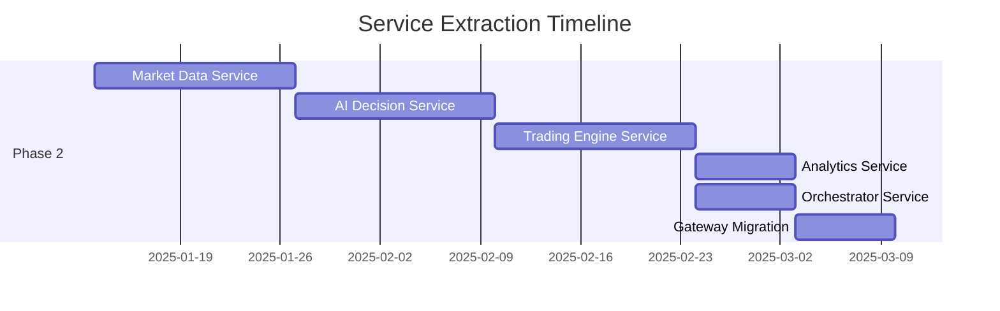

# Microservices Transformation Roadmap

> **Vision:** Transform AI Active Trader into a modular, event-driven platform with plug-and-play services that can be independently developed, deployed, and scaled.

---

## Architecture Overview

```
┌─────────────────────────────────────────────────────────────────────────────┐
│                              API GATEWAY                                      │
│                    (Auth, Rate Limiting, Routing)                            │
└──────────────────────────────────┬──────────────────────────────────────────┘
                                   │
                    ┌──────────────┴──────────────┐
                    │                             │
                    ▼                             ▼
          ┌─────────────────┐           ┌─────────────────┐
          │   Mobile App    │           │    Web App      │
          │  (React Native) │           │ (React Native)  │
          └─────────────────┘           └─────────────────┘
                                   │
┌──────────────────────────────────┴──────────────────────────────────────────┐
│                           EVENT BUS (NATS JetStream)                         │
│  ┌────────────┐ ┌────────────┐ ┌────────────┐ ┌────────────┐ ┌────────────┐│
│  │ market.*   │ │ trade.*    │ │ ai.*       │ │ analytics.*│ │ system.*   ││
│  └────────────┘ └────────────┘ └────────────┘ └────────────┘ └────────────┘│
└─────────────────────────────────────────────────────────────────────────────┘
         │              │              │              │              │
         ▼              ▼              ▼              ▼              ▼
┌─────────────┐ ┌─────────────┐ ┌─────────────┐ ┌─────────────┐ ┌─────────────┐
│   Market    │ │  Trading    │ │     AI      │ │  Analytics  │ │ Orchestrator│
│   Data      │ │   Engine    │ │  Decision   │ │   Service   │ │   Service   │
│   Service   │ │   Service   │ │   Service   │ │             │ │             │
├─────────────┤ ├─────────────┤ ├─────────────┤ ├─────────────┤ ├─────────────┤
│ • Alpaca    │ │ • Orders    │ │ • LLM Router│ │ • P&L Calc  │ │ • Scheduling│
│ • Finnhub   │ │ • Positions │ │ • Data Fuse │ │ • Metrics   │ │ • Sagas     │
│ • CoinGecko │ │ • Risk Mgmt │ │ • Prompts   │ │ • Reports   │ │ • Coord     │
│ • NewsAPI   │ │ • Execution │ │ • Features  │ │ • Backtest  │ │ • State     │
└──────┬──────┘ └──────┬──────┘ └──────┬──────┘ └──────┬──────┘ └──────┬──────┘
       │               │               │               │               │
       ▼               ▼               ▼               ▼               ▼
┌─────────────────────────────────────────────────────────────────────────────┐
│                           PostgreSQL (Per-Service Schemas)                   │
│  ┌──────────┐  ┌──────────┐  ┌──────────┐  ┌──────────┐  ┌──────────┐      │
│  │ market   │  │ trading  │  │ ai       │  │analytics │  │orchestr  │      │
│  │ _data    │  │          │  │          │  │          │  │ ation    │      │
│  └──────────┘  └──────────┘  └──────────┘  └──────────┘  └──────────┘      │
└─────────────────────────────────────────────────────────────────────────────┘
```

---

## Phase 0: Discovery & Foundation (Weeks 1-3)

### Objectives
- Validate architecture decisions
- Set up infrastructure sandbox
- Establish team conventions

### Deliverables

| Task | Owner | Status | Acceptance Criteria |
|------|-------|--------|---------------------|
| ADR-001: Microservices Architecture | Architect | ✅ Done | Team approved |
| ADR-002: Event Bus Selection | Architect | ✅ Done | NATS selected |
| ADR-003: Container Standards | Architect | ✅ Done | Dockerfile templates |
| Infrastructure sandbox | DevOps | 🔄 In Progress | K8s namespace available |
| NATS JetStream PoC | Backend | ✅ Done | 9 smoke tests passing |
| Schema registry setup | Backend | ✅ Done | Zod validation integrated |
| OpenTelemetry integration | Backend | ✅ Done | 16 smoke tests passing |

### Exit Criteria
- [x] All ADRs approved and documented
- [x] NATS cluster running in sandbox
- [x] Sample event published and consumed
- [x] Tracing pipeline functional

---

## Phase 1: Platform Foundation (Weeks 4-9)

### Objectives
- Build shared infrastructure
- Create service templates
- Establish CI/CD patterns

### Deliverables

| Task | Owner | Status | Acceptance Criteria |
|------|-------|--------|---------------------|
| Service template repository | Platform | ✅ Done | Template with Dockerfile, health checks, config |
| Shared TypeScript packages | Platform | ✅ Done | `services/shared/common`, `services/shared/events` |
| GitHub Actions workflows | DevOps | ⏳ Pending | Build, test, deploy pipelines |
| API Gateway (Express) | Platform | ✅ Done | Reverse proxy, auth middleware, rate limiting |
| Secrets management (Vault) | DevOps | ⏳ Pending | Secrets injected at runtime |
| OpenTelemetry Collector | DevOps | ✅ Done | Traces, metrics, context propagation |
| Per-service database schemas | Backend | ✅ Done | Drizzle schemas for trading, ai, analytics, orchestrator |

### Shared Packages

```
packages/
├── @ai-trader/events           # Event type definitions
│   ├── market.ts               # MarketQuoteEvent, MarketBarEvent
│   ├── trade.ts                # OrderEvent, PositionEvent
│   ├── ai.ts                   # DecisionEvent, CalibrationEvent
│   └── index.ts                # Barrel export
├── @ai-trader/common           # Shared utilities
│   ├── config.ts               # Configuration loading
│   ├── logger.ts               # Structured logging
│   ├── health.ts               # Health endpoint helpers
│   └── nats.ts                 # NATS client wrapper
└── @ai-trader/contracts        # API contracts (OpenAPI)
    ├── trading-engine.yaml
    ├── ai-decision.yaml
    └── market-data.yaml
```

### Exit Criteria
- [x] New service created in <5 minutes from template
- [x] Events published with schema validation
- [ ] CI/CD deploys to staging on merge
- [ ] Secrets injected at runtime via Vault

---

## Phase 2: Domain Decomposition (Weeks 10-17)

### Objectives
- Extract services from monolith
- Implement event-driven communication
- Validate with dual-run

### Phase 2 Progress Summary

| Task | Status | Tests | Notes |
|------|--------|-------|-------|
| Dual-write repositories | ✅ Done | 11 smoke tests | DualWriteRepository pattern for gradual migration |
| Market Data Service extraction | ✅ Done | - | Connector abstraction, event emission |
| Trading Engine persistence | ✅ Done | 13 smoke tests | Order/position repositories with DB persistence |
| Feature flag routing | ✅ Done | 23 smoke tests | Strangler fig pattern for traffic splitting |

### Service Extraction Order



### 2.1 Market Data Service (Weeks 10-11)

**Current Location:** `server/connectors/alpaca.ts`, `server/connectors/finnhub.ts`, etc.

**Target Interface:**
```typescript
interface MarketDataService {
  // REST API
  GET /api/v1/quotes/:symbol
  GET /api/v1/bars/:symbol?timeframe=1m&limit=100
  GET /api/v1/news?symbols=AAPL,TSLA
  
  // Events Published
  market.quote.received
  market.bar.1m
  market.bar.1d
  market.news.published
}
```

**Migration Steps:**
1. Create `services/market-data/` from template
2. Copy connector logic, add NATS publisher
3. Run dual: monolith + microservice
4. Validate event ordering and latency
5. Switch API Gateway to new service
6. Remove from monolith

### 2.2 AI Decision Service (Weeks 12-13)

**Current Location:** `server/ai/decision-engine.ts`, `server/ai/llmRouter.ts`

**Target Interface:**
```typescript
interface AIDecisionService {
  // REST API (sync for debugging)
  POST /api/v1/decisions/generate
  GET /api/v1/decisions/:id
  
  // Events Subscribed
  market.quote.received
  trade.position.updated
  
  // Events Published
  ai.decision.generated
  ai.decision.validated
  ai.calibration.completed
}
```

### 2.3 Trading Engine Service (Weeks 14-15)

**Current Location:** `server/trading/alpaca-trading-engine.ts`, `server/trading/order-execution-flow.ts`

**Target Interface:**
```typescript
interface TradingEngineService {
  // REST API
  POST /api/v1/orders
  DELETE /api/v1/orders/:id
  GET /api/v1/positions
  
  // Events Subscribed
  ai.decision.generated
  
  // Events Published
  trade.order.submitted
  trade.order.filled
  trade.order.rejected
  trade.position.updated
}
```

### 2.4 Analytics Service (Week 16)

**Current Location:** Various P&L calculations scattered in routes

**Target Interface:**
```typescript
interface AnalyticsService {
  // REST API
  GET /api/v1/analytics/summary
  GET /api/v1/analytics/pnl?period=1d
  GET /api/v1/analytics/equity-curve
  
  // Events Subscribed
  trade.order.filled
  trade.position.updated
  market.bar.1d
  
  // Events Published
  analytics.pnl.calculated
  analytics.metrics.snapshot
}
```

### 2.5 Orchestrator Service (Week 16-17)

**Current Location:** `server/autonomous/orchestrator.ts`

**Target Interface:**
```typescript
interface OrchestratorService {
  // REST API
  POST /api/v1/agent/start
  POST /api/v1/agent/stop
  GET /api/v1/agent/status
  
  // Events Subscribed
  system.heartbeat
  trade.order.filled
  ai.decision.generated
  
  // Events Published
  orchestrator.cycle.started
  orchestrator.cycle.completed
  system.error.occurred
}
```

### Exit Criteria
- [x] Dual-write repositories for gradual migration
- [x] Feature flags for traffic splitting (strangler fig pattern)
- [x] Market Data and Trading Engine services extracted
- [ ] AI Decision, Analytics, Orchestrator services extracted
- [ ] All 5 services running independently
- [ ] Monolith deprecated (read-only mode)
- [ ] Event replay tests passing
- [ ] Latency SLOs met (<100ms order execution)

---

## Phase 3: Optimization & Ecosystem (Weeks 18+)

### Objectives
- Performance tuning
- n8n workflow integration
- Feature parity with competitors

### 3.1 Performance Optimization

| Optimization | Target | Current | Status |
|--------------|--------|---------|--------|
| Order execution latency | <50ms p99 | ~200ms | ⏳ |
| Quote propagation | <10ms p99 | ~50ms | ⏳ |
| AI decision time | <5s | ~3s | ✅ |
| Event throughput | 10K/sec | 1K/sec | ⏳ |

### 3.2 n8n Workflow Integration

```
┌─────────────────────────────────────────────────────────────────────┐
│                           n8n AUTOMATION HUB                         │
├─────────────────────────────────────────────────────────────────────┤
│                                                                      │
│  ┌─────────────────┐  ┌─────────────────┐  ┌─────────────────┐    │
│  │  Trade Alerts   │  │  Data Pipeline  │  │   AI Workflow   │    │
│  │  • Telegram     │  │  • Google Sheets│  │  • Multi-Agent  │    │
│  │  • Slack        │  │  • Notion       │  │  • Analysis     │    │
│  │  • Email        │  │  • Airtable     │  │  • ICT Strategy │    │
│  └────────┬────────┘  └────────┬────────┘  └────────┬────────┘    │
│           │                    │                    │              │
│           └────────────────────┼────────────────────┘              │
│                                │                                    │
│                    ┌───────────▼───────────┐                       │
│                    │    n8n Webhook API    │                       │
│                    └───────────┬───────────┘                       │
│                                │                                    │
└────────────────────────────────┼────────────────────────────────────┘
                                 │
                    ┌────────────▼────────────┐
                    │  NATS Event Bridge      │
                    │  (Events ↔ Webhooks)    │
                    └─────────────────────────┘
```

**Imported Workflows:**
1. [Automated Stock Trading with AI + Google Sheets](https://n8n.io/workflows/5711)
2. [AI-Driven Technical Analysis + Alpaca](https://n8n.io/workflows/7240)
3. [ICT Crypto Bot with GPT-4o](https://n8n.io/workflows/8453)
4. [Multi-Agent Trading Analysis](https://n8n.io/workflows/8569)
5. [Smart Stock Recommendations](https://n8n.io/workflows/8594)

### 3.3 Competitive Feature Parity

**QuantConnect Features to Implement:**

| Feature | Priority | Status | Target |
|---------|----------|--------|--------|
| Backtesting Engine | High | ⏳ Pending | Q1 2025 |
| Historical Data Access | High | ✅ Partial | Expand |
| Strategy Versioning | Medium | ⏳ Pending | Q2 2025 |
| Team Collaboration | Medium | ⏳ Pending | Q2 2025 |
| Alpha Marketplace | Low | ⏳ Pending | Q3 2025 |

**Alpaca Features to Match:**

| Feature | Priority | Status | Target |
|---------|----------|--------|--------|
| MCP Server (AI Control) | High | ⏳ Pending | Q1 2025 |
| Extended Hours Trading | High | ✅ Done | - |
| Crypto Trading | Medium | ✅ Done | - |
| Paper Trading | High | ✅ Done | - |

### 3.4 New Integrations

| Integration | Purpose | Priority | Status |
|-------------|---------|----------|--------|
| Polygon.io | Premium market data | High | ⏳ Pending |
| Twelve Data | Technical indicators | High | ⏳ Pending |
| Kaiko | Crypto order book depth | Medium | ⏳ Pending |
| StockTwits | Social sentiment | Medium | ⏳ Pending |
| Reddit API | Social sentiment | Medium | ⏳ Pending |
| Anthropic Claude | Alternative LLM | Low | ⏳ Pending |
| DeepSeek | Cost-effective LLM | Low | ⏳ Pending |

---

## Success Metrics

### Technical KPIs

| Metric | Target | Measurement |
|--------|--------|-------------|
| Service Availability | 99.9% | Uptime per service |
| Order Execution Latency | <50ms p99 | End-to-end timing |
| Event Processing Rate | 10K/sec | NATS metrics |
| Deployment Frequency | 10x/week | GitHub Actions |
| Mean Time to Recovery | <5 min | Incident tracking |
| Test Coverage | >80% | Jest coverage |

### Business KPIs

| Metric | Target | Measurement |
|--------|--------|-------------|
| Trading Accuracy | >60% win rate | Analytics service |
| Paper P&L | Positive monthly | Performance reports |
| Strategy Count | 10+ active | Database |
| User Satisfaction | >4.5/5 | Feedback |

---

## Risk Register

| Risk | Probability | Impact | Mitigation |
|------|-------------|--------|------------|
| Service boundaries wrong | Medium | High | Start with Strangler Fig, dual-run |
| Event ordering issues | Low | High | Use partition keys, test replay |
| Performance regression | Medium | Medium | Benchmark before/after |
| Team learning curve | Medium | Medium | Documentation, pairing |
| Vendor lock-in | Low | Medium | Abstract all external services |

---

## Team Structure

```
┌─────────────────────────────────────────────────────────────────────┐
│                         ENGINEERING TEAM                             │
├─────────────────────────────────────────────────────────────────────┤
│                                                                      │
│  ┌─────────────────┐  ┌─────────────────┐  ┌─────────────────┐    │
│  │   Platform      │  │   Domain        │  │   Frontend      │    │
│  │   Engineering   │  │   Engineering   │  │   Engineering   │    │
│  ├─────────────────┤  ├─────────────────┤  ├─────────────────┤    │
│  │ • Event Bus     │  │ • Trading Engine│  │ • Mobile App    │    │
│  │ • API Gateway   │  │ • AI Decision   │  │ • Web App       │    │
│  │ • Observability │  │ • Market Data   │  │ • Components    │    │
│  │ • CI/CD         │  │ • Analytics     │  │ • UX            │    │
│  │ • Security      │  │ • Orchestrator  │  │                 │    │
│  └─────────────────┘  └─────────────────┘  └─────────────────┘    │
│                                                                      │
└─────────────────────────────────────────────────────────────────────┘
```

---

## Appendix: Service Specifications

Detailed specifications for each service are in the `docs/services/` directory:
- [Trading Engine Service](./services/TRADING_ENGINE.md)
- [AI Decision Service](./services/AI_DECISION.md)
- [Market Data Service](./services/MARKET_DATA.md)
- [Analytics Service](./services/ANALYTICS.md)
- [Orchestrator Service](./services/ORCHESTRATOR.md)
- [API Gateway](./services/API_GATEWAY.md)
