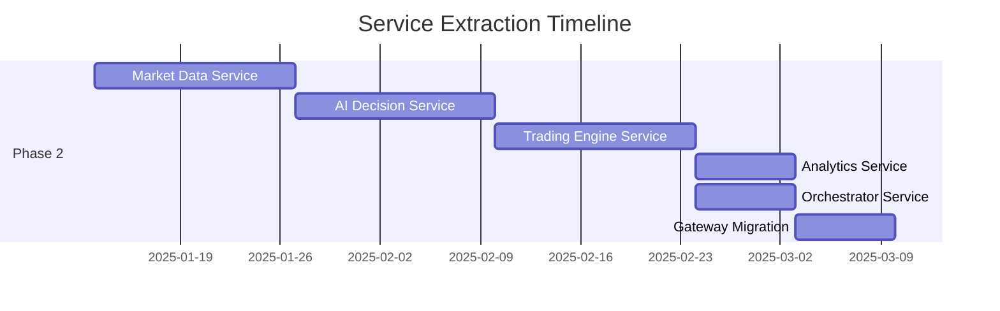

# Microservices Transformation Roadmap

> **Vision:** Transform AI Active Trader into a modular, event-driven platform with plug-and-play services that can be independently developed, deployed, and scaled.

---

## Architecture Overview

```
┌─────────────────────────────────────────────────────────────────────────────┐
│                              API GATEWAY                                      │
│                    (Auth, Rate Limiting, Routing)                            │
└──────────────────────────────────┬──────────────────────────────────────────┘
                                   │
                    ┌──────────────┴──────────────┐
                    │                             │
                    ▼                             ▼
          ┌─────────────────┐           ┌─────────────────┐
          │   Mobile App    │           │    Web App      │
          │  (React Native) │           │ (React Native)  │
          └─────────────────┘           └─────────────────┘
                                   │
┌──────────────────────────────────┴──────────────────────────────────────────┐
│                           EVENT BUS (NATS JetStream)                         │
│  ┌────────────┐ ┌────────────┐ ┌────────────┐ ┌────────────┐ ┌────────────┐│
│  │ market.*   │ │ trade.*    │ │ ai.*       │ │ analytics.*│ │ system.*   ││
│  └────────────┘ └────────────┘ └────────────┘ └────────────┘ └────────────┘│
└─────────────────────────────────────────────────────────────────────────────┘
         │              │              │              │              │
         ▼              ▼              ▼              ▼              ▼
┌─────────────┐ ┌─────────────┐ ┌─────────────┐ ┌─────────────┐ ┌─────────────┐
│   Market    │ │  Trading    │ │     AI      │ │  Analytics  │ │ Orchestrator│
│   Data      │ │   Engine    │ │  Decision   │ │   Service   │ │   Service   │
│   Service   │ │   Service   │ │   Service   │ │             │ │             │
├─────────────┤ ├─────────────┤ ├─────────────┤ ├─────────────┤ ├─────────────┤
│ • Alpaca    │ │ • Orders    │ │ • LLM Router│ │ • P&L Calc  │ │ • Scheduling│
│ • Finnhub   │ │ • Positions │ │ • Data Fuse │ │ • Metrics   │ │ • Sagas     │
│ • CoinGecko │ │ • Risk Mgmt │ │ • Prompts   │ │ • Reports   │ │ • Coord     │
│ • NewsAPI   │ │ • Execution │ │ • Features  │ │ • Backtest  │ │ • State     │
└──────┬──────┘ └──────┬──────┘ └──────┬──────┘ └──────┬──────┘ └──────┬──────┘
       │               │               │               │               │
       ▼               ▼               ▼               ▼               ▼
┌─────────────────────────────────────────────────────────────────────────────┐
│                           PostgreSQL (Per-Service Schemas)                   │
│  ┌──────────┐  ┌──────────┐  ┌──────────┐  ┌──────────┐  ┌──────────┐      │
│  │ market   │  │ trading  │  │ ai       │  │analytics │  │orchestr  │      │
│  │ _data    │  │          │  │          │  │          │  │ ation    │      │
│  └──────────┘  └──────────┘  └──────────┘  └──────────┘  └──────────┘      │
└─────────────────────────────────────────────────────────────────────────────┘
```

---

## Phase 0: Discovery & Foundation (Weeks 1-3)

### Objectives
- Validate architecture decisions
- Set up infrastructure sandbox
- Establish team conventions

### Deliverables

| Task | Owner | Status | Acceptance Criteria |
|------|-------|--------|---------------------|
| ADR-001: Microservices Architecture | Architect | ✅ Done | Team approved |
| ADR-002: Event Bus Selection | Architect | ✅ Done | NATS selected |
| ADR-003: Container Standards | Architect | ✅ Done | Dockerfile templates |
| Infrastructure sandbox | DevOps | ✅ Done | K8s namespace and manifests in `infrastructure/k8s/` |
| NATS JetStream PoC | Backend | ✅ Done | 9 smoke tests passing |
| Schema registry setup | Backend | ✅ Done | Zod validation integrated |
| OpenTelemetry integration | Backend | ✅ Done | 16 smoke tests passing |

### Exit Criteria
- [x] All ADRs approved and documented
- [x] NATS cluster running in sandbox
- [x] Sample event published and consumed
- [x] Tracing pipeline functional

---

## Phase 1: Platform Foundation (Weeks 4-9)

### Objectives
- Build shared infrastructure
- Create service templates
- Establish CI/CD patterns

### Deliverables

| Task | Owner | Status | Acceptance Criteria |
|------|-------|--------|---------------------|
| Service template repository | Platform | ✅ Done | Template with Dockerfile, health checks, config |
| Shared TypeScript packages | Platform | ✅ Done | `services/shared/common`, `services/shared/events` |
| GitHub Actions workflows | DevOps | ✅ Done | Build, test, deploy pipelines in `.github/workflows/` |
| Kubernetes manifests | DevOps | ✅ Done | All services deployable via `infrastructure/k8s/` |
| API Gateway (Express) | Platform | ✅ Done | Reverse proxy, auth middleware, rate limiting |
| Secrets management (Vault) | DevOps | ⏳ Pending | Secrets injected at runtime |
| OpenTelemetry Collector | DevOps | ✅ Done | Traces, metrics, context propagation |
| Per-service database schemas | Backend | ✅ Done | Drizzle schemas for trading, ai, analytics, orchestrator |

### Shared Packages

```
packages/
├── @ai-trader/events           # Event type definitions
│   ├── market.ts               # MarketQuoteEvent, MarketBarEvent
│   ├── trade.ts                # OrderEvent, PositionEvent
│   ├── ai.ts                   # DecisionEvent, CalibrationEvent
│   └── index.ts                # Barrel export
├── @ai-trader/common           # Shared utilities
│   ├── config.ts               # Configuration loading
│   ├── logger.ts               # Structured logging
│   ├── health.ts               # Health endpoint helpers
│   └── nats.ts                 # NATS client wrapper
└── @ai-trader/contracts        # API contracts (OpenAPI)
    ├── trading-engine.yaml
    ├── ai-decision.yaml
    └── market-data.yaml
```

### Exit Criteria
- [x] New service created in <5 minutes from template
- [x] Events published with schema validation
- [x] CI/CD deploys to staging on merge (GitHub Actions configured)
- [x] Kubernetes manifests ready for all services
- [ ] Secrets injected at runtime via Vault

---

## Phase 2: Domain Decomposition (Weeks 10-17)

### Objectives
- Extract services from monolith
- Implement event-driven communication
- Validate with dual-run

### Phase 2 Progress Summary

| Task | Status | Tests | Notes |
|------|--------|-------|-------|
| Dual-write repositories | ✅ Done | 11 smoke tests | DualWriteRepository pattern for gradual migration |
| Market Data Service extraction | ✅ Done | - | Connector abstraction, event emission |
| Trading Engine persistence | ✅ Done | 13 smoke tests | Order/position repositories with DB persistence |
| Feature flag routing | ✅ Done | 23 smoke tests | Strangler fig pattern for traffic splitting |

### Service Extraction Order



### 2.1 Market Data Service (Weeks 10-11)

**Current Location:** `server/connectors/alpaca.ts`, `server/connectors/finnhub.ts`, etc.

**Target Interface:**
```typescript
interface MarketDataService {
  // REST API
  GET /api/v1/quotes/:symbol
  GET /api/v1/bars/:symbol?timeframe=1m&limit=100
  GET /api/v1/news?symbols=AAPL,TSLA
  
  // Events Published
  market.quote.received
  market.bar.1m
  market.bar.1d
  market.news.published
}
```

**Migration Steps:**
1. Create `services/market-data/` from template
2. Copy connector logic, add NATS publisher
3. Run dual: monolith + microservice
4. Validate event ordering and latency
5. Switch API Gateway to new service
6. Remove from monolith

### 2.2 AI Decision Service (Weeks 12-13)

**Current Location:** `server/ai/decision-engine.ts`, `server/ai/llmRouter.ts`

**Target Interface:**
```typescript
interface AIDecisionService {
  // REST API (sync for debugging)
  POST /api/v1/decisions/generate
  GET /api/v1/decisions/:id
  
  // Events Subscribed
  market.quote.received
  trade.position.updated
  
  // Events Published
  ai.decision.generated
  ai.decision.validated
  ai.calibration.completed
}
```

### 2.3 Trading Engine Service (Weeks 14-15)

**Current Location:** `server/trading/alpaca-trading-engine.ts`, `server/trading/order-execution-flow.ts`

**Target Interface:**
```typescript
interface TradingEngineService {
  // REST API
  POST /api/v1/orders
  DELETE /api/v1/orders/:id
  GET /api/v1/positions
  
  // Events Subscribed
  ai.decision.generated
  
  // Events Published
  trade.order.submitted
  trade.order.filled
  trade.order.rejected
  trade.position.updated
}
```

### 2.4 Analytics Service (Week 16)

**Current Location:** Various P&L calculations scattered in routes

**Target Interface:**
```typescript
interface AnalyticsService {
  // REST API
  GET /api/v1/analytics/summary
  GET /api/v1/analytics/pnl?period=1d
  GET /api/v1/analytics/equity-curve
  
  // Events Subscribed
  trade.order.filled
  trade.position.updated
  market.bar.1d
  
  // Events Published
  analytics.pnl.calculated
  analytics.metrics.snapshot
}
```

### 2.5 Orchestrator Service (Week 16-17)

**Current Location:** `server/autonomous/orchestrator.ts`

**Target Interface:**
```typescript
interface OrchestratorService {
  // REST API
  POST /api/v1/agent/start
  POST /api/v1/agent/stop
  GET /api/v1/agent/status
  
  // Events Subscribed
  system.heartbeat
  trade.order.filled
  ai.decision.generated
  
  // Events Published
  orchestrator.cycle.started
  orchestrator.cycle.completed
  system.error.occurred
}
```

### Exit Criteria
- [x] Dual-write repositories for gradual migration
- [x] Feature flags for traffic splitting (strangler fig pattern)
- [x] Market Data and Trading Engine services extracted
- [ ] AI Decision, Analytics, Orchestrator services extracted
- [ ] All 5 services running independently
- [ ] Monolith deprecated (read-only mode)
- [ ] Event replay tests passing
- [ ] Latency SLOs met (<100ms order execution)

---

## Phase 3: Optimization & Ecosystem (Weeks 18+)

### Objectives
- Performance tuning
- n8n workflow integration
- Feature parity with competitors

### 3.1 Performance Optimization

| Optimization | Target | Current | Status |
|--------------|--------|---------|--------|
| Order execution latency | <50ms p99 | ~200ms | ⏳ |
| Quote propagation | <10ms p99 | ~50ms | ⏳ |
| AI decision time | <5s | ~3s | ✅ |
| Event throughput | 10K/sec | 1K/sec | ⏳ |

### 3.2 n8n Workflow Integration

```
┌─────────────────────────────────────────────────────────────────────┐
│                           n8n AUTOMATION HUB                         │
├─────────────────────────────────────────────────────────────────────┤
│                                                                      │
│  ┌─────────────────┐  ┌─────────────────┐  ┌─────────────────┐    │
│  │  Trade Alerts   │  │  Data Pipeline  │  │   AI Workflow   │    │
│  │  • Telegram     │  │  • Google Sheets│  │  • Multi-Agent  │    │
│  │  • Slack        │  │  • Notion       │  │  • Analysis     │    │
│  │  • Email        │  │  • Airtable     │  │  • ICT Strategy │    │
│  └────────┬────────┘  └────────┬────────┘  └────────┬────────┘    │
│           │                    │                    │              │
│           └────────────────────┼────────────────────┘              │
│                                │                                    │
│                    ┌───────────▼───────────┐                       │
│                    │    n8n Webhook API    │                       │
│                    └───────────┬───────────┘                       │
│                                │                                    │
└────────────────────────────────┼────────────────────────────────────┘
                                 │
                    ┌────────────▼────────────┐
                    │  NATS Event Bridge      │
                    │  (Events ↔ Webhooks)    │
                    └─────────────────────────┘
```

**Imported Workflows:**
1. [Automated Stock Trading with AI + Google Sheets](https://n8n.io/workflows/5711)
2. [AI-Driven Technical Analysis + Alpaca](https://n8n.io/workflows/7240)
3. [ICT Crypto Bot with GPT-4o](https://n8n.io/workflows/8453)
4. [Multi-Agent Trading Analysis](https://n8n.io/workflows/8569)
5. [Smart Stock Recommendations](https://n8n.io/workflows/8594)

### 3.3 Competitive Feature Parity

**QuantConnect Features to Implement:**

| Feature | Priority | Status | Target |
|---------|----------|--------|--------|
| Backtesting Engine | High | ✅ Done | `services/shared/backtesting/` |
| Algorithm Framework | High | ✅ Done | `services/shared/algorithm-framework/` |
| Transaction Cost Analysis | High | ✅ Done | `services/shared/analytics/` |
| Historical Data Access | High | ✅ Partial | Expand |
| Strategy Versioning | Medium | ✅ Done | `services/shared/strategies/` |
| Team Collaboration | Medium | ⏳ Pending | Q2 2025 |
| Alpha Marketplace | Low | ⏳ Pending | Q3 2025 |

**Alpaca Features to Match:**

| Feature | Priority | Status | Target |
|---------|----------|--------|--------|
| MCP Server (AI Control) | High | ⏳ Pending | Q1 2025 |
| Extended Hours Trading | High | ✅ Done | - |
| Crypto Trading | Medium | ✅ Done | - |
| Paper Trading | High | ✅ Done | - |

### 3.4 New Integrations

| Integration | Purpose | Priority | Status |
|-------------|---------|----------|--------|
| Polygon.io | Premium market data | High | ⏳ Pending |
| Twelve Data | Technical indicators | High | ⏳ Pending |
| Kaiko | Crypto order book depth | Medium | ⏳ Pending |
| StockTwits | Social sentiment | Medium | ⏳ Pending |
| Reddit API | Social sentiment | Medium | ⏳ Pending |
| Anthropic Claude | Alternative LLM | Low | ⏳ Pending |
| DeepSeek | Cost-effective LLM | Low | ⏳ Pending |

---

## Phase 4: Advanced Features (Implemented)

The following advanced trading infrastructure features have been implemented in `services/shared/` and are available for use across all microservices.

### 4.1 Backtesting Engine (`services/shared/backtesting/`)

A comprehensive event-driven backtesting engine inspired by QuantConnect LEAN, Backtrader, and Zipline.

**Components:**

| Module | Description | Status |
|--------|-------------|--------|
| `backtesting-engine.ts` | Core simulation engine with factory pattern for algorithm isolation | ✅ Done |
| `data-feed.ts` | Historical data replay with multiple timeframes | ✅ Done |
| `fill-model.ts` | Fill simulation (immediate, realistic, volume-participation) | ✅ Done |
| `commission-model.ts` | Commission structures (flat, percentage, tiered, Alpaca) | ✅ Done |
| `slippage-model.ts` | Slippage modeling (fixed, volume-based, volatility-based) | ✅ Done |
| `performance-analyzer.ts` | Metrics calculation (Sharpe, Sortino, Calmar, drawdowns) | ✅ Done |

**Key Features:**
- Event-driven simulation matching live trading flow
- Factory pattern for isolated algorithm instances (`runWithFactory`)
- Prorated partial exit handling for accurate cost tracking
- Trade-by-trade analysis and equity curve generation
- Configurable warmup periods

**Execution Methods:**
| Method | Description | Use When |
|--------|-------------|----------|
| `runWithFactory()` | Creates fresh algorithm instance per run, ensures isolation | **Recommended** for production, parallel runs |
| `run()` | Uses provided instance, caller manages state | Testing, single run scenarios |

```typescript
import { 
  BacktestEngine, 
  createDataFeed, 
  createAlpacaCommission,
  createRealisticSlippage 
} from 'services/shared/backtesting';

const engine = new BacktestEngine({
  name: 'MyBacktest',
  initialCapital: 100000,
  commissionModel: createAlpacaCommission(),
  slippageModel: createRealisticSlippage(),
});

// Recommended: Factory pattern ensures algorithm isolation between runs
// Factory must return a ready-to-run AlgorithmFramework instance
const result = await engine.runWithFactory(dataFeed, () => createMomentumAlgorithm('MyStrategy'));
console.log(result.metrics); // { sharpeRatio, maxDrawdown, winRate, ... }
```

### 4.2 Algorithm Framework (`services/shared/algorithm-framework/`)

A QuantConnect LEAN-inspired modular trading pipeline with pluggable components.

**Pipeline Architecture:**

```
┌───────────────┐    ┌───────────────┐    ┌───────────────┐    ┌───────────────┐    ┌───────────────┐
│   Universe    │───▶│     Alpha     │───▶│   Portfolio   │───▶│   Execution   │───▶│     Risk      │
│   Selection   │    │  Generation   │    │ Construction  │    │    Module     │    │  Management   │
└───────────────┘    └───────────────┘    └───────────────┘    └───────────────┘    └───────────────┘
```

**Modules:**

| Module | Description | Built-in Implementations |
|--------|-------------|--------------------------|
| Universe Selection | Filter tradable securities | Momentum, Value, Low Volatility, Sector |
| Alpha Generation | Generate trading signals | Momentum, Mean Reversion, Multi-Factor, ML-based |
| Portfolio Construction | Position sizing | Equal Weight, Risk Parity, Mean-Variance, Black-Litterman, HRP |
| Execution | Order management | Immediate, TWAP, VWAP, Smart Routing |
| Risk Management | Risk controls | Conservative, Moderate, Aggressive, VaR-based |

**Portfolio Construction Methods:**
- **Equal Weight**: Simple 1/N allocation
- **Risk Parity**: Allocate inversely proportional to volatility
- **Mean-Variance**: Classic Markowitz optimization
- **Black-Litterman**: Bayesian approach with investor views
- **Hierarchical Risk Parity (HRP)**: ML-based clustering for diversification

```typescript
import { AlgorithmFramework, createMomentumAlgorithm } from 'services/shared/algorithm-framework';

const algorithm = createMomentumAlgorithm('MyMomentumStrategy');
const result = await algorithm.run(securities, currentTime);
// result: { insights, targets, orders, riskAlerts, metrics }
```

### 4.3 Transaction Cost Analysis (`services/shared/analytics/`)

Comprehensive TCA module for analyzing execution quality and trading costs.

**Metrics Calculated:**

| Metric | Description |
|--------|-------------|
| Implementation Shortfall | Arrival price vs execution price |
| Market Impact | Temporary and permanent price impact |
| Timing Cost | Delay cost from order to execution |
| Spread Cost | Bid-ask spread contribution |
| Commission Cost | Broker fees and commissions |

**Features:**
- Execution quality scoring (A-F grades)
- Benchmark comparisons (arrival, VWAP, TWAP)
- Slippage breakdown by cause (market movement, spread crossing, impact, timing)
- Aggregated statistics by symbol, order type, time of day
- Broker comparison and fee structure analysis

```typescript
import { TransactionCostAnalyzer, BrokerComparisonAnalyzer } from 'services/shared/analytics';

const analyzer = new TransactionCostAnalyzer();
const metrics = analyzer.analyzeTrade(execution);
// metrics: { implementationShortfall, marketImpact, timingCost, spreadCost, ... }

const quality = analyzer.calculateExecutionQuality(execution);
// quality: { overallScore: 85, grade: 'B', feedback: [...] }
```

### 4.4 Pre-built Strategy Templates

Factory functions for common quantitative strategies:

| Strategy | Description | Components |
|----------|-------------|------------|
| `createMomentumAlgorithm()` | Trend-following | Momentum Universe + Momentum Alpha + Mean-Variance Portfolio |
| `createValueAlgorithm()` | Mean reversion | Value Universe + Mean Reversion Alpha + Equal Weight Portfolio |
| `createMultiFactorAlgorithm()` | Multi-factor | Low Vol Universe + Multi-Factor Alpha + Risk Parity Portfolio |

### 4.5 Strategy Versioning (`services/shared/strategies/strategy-versioning.ts`)

Git-like version control for trading strategies with A/B testing and automatic rollback.

**Features:**
- Semantic versioning (major.minor.patch) for strategies
- Git-like branching for strategy variants (main, experimental, conservative)
- A/B testing framework with statistical significance testing
- Automatic rollback on performance degradation
- Changelog and version history tracking
- Performance metrics per version (Sharpe, Sortino, drawdown, win rate)

```typescript
import { StrategyVersionManager, ABTestManager } from 'services/shared/strategies/strategy-versioning';

const versionManager = new StrategyVersionManager();
const version = await versionManager.createVersion({
  strategyId: 'momentum-v1',
  version: { major: 1, minor: 2, patch: 0 },
  branch: 'main',
  parameters: { lookback: 20, threshold: 0.02 },
});

// A/B test new version vs current
const abTest = new ABTestManager();
const test = await abTest.createTest('momentum-v1', 'v1.1.0', 'v1.2.0', { trafficSplit: 0.5 });
```

### 4.6 Alpha Decay Modeling (`services/shared/strategies/alpha-decay.ts`)

Quantitative analysis of signal decay for optimal holding periods.

**Features:**
- Signal half-life estimation from historical returns
- Decay models: Exponential, Hyperbolic, Power Law, Linear
- Optimal holding period calculation (balancing alpha vs transaction costs)
- Breakeven and max profitable holding periods
- Turnover optimization

| Analysis Output | Description |
|-----------------|-------------|
| Half-life | Time for signal to decay to 50% |
| Optimal Duration | Best holding period for net alpha |
| Alpha Capture Efficiency | Net alpha / gross alpha ratio |
| Annualized Return | Expected return at optimal holding |

### 4.7 Market Regime Detection ML (`services/shared/data/market-regime-ml.ts`)

Advanced machine learning for market regime classification.

**Algorithms:**
- **Hidden Markov Model (HMM)**: Probabilistic regime inference with Baum-Welch and Viterbi
- **Bayesian Online Changepoint Detection (BOCD)**: Real-time regime shift detection

**Regime Types:**

| Regime | Description |
|--------|-------------|
| `TRENDING_UP` | Bullish trend |
| `TRENDING_DOWN` | Bearish trend |
| `MEAN_REVERTING` | Range-bound oscillation |
| `HIGH_VOLATILITY` | Elevated volatility |
| `LOW_VOLATILITY` | Compressed volatility |
| `BREAKOUT` | Volatility expansion |
| `CONSOLIDATION` | Tightening range |

**Features Extracted:**
- Returns, Volatility, Skewness, Kurtosis
- Hurst exponent (trend persistence)
- Autocorrelation, Mean reversion speed
- Transition probability matrix

```typescript
import { MLRegimeDetector, HiddenMarkovModel } from 'services/shared/data/market-regime-ml';

const detector = new MLRegimeDetector();
const result = await detector.detectRegime(priceData);
// result: { currentRegime: 'trending_up', confidence: 0.85, changepointProbability: 0.12, ... }
```

### 4.8 Multi-Source Sentiment Fusion (`services/shared/data/sentiment-fusion.ts`)

Aggregates sentiment from multiple sources with intelligent fusion.

**Supported Sources:**

| Source | Data Type | Weight |
|--------|-----------|--------|
| GDELT | Geopolitical events | 0.2 |
| NewsAPI | Financial news | 0.25 |
| FinBERT | NLP sentiment | 0.25 |
| Twitter/X | Social sentiment | 0.1 |
| Reddit | Social sentiment | 0.1 |
| StockTwits | Trader sentiment | 0.1 |

**Fusion Features:**
- Source-weighted aggregation with reliability multipliers
- Time-decay for recency bias
- Conflict detection between sources (divergence metric)
- Sentiment momentum and trend tracking
- Market regime-aware signal adjustment

```typescript
import { SentimentFusionEngine } from 'services/shared/data/sentiment-fusion';

const engine = new SentimentFusionEngine();
const fused = await engine.fuseSentiment('AAPL');
// fused: { fusedScore: 0.65, polarity: 'bullish', confidence: 0.82, divergence: 0.15, ... }
```

### 4.9 LLM Trading Governance (`services/shared/strategies/llm-governance.ts`)

Guardrails and safety framework for AI trading decisions.

**Components:**
- Prompt template registry with versioning
- Trading guardrails (position limits, loss limits, volatility limits)
- Decision evaluation and scoring
- Audit trail for all LLM interactions
- Rate limiting and cost tracking
- Prompt injection protection

**Guardrail Types:**

| Guardrail | Description | Action |
|-----------|-------------|--------|
| `max_position_size` | Limit position size | block/warn |
| `max_loss_limit` | Daily loss threshold | block |
| `confidence_threshold` | Minimum AI confidence | block |
| `volatility_limit` | Max market volatility | warn |
| `concentration_limit` | Portfolio concentration | block |
| `prompt_injection` | Detect injection attacks | block |

### 4.10 Intelligence Fabric (`services/intelligence-fabric/`)

Central AI data hub integrating RAG cache, vector store, and prompt registry for efficient financial data analysis with minimal storage overhead.

**Design Philosophy:**
- Store only AI summaries and analysis, not raw data
- Cache aggressively to minimize redundant API calls
- Enable semantic search across historical analyses

**Components:**

| Module | Description | Status |
|--------|-------------|--------|
| `index.ts` | IntelligenceFabric orchestration class | ✅ Done |
| `vector-store.ts` | In-memory vector store with OpenAI embeddings | ✅ Done |
| `rag-cache.ts` | LRU cache with TTL for analysis results | ✅ Done |
| `prompt-registry.ts` | Centralized prompt management for analysis | ✅ Done |

**IntelligenceFabric Class:**

| Method | Description |
|--------|-------------|
| `ingestAndAnalyze()` | Process raw data and generate AI summary |
| `semanticSearch()` | Find related analyses using embeddings |
| `getRecentAnalyses()` | Retrieve recent analyses by type |
| `getSymbolAnalyses()` | Get all analyses for a specific symbol |
| `cleanupExpired()` | Remove stale cache entries |

**Vector Store Features:**
- OpenAI `text-embedding-3-small` for embeddings (1536 dimensions)
- Cosine similarity search with configurable threshold
- Fallback embedding generation if API unavailable
- Embedding cache to reduce API calls

**RAG Cache Features:**
- LRU eviction policy with configurable max size (default 10K entries)
- TTL-based expiration (default 1 hour)
- Cache hit rate tracking via `getHitRate()`
- Automatic cleanup of expired entries via `cleanupExpired()`
- Access count tracking for frequently accessed analyses

**Production Behavior:**

| Behavior | Configuration | Details |
|----------|---------------|---------|
| Semantic Search Toggle | `enableSemanticSearch: boolean` | When disabled, skips vector store operations, logs warning |
| Embedding Fallback | Automatic | Uses deterministic hash-based embeddings if OpenAI API fails |
| Embedding Cache | 1000 entries max | Per-text caching reduces redundant API calls |
| Cache Stats | `getStats()` | Returns hit rate, size, evictions for monitoring |
| Stale Cleanup | `cleanupExpired()` | Removes expired analyses from cache and vector store |

**Operational Notes:**
- Stats are in-memory only; export to external monitoring for production telemetry
- `cleanupExpired()` must be scheduled externally (e.g., setInterval or cron job)

```typescript
// Monitor cache performance (in-memory stats)
const stats = fabric.getStats();
// stats: { analysisCount: 150, cacheHitRate: 0.82, vectorStoreSize: 120 }

// Schedule periodic cleanup (caller responsibility)
setInterval(() => {
  const removed = fabric.cleanupExpired();
  console.log(`Cleaned ${removed} stale analyses`);
}, 300000); // Every 5 minutes
```

**Prompt Registry Templates:**

| Template ID | Purpose |
|-------------|---------|
| `document` | Financial document analysis (10-K, reports) |
| `table` | Data table pattern identification |
| `timeseries` | Price/volume time series analysis |
| `news` | News sentiment and market impact |
| `report` | Earnings report interpretation |
| `market` | Market regime and sector analysis |
| `sentiment` | Sentiment scoring and drivers |
| `fundamental` | Valuation and financial health |
| `technical` | Chart patterns and indicators |

```typescript
import { createIntelligenceFabric } from 'services/intelligence-fabric';

const fabric = createIntelligenceFabric({
  ragCacheMaxSize: 10000,
  ragCacheTTLMs: 3600000,
  vectorStoreDimensions: 1536,
  enableSemanticSearch: true,
});

// Ingest and analyze data
const analysis = await fabric.ingestAndAnalyze({
  source: 'finnhub',
  type: 'news',
  symbol: 'AAPL',
  rawData: newsArticles,
});

// Semantic search across analyses
const related = await fabric.semanticSearch('Apple earnings guidance', 10);
```

**Relationship to LLM Governance:**
- `services/intelligence-fabric/` handles data analysis prompts and RAG
- `services/shared/strategies/llm-governance.ts` handles trading decision prompts with guardrails
- Both share similar patterns but serve different purposes

**Future Enhancements (Planned):**
- External vector store integration (pgvector, Qdrant, Pinecone)
- Multi-model prompt adaptation (Claude, Gemini, local models)
- Prompt A/B testing with statistical significance
- Dynamic prompt optimization based on trading performance

---

## Success Metrics

### Technical KPIs

| Metric | Target | Measurement |
|--------|--------|-------------|
| Service Availability | 99.9% | Uptime per service |
| Order Execution Latency | <50ms p99 | End-to-end timing |
| Event Processing Rate | 10K/sec | NATS metrics |
| Deployment Frequency | 10x/week | GitHub Actions |
| Mean Time to Recovery | <5 min | Incident tracking |
| Test Coverage | >80% | Jest coverage |

### Business KPIs

| Metric | Target | Measurement |
|--------|--------|-------------|
| Trading Accuracy | >60% win rate | Analytics service |
| Paper P&L | Positive monthly | Performance reports |
| Strategy Count | 10+ active | Database |
| User Satisfaction | >4.5/5 | Feedback |

---

## Risk Register

| Risk | Probability | Impact | Mitigation |
|------|-------------|--------|------------|
| Service boundaries wrong | Medium | High | Start with Strangler Fig, dual-run |
| Event ordering issues | Low | High | Use partition keys, test replay |
| Performance regression | Medium | Medium | Benchmark before/after |
| Team learning curve | Medium | Medium | Documentation, pairing |
| Vendor lock-in | Low | Medium | Abstract all external services |

---

## Team Structure

```
┌─────────────────────────────────────────────────────────────────────┐
│                         ENGINEERING TEAM                             │
├─────────────────────────────────────────────────────────────────────┤
│                                                                      │
│  ┌─────────────────┐  ┌─────────────────┐  ┌─────────────────┐    │
│  │   Platform      │  │   Domain        │  │   Frontend      │    │
│  │   Engineering   │  │   Engineering   │  │   Engineering   │    │
│  ├─────────────────┤  ├─────────────────┤  ├─────────────────┤    │
│  │ • Event Bus     │  │ • Trading Engine│  │ • Mobile App    │    │
│  │ • API Gateway   │  │ • AI Decision   │  │ • Web App       │    │
│  │ • Observability │  │ • Market Data   │  │ • Components    │    │
│  │ • CI/CD         │  │ • Analytics     │  │ • UX            │    │
│  │ • Security      │  │ • Orchestrator  │  │                 │    │
│  └─────────────────┘  └─────────────────┘  └─────────────────┘    │
│                                                                      │
└─────────────────────────────────────────────────────────────────────┘
```

---

## Appendix: Service Specifications

Detailed specifications for each service are in the `docs/services/` directory:
- [Trading Engine Service](./services/TRADING_ENGINE.md)
- [AI Decision Service](./services/AI_DECISION.md)
- [Market Data Service](./services/MARKET_DATA.md)
- [Analytics Service](./services/ANALYTICS.md)
- [Orchestrator Service](./services/ORCHESTRATOR.md)
- [API Gateway](./services/API_GATEWAY.md)
