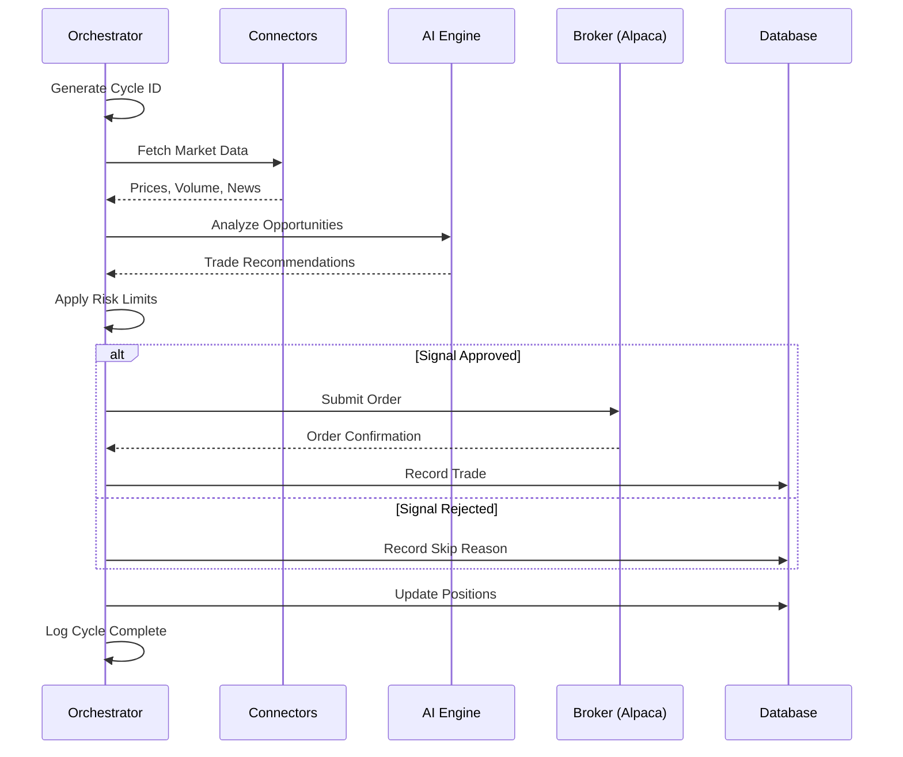

# Orchestrator & Agent Runtime

> **Canonical document for trading agent runtime behavior, cycle management, and safety mechanisms.**
>
> Start here: [INDEX.md](INDEX.md) | Related: [ARCHITECTURE.md](ARCHITECTURE.md) (system design), [AGENT_EXECUTION_GUIDE.md](AGENT_EXECUTION_GUIDE.md) (governance rules)

---

## Canonical References

| Topic | Go To |
|-------|-------|
| C4 architecture diagrams | [ARCHITECTURE.md](ARCHITECTURE.md) |
| AI agent governance rules | [AGENT_EXECUTION_GUIDE.md](AGENT_EXECUTION_GUIDE.md) |
| LLM providers & routing | [AI_MODELS_AND_PROVIDERS.md](AI_MODELS_AND_PROVIDERS.md) |
| External API connectors | [CONNECTORS_AND_INTEGRATIONS.md](CONNECTORS_AND_INTEGRATIONS.md) |
| P&L formulas & metrics | [FINANCIAL_METRICS.md](FINANCIAL_METRICS.md) |
| Logging & tracing | [OBSERVABILITY.md](OBSERVABILITY.md) |

---

## Table of Contents

1. [Overview](#1-overview)
2. [Orchestrator Cycle](#2-orchestrator-cycle)
3. [State Management](#3-state-management)
4. [Safety Mechanisms](#4-safety-mechanisms)
5. [Integration Points](#5-integration-points)
6. [Failure Handling](#6-failure-handling)
7. [Testing](#7-testing)
8. [Microservices Orchestrator (December 2025)](#8-microservices-orchestrator-december-2025)
9. [Current State (December 2025)](#9-current-state-december-2025)
10. [Enhancements Compared to Previous Version](#10-enhancements-compared-to-previous-version)
11. [Old vs New - Summary of Changes](#11-old-vs-new---summary-of-changes)

---

## 1. Overview

The trading orchestrator is the core runtime component that coordinates AI-powered market analysis and paper trade execution. It runs autonomously in the background, executing analysis cycles at configured intervals.

**Core location:** `server/autonomous/orchestrator.ts`

**Key responsibilities:**
- Schedule and execute analysis cycles
- Coordinate between market data, AI, and broker connectors
- Enforce risk limits and safety controls
- Maintain state and sync with database
- Emit structured logs for observability

---

## 2. Orchestrator Cycle

### 2.1 Cycle Flow Diagram



### 2.2 Cycle Steps

| Step | Description | Failure Behavior |
|------|-------------|------------------|
| 1. Initialize | Generate cycle ID, check kill switch | Abort if kill switch active |
| 2. Fetch Market Data | Get prices from connectors | Continue with partial data |
| 3. AI Analysis | Generate trade recommendations | Skip trades, log error |
| 4. Risk Check | Validate against limits | Reject if limits exceeded |
| 5. Execute Trade | Submit order to broker | Log rejection, continue |
| 6. Sync State | Update positions in DB | Log error, continue |
| 7. Complete | Log cycle metrics | Always completes |

### 2.3 Cycle Configuration

| Setting | Default | Description |
|---------|---------|-------------|
| Cycle Interval | 60 seconds | Time between analysis cycles |
| Analysis Timeout | 30 seconds | Max time for AI analysis |
| Order Timeout | 10 seconds | Max time for order submission |
| Max Retries | 3 | Retry count for transient failures |

---

## 3. State Management

### 3.1 In-Memory State

```typescript
interface OrchestratorState {
  isRunning: boolean;
  lastCycleTime: Date | null;
  currentCycleId: string | null;
  positionCount: number;
  dailyPnL: number;
  killSwitchActive: boolean;
  riskLimits: RiskLimits;
}
```

### 3.2 Database State

| Table | Purpose | Sync Frequency |
|-------|---------|----------------|
| `agent_status` | Runtime state | Every cycle |
| `positions` | Open positions | Every cycle |
| `trades` | Trade history | On execution |
| `ai_decisions` | AI recommendations | On generation |

### 3.3 Position Sync

Positions are synced from Alpaca on every cycle:

```typescript
async function syncPositions(): Promise<void> {
  const alpacaPositions = await alpacaConnector.getPositions();
  await db.upsertPositions(alpacaPositions.map(transformPosition));
  log.info("Orchestrator", `Synced ${alpacaPositions.length} positions`);
}
```

---

## 4. Safety Mechanisms

### 4.1 Kill Switch

Immediately halts all trading activity:

```typescript
// Activation
await setKillSwitch(true);

// Check before every trade
if (state.killSwitchActive) {
  log.warn("Orchestrator", "Kill switch active, skipping trade");
  return { skipped: true, reason: "kill_switch" };
}
```

**Trigger conditions:**
- Manual activation via API
- Daily loss limit exceeded
- Critical system error
- Account margin call (if implemented)

### 4.2 Risk Limits

| Limit | Description | Default |
|-------|-------------|---------|
| `maxPositionSizePercent` | Max % of portfolio per position | 10% |
| `maxTotalExposurePercent` | Max % of portfolio in positions | 50% |
| `maxPositionsCount` | Maximum open positions | 15 |
| `dailyLossLimitPercent` | Max daily loss before kill switch | 5% |

### 4.3 Risk Limit Enforcement

```typescript
function checkRiskLimits(order: Order, state: State): RiskCheckResult {
  // Check position count
  if (state.positionCount >= limits.maxPositionsCount) {
    return { allowed: false, reason: "max_positions_reached" };
  }

  // Check position size
  const positionValue = order.qty * order.price;
  const positionPercent = positionValue / state.portfolioValue;
  if (positionPercent > limits.maxPositionSizePercent / 100) {
    return { allowed: false, reason: "position_too_large" };
  }

  // Check total exposure
  const newExposure = state.totalExposure + positionValue;
  const exposurePercent = newExposure / state.portfolioValue;
  if (exposurePercent > limits.maxTotalExposurePercent / 100) {
    return { allowed: false, reason: "exposure_limit_exceeded" };
  }

  return { allowed: true };
}
```

### 4.4 Paper Trading Enforcement

The system is designed for paper trading only:

```typescript
const ALPACA_BASE_URL = "https://paper-api.alpaca.markets";
// Real trading URL is NOT used: https://api.alpaca.markets
```

**Never bypass this check** without explicit project configuration changes.

---

## 5. Integration Points

### 5.1 AI Engine

```typescript
// Request analysis
const decision = await aiEngine.analyze({
  symbol,
  marketData,
  newsHeadlines,
  technicalIndicators
});

// Validate response
if (!isValidDecision(decision)) {
  log.warn("Orchestrator", "Invalid AI decision", { decision });
  return null;
}
```

### 5.2 Connectors

```typescript
// Fetch market data (parallel)
const [stockPrices, cryptoPrices, news] = await Promise.all([
  finnhubConnector.getQuotes(stockSymbols),
  coingeckoConnector.getPrices(cryptoSymbols),
  newsConnector.getHeadlines(keywords)
]);
```

### 5.3 Broker

```typescript
// Submit order
const orderResult = await alpacaConnector.submitOrder({
  symbol: decision.symbol,
  qty: calculateQty(decision, state),
  side: decision.action,
  type: "market",
  time_in_force: "day"
});

// Record trade
await db.insertTrade({
  strategyId,
  symbol: decision.symbol,
  side: decision.action,
  quantity: orderResult.filled_qty,
  price: orderResult.filled_avg_price,
  executedAt: new Date(),
  notes: decision.reasoning
});
```

---

## 6. Failure Handling

### 6.1 Failure Matrix

| Component | Failure | Response |
|-----------|---------|----------|
| AI Engine | Timeout | Skip analysis, continue cycle |
| AI Engine | Invalid response | Use "hold", log warning |
| Connector | Rate limited | Back off, use cached data |
| Connector | Network error | Retry with backoff |
| Broker | Order rejected | Log rejection, record in DB |
| Broker | API down | Pause cycle, retry |
| Database | Connection error | Log critical, pause |

### 6.2 Retry Strategy

```typescript
const retryConfig = {
  maxRetries: 3,
  baseDelay: 1000,
  maxDelay: 30000,
  backoffMultiplier: 2
};

async function withRetry<T>(
  operation: () => Promise<T>,
  config = retryConfig
): Promise<T> {
  let lastError: Error;
  for (let attempt = 0; attempt < config.maxRetries; attempt++) {
    try {
      return await operation();
    } catch (error) {
      lastError = error;
      const delay = Math.min(
        config.baseDelay * Math.pow(config.backoffMultiplier, attempt),
        config.maxDelay
      );
      log.warn("Orchestrator", `Retry ${attempt + 1} after ${delay}ms`);
      await sleep(delay);
    }
  }
  throw lastError;
}
```

### 6.3 Logging Requirements

All failures must be logged with:
- Cycle ID for correlation
- Error type and message
- Contextual data (symbol, operation, state)
- Appropriate log level

```typescript
log.error("Orchestrator", `[${cycleId}] Order failed`, {
  symbol,
  side,
  qty,
  error: String(error),
  brokerMessage: error.response?.data?.message
});
```

---

## 7. Testing

### 7.1 Unit Tests

Test pure orchestration logic:

```typescript
describe("Risk Limit Checks", () => {
  it("should reject when max positions reached", () => {
    const state = { positionCount: 15 };
    const limits = { maxPositionsCount: 15 };
    const result = checkRiskLimits(order, state, limits);
    expect(result.allowed).toBe(false);
    expect(result.reason).toBe("max_positions_reached");
  });
});
```

### 7.2 Integration Tests

Test end-to-end with mocked services:

```typescript
describe("Orchestrator Cycle", () => {
  beforeEach(() => {
    mockAlpaca.getPositions.mockResolvedValue([]);
    mockAI.analyze.mockResolvedValue({ action: "hold" });
  });

  it("should complete cycle successfully", async () => {
    await orchestrator.runCycle();
    expect(mockAlpaca.getPositions).toHaveBeenCalled();
    expect(mockAI.analyze).toHaveBeenCalled();
  });
});
```

### 7.3 Kill Switch Tests

```typescript
describe("Kill Switch", () => {
  it("should prevent trades when active", async () => {
    await setKillSwitch(true);
    const result = await orchestrator.submitTrade(order);
    expect(result.skipped).toBe(true);
    expect(result.reason).toBe("kill_switch");
  });
});
```

---

## Related Documentation

| Document | Relevance |
|----------|-----------|
| `AGENT_EXECUTION_GUIDE.md` | Section 16: Trading Orchestrator & Agent Runtime Governance |
| `ARCHITECTURE.md` | Orchestrator in system architecture |
| `OBSERVABILITY.md` | Orchestrator logging integration |
| `FINANCIAL_METRICS.md` | P&L calculations updated by orchestrator |
| `TESTING.md` | Orchestrator test scenarios (Section 5) |

---

## 8. Microservices Orchestrator (December 2025)

The orchestrator has been extracted into a standalone microservice as part of the microservices migration. The new orchestrator service provides enhanced capabilities including saga-based transaction coordination, event-driven communication, and multiple operational modes.

**Core location:** `services/orchestrator/`

### 8.1 Orchestrator Service Architecture

```
services/orchestrator/
├── index.ts              # Express server, routes, event subscriptions
├── cycle-manager.ts      # Trading cycle lifecycle management
├── saga-coordinator.ts   # Distributed transaction coordination
└── types.ts              # Type definitions
```

### 8.2 Operational Modes

The microservice orchestrator supports three operational modes:

| Mode | Behavior | AI Decision Handling |
|------|----------|---------------------|
| **AUTONOMOUS** | Fully automated trading | Executes trades automatically if confidence >= threshold |
| **SEMI_AUTO** | Requires confirmation | Queues decisions for approval before execution |
| **MANUAL** | No automatic execution | Stores decisions for manual review |

```typescript
enum OrchestratorMode {
  AUTONOMOUS = 'autonomous',
  SEMI_AUTO = 'semi_auto',
  MANUAL = 'manual'
}

// Default: MANUAL mode with 0.7 confidence threshold
let orchestratorMode: OrchestratorMode = OrchestratorMode.MANUAL;
const confidenceThreshold = 0.7;
```

### 8.3 Cycle Manager

The CycleManager handles trading cycle lifecycle with event-driven coordination:

```typescript
interface TradingCycle {
  cycleId: string;
  status: 'running' | 'paused' | 'completed' | 'failed';
  startedAt: Date;
  completedAt?: Date;
  symbols: string[];
  decisionsCount: number;
  tradesCount: number;
  cycleType: 'analysis' | 'execution' | 'maintenance';
}

class CycleManager {
  // Start a new trading cycle
  async startCycle(symbols: string[], cycleType: CycleType): Promise<TradingCycle>;
  
  // Stop current cycle
  async stopCycle(): Promise<TradingCycle | null>;
  
  // Pause/resume cycle
  pauseCycle(): boolean;
  resumeCycle(): boolean;
  
  // Track metrics
  incrementDecisions(): void;
  incrementTrades(): void;
  
  // Query state
  getCurrentCycle(): TradingCycle | null;
  getCycleHistory(): TradingCycle[];
}
```

**Event Publishing:**
- `orchestrator.cycle.started` - Cycle begins
- `orchestrator.cycle.completed` - Cycle ends
- `orchestrator.cycle.paused` - Cycle paused
- `orchestrator.cycle.resumed` - Cycle resumed

### 8.4 Saga Coordinator

The SagaCoordinator manages distributed transactions for trade execution:

```typescript
interface SagaState {
  sagaId: string;
  type: string;
  currentStep: number;
  totalSteps: number;
  status: 'running' | 'completed' | 'compensating' | 'compensated' | 'failed';
  steps: SagaStep[];
  startedAt: Date;
  completedAt?: Date;
  correlationId: string;
  initialData: Record<string, unknown>;
  error?: string;
}

// Trade Execution Saga Steps
const tradeExecutionSaga = [
  'validate-risk',      // Check risk limits
  'submit-order',       // Submit to broker
  'confirm-fill',       // Wait for fill confirmation
  'update-position'     // Update position records
];
```

**Saga Lifecycle:**

```
┌─────────────────────────────────────────────────────────────────────┐
│                    TRADE EXECUTION SAGA                              │
│                                                                       │
│  ┌──────────────┐    ┌──────────────┐    ┌──────────────┐          │
│  │ validate-risk │───▶│ submit-order │───▶│ confirm-fill │          │
│  └──────────────┘    └──────────────┘    └──────┬───────┘          │
│         │                   │                    │                   │
│         │                   │                    ▼                   │
│         │                   │           ┌──────────────┐            │
│         │                   │           │update-position│            │
│         │                   │           └──────┬───────┘            │
│         │                   │                  │                     │
│         │ (failure)         │ (failure)        ▼                    │
│         │                   │           ┌──────────────┐            │
│         └───────────────────┴──────────▶│ COMPENSATION │            │
│                                         │ (rollback)   │            │
│                                         └──────────────┘            │
└─────────────────────────────────────────────────────────────────────┘
```

**Saga Features:**
- Automatic timeout handling (default: 5 minutes)
- Step-by-step compensation on failure
- Correlation ID propagation for tracing
- Event publishing for observability

### 8.5 Event Subscriptions

The orchestrator subscribes to events from other microservices:

| Event | Source | Handler |
|-------|--------|---------|
| `ai-decision.decision.generated` | AI Decision Service | `handleAIDecision()` |
| `trading-engine.order.filled` | Trading Engine | `handleOrderFilled()` |
| `trading-engine.order.failed` | Trading Engine | `handleOrderFailed()` |

### 8.6 API Endpoints

| Endpoint | Method | Description |
|----------|--------|-------------|
| `/health/live` | GET | Liveness probe |
| `/health/ready` | GET | Readiness probe |
| `/health/startup` | GET | Startup probe |
| `/cycles/current` | GET | Get current cycle |
| `/cycles/history` | GET | Get cycle history |
| `/cycles/start` | POST | Start new cycle |
| `/cycles/stop` | POST | Stop current cycle |
| `/sagas/active` | GET | List active sagas |
| `/sagas/:id` | GET | Get saga status |
| `/strategies` | GET | List active strategies |
| `/mode` | GET | Get orchestrator mode |
| `/mode` | PUT | Set orchestrator mode |

---

## 9. Current State (December 2025)

### 9.1 Dual Architecture

The orchestrator currently exists in two forms:

| Component | Location | Status |
|-----------|----------|--------|
| **Monolith Orchestrator** | `server/autonomous/orchestrator.ts` | Active (primary) |
| **Microservice Orchestrator** | `services/orchestrator/` | Ready (feature-flagged) |

Traffic routing between the two is controlled by feature flags using the strangler fig pattern.

### 9.2 Feature Comparison

| Feature | Monolith | Microservice |
|---------|----------|--------------|
| Timer-based cycles | Yes | Yes |
| Kill switch | Yes | Yes |
| Risk limits | Yes | Yes |
| Event-driven coordination | No | Yes (NATS) |
| Saga transactions | No | Yes |
| Multiple modes | No | Yes (3 modes) |
| Health probes | Basic | Comprehensive |
| Distributed tracing | Request ID | OpenTelemetry |

### 9.3 Self-Healing Orchestrator

The shared library includes a self-healing orchestrator for resilience:

**Location:** `services/shared/common/self-healing-orchestrator.ts`

Features:
- Exponential backoff with jitter
- Circuit breaker integration
- Automatic recovery attempts
- Health status monitoring

---

## 10. Enhancements Compared to Previous Version

| Aspect | Previous (Monolith) | Current (Microservice) |
|--------|---------------------|------------------------|
| **Architecture** | Single server process | Standalone microservice |
| **Communication** | Internal function calls | Event-driven (NATS) |
| **Transactions** | Direct DB writes | Saga-based distributed tx |
| **Modes** | Always autonomous | Manual, Semi-Auto, Autonomous |
| **Confidence Filter** | Hardcoded | Configurable threshold |
| **Cycle Types** | Single type | Analysis, Execution, Maintenance |
| **Failure Recovery** | Try-catch with retries | Saga compensation |
| **Observability** | Logs with cycle IDs | Events + OpenTelemetry traces |
| **Scaling** | Vertical only | Horizontal with state coordination |

---

## 11. Old vs New - Summary of Changes

| Category | Before | After |
|----------|--------|-------|
| **Entry Point** | `server/autonomous/orchestrator.ts` | `services/orchestrator/index.ts` |
| **State Storage** | In-memory + DB sync | Event-sourced + DB |
| **Trade Execution** | Direct broker calls | Saga workflow |
| **AI Integration** | Sync function calls | Async event subscription |
| **Cycle Management** | Timer intervals | CycleManager class |
| **Error Handling** | Error counter + restart | Saga compensation |
| **Configuration** | Environment variables | Shared config module |
| **Health Checks** | Single endpoint | Three-tier probes |
| **Logging** | Custom logger | Structured with context |

---

## When to Update This Document

Update this document when:
- Modifying the orchestrator cycle flow or timing
- Changing state management (in-memory, database, event-sourced)
- Updating safety mechanisms (kill switch, risk limits)
- Adding or modifying saga workflows
- Changing integration points with AI or broker services
- Updating failure handling or recovery strategies

---

## 12. Dynamic Universe Expansion (December 2025)

The orchestrator now supports dynamic symbol universe expansion, merging symbols from multiple sources with intelligent rotation and safety caps.

### 12.1 Universe Sources

| Source | Priority | Description |
|--------|----------|-------------|
| Watchlist | High | User-configured symbols from `universe_candidates` |
| Approved Candidates | High | Symbols with status='approved' in `universe_candidates` |
| Recent AI Decisions | Medium | High-confidence (>0.7) decisions from last 24h |
| Executed Trades | Boosted | Symbols with recent fills (priority boost) |

### 12.2 Safety Caps

| Asset Class | Max Per Cycle | Rationale |
|-------------|---------------|-----------|
| Stocks | 120 | Alpaca snapshot limit |
| Crypto | 20 | Lower liquidity, higher volatility |

### 12.3 Rotation Mechanism

When the universe pool exceeds safety caps:
- Symbols are sorted by priority score
- Executed trade symbols receive +10 priority boost
- High-confidence decisions receive +5 boost
- Symbol rotation shuffles remaining candidates each cycle

### 12.4 Batch Market Data Fetching

The orchestrator now uses Alpaca batch snapshots for improved performance:

```typescript
// Old: Sequential Finnhub calls (1 request per symbol)
for (const symbol of symbols) {
  const quote = await finnhub.getQuote(symbol);
}

// New: Alpaca batch snapshots (50 symbols per request)
const chunks = chunkArray(symbols, 50);
for (const chunk of chunks) {
  const snapshots = await alpaca.getSnapshots(chunk);
}
```

**Fallback Chain:**
1. Alpaca batch snapshots (primary)
2. Finnhub quotes (for missing symbols, limited to 30)
3. CoinGecko (for crypto symbols)

---

## 13. AI Decision Enrichment & Timeline (December 2025)

### 13.1 Enriched Decision Endpoint

`GET /api/ai-decisions/enriched` returns decisions with linked execution data:

```typescript
interface EnrichedDecision {
  decision: AiDecision;
  linkedOrder: Order | null;
  linkedTrade: Trade | null;
  linkedPosition: Position | null;
  timeline: TimelineItem[];
}

interface TimelineItem {
  stage: "decision" | "risk_gate" | "order" | "fill" | "position" | "exit";
  status: "completed" | "pending" | "skipped" | "failed";
  timestamp: Date | null;
  details?: string;
}
```

### 13.2 Timeline Stages

| Stage | Trigger | Completes When |
|-------|---------|----------------|
| Decision | AI generates recommendation | Decision saved to DB |
| Risk Gate | Order execution flow | Risk check passes/fails |
| Order | Broker submission | Order acknowledged by broker |
| Fill | Trade execution | Order fully/partially filled |
| Position | Position tracking | Position recorded in portfolio |
| Exit | Position closed | Exit trade executed |

### 13.3 Timeline Status Colors (UI)

| Status | Color | Meaning |
|--------|-------|---------|
| Completed | Green | Stage finished successfully |
| Pending | Yellow | Stage in progress |
| Skipped | Gray | Stage not applicable |
| Failed | Red | Stage encountered error |

---

*Last Updated: December 2025*  
*Version: 2.1.0 (Universe Expansion & Decision Enrichment)*
