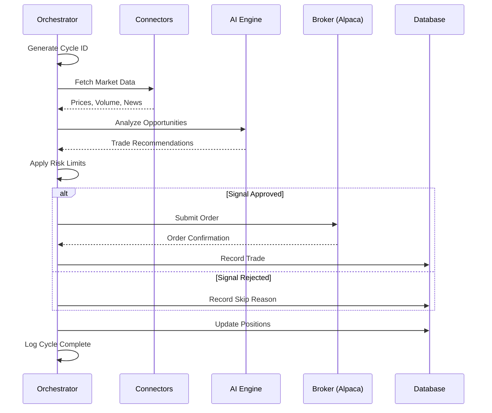

# Orchestrator & Agent Runtime

> **Purpose**  
> Deep-dive documentation on the trading orchestrator, agent runtime behavior, cycle management, and safety mechanisms.

---

## Table of Contents

1. [Overview](#1-overview)
2. [Orchestrator Cycle](#2-orchestrator-cycle)
3. [State Management](#3-state-management)
4. [Safety Mechanisms](#4-safety-mechanisms)
5. [Integration Points](#5-integration-points)
6. [Failure Handling](#6-failure-handling)
7. [Testing](#7-testing)

---

## 1. Overview

The trading orchestrator is the core runtime component that coordinates AI-powered market analysis and paper trade execution. It runs autonomously in the background, executing analysis cycles at configured intervals.

**Core location:** `server/autonomous/orchestrator.ts`

**Key responsibilities:**
- Schedule and execute analysis cycles
- Coordinate between market data, AI, and broker connectors
- Enforce risk limits and safety controls
- Maintain state and sync with database
- Emit structured logs for observability

---

## 2. Orchestrator Cycle

### 2.1 Cycle Flow Diagram



### 2.2 Cycle Steps

| Step | Description | Failure Behavior |
|------|-------------|------------------|
| 1. Initialize | Generate cycle ID, check kill switch | Abort if kill switch active |
| 2. Fetch Market Data | Get prices from connectors | Continue with partial data |
| 3. AI Analysis | Generate trade recommendations | Skip trades, log error |
| 4. Risk Check | Validate against limits | Reject if limits exceeded |
| 5. Execute Trade | Submit order to broker | Log rejection, continue |
| 6. Sync State | Update positions in DB | Log error, continue |
| 7. Complete | Log cycle metrics | Always completes |

### 2.3 Cycle Configuration

| Setting | Default | Description |
|---------|---------|-------------|
| Cycle Interval | 60 seconds | Time between analysis cycles |
| Analysis Timeout | 30 seconds | Max time for AI analysis |
| Order Timeout | 10 seconds | Max time for order submission |
| Max Retries | 3 | Retry count for transient failures |

---

## 3. State Management

### 3.1 In-Memory State

```typescript
interface OrchestratorState {
  isRunning: boolean;
  lastCycleTime: Date | null;
  currentCycleId: string | null;
  positionCount: number;
  dailyPnL: number;
  killSwitchActive: boolean;
  riskLimits: RiskLimits;
}
```

### 3.2 Database State

| Table | Purpose | Sync Frequency |
|-------|---------|----------------|
| `agent_status` | Runtime state | Every cycle |
| `positions` | Open positions | Every cycle |
| `trades` | Trade history | On execution |
| `ai_decisions` | AI recommendations | On generation |

### 3.3 Position Sync

Positions are synced from Alpaca on every cycle:

```typescript
async function syncPositions(): Promise<void> {
  const alpacaPositions = await alpacaConnector.getPositions();
  await db.upsertPositions(alpacaPositions.map(transformPosition));
  log.info("Orchestrator", `Synced ${alpacaPositions.length} positions`);
}
```

---

## 4. Safety Mechanisms

### 4.1 Kill Switch

Immediately halts all trading activity:

```typescript
// Activation
await setKillSwitch(true);

// Check before every trade
if (state.killSwitchActive) {
  log.warn("Orchestrator", "Kill switch active, skipping trade");
  return { skipped: true, reason: "kill_switch" };
}
```

**Trigger conditions:**
- Manual activation via API
- Daily loss limit exceeded
- Critical system error
- Account margin call (if implemented)

### 4.2 Risk Limits

| Limit | Description | Default |
|-------|-------------|---------|
| `maxPositionSizePercent` | Max % of portfolio per position | 10% |
| `maxTotalExposurePercent` | Max % of portfolio in positions | 50% |
| `maxPositionsCount` | Maximum open positions | 15 |
| `dailyLossLimitPercent` | Max daily loss before kill switch | 5% |

### 4.3 Risk Limit Enforcement

```typescript
function checkRiskLimits(order: Order, state: State): RiskCheckResult {
  // Check position count
  if (state.positionCount >= limits.maxPositionsCount) {
    return { allowed: false, reason: "max_positions_reached" };
  }

  // Check position size
  const positionValue = order.qty * order.price;
  const positionPercent = positionValue / state.portfolioValue;
  if (positionPercent > limits.maxPositionSizePercent / 100) {
    return { allowed: false, reason: "position_too_large" };
  }

  // Check total exposure
  const newExposure = state.totalExposure + positionValue;
  const exposurePercent = newExposure / state.portfolioValue;
  if (exposurePercent > limits.maxTotalExposurePercent / 100) {
    return { allowed: false, reason: "exposure_limit_exceeded" };
  }

  return { allowed: true };
}
```

### 4.4 Paper Trading Enforcement

The system is designed for paper trading only:

```typescript
const ALPACA_BASE_URL = "https://paper-api.alpaca.markets";
// Real trading URL is NOT used: https://api.alpaca.markets
```

**Never bypass this check** without explicit project configuration changes.

---

## 5. Integration Points

### 5.1 AI Engine

```typescript
// Request analysis
const decision = await aiEngine.analyze({
  symbol,
  marketData,
  newsHeadlines,
  technicalIndicators
});

// Validate response
if (!isValidDecision(decision)) {
  log.warn("Orchestrator", "Invalid AI decision", { decision });
  return null;
}
```

### 5.2 Connectors

```typescript
// Fetch market data (parallel)
const [stockPrices, cryptoPrices, news] = await Promise.all([
  finnhubConnector.getQuotes(stockSymbols),
  coingeckoConnector.getPrices(cryptoSymbols),
  newsConnector.getHeadlines(keywords)
]);
```

### 5.3 Broker

```typescript
// Submit order
const orderResult = await alpacaConnector.submitOrder({
  symbol: decision.symbol,
  qty: calculateQty(decision, state),
  side: decision.action,
  type: "market",
  time_in_force: "day"
});

// Record trade
await db.insertTrade({
  strategyId,
  symbol: decision.symbol,
  side: decision.action,
  quantity: orderResult.filled_qty,
  price: orderResult.filled_avg_price,
  executedAt: new Date(),
  notes: decision.reasoning
});
```

---

## 6. Failure Handling

### 6.1 Failure Matrix

| Component | Failure | Response |
|-----------|---------|----------|
| AI Engine | Timeout | Skip analysis, continue cycle |
| AI Engine | Invalid response | Use "hold", log warning |
| Connector | Rate limited | Back off, use cached data |
| Connector | Network error | Retry with backoff |
| Broker | Order rejected | Log rejection, record in DB |
| Broker | API down | Pause cycle, retry |
| Database | Connection error | Log critical, pause |

### 6.2 Retry Strategy

```typescript
const retryConfig = {
  maxRetries: 3,
  baseDelay: 1000,
  maxDelay: 30000,
  backoffMultiplier: 2
};

async function withRetry<T>(
  operation: () => Promise<T>,
  config = retryConfig
): Promise<T> {
  let lastError: Error;
  for (let attempt = 0; attempt < config.maxRetries; attempt++) {
    try {
      return await operation();
    } catch (error) {
      lastError = error;
      const delay = Math.min(
        config.baseDelay * Math.pow(config.backoffMultiplier, attempt),
        config.maxDelay
      );
      log.warn("Orchestrator", `Retry ${attempt + 1} after ${delay}ms`);
      await sleep(delay);
    }
  }
  throw lastError;
}
```

### 6.3 Logging Requirements

All failures must be logged with:
- Cycle ID for correlation
- Error type and message
- Contextual data (symbol, operation, state)
- Appropriate log level

```typescript
log.error("Orchestrator", `[${cycleId}] Order failed`, {
  symbol,
  side,
  qty,
  error: String(error),
  brokerMessage: error.response?.data?.message
});
```

---

## 7. Testing

### 7.1 Unit Tests

Test pure orchestration logic:

```typescript
describe("Risk Limit Checks", () => {
  it("should reject when max positions reached", () => {
    const state = { positionCount: 15 };
    const limits = { maxPositionsCount: 15 };
    const result = checkRiskLimits(order, state, limits);
    expect(result.allowed).toBe(false);
    expect(result.reason).toBe("max_positions_reached");
  });
});
```

### 7.2 Integration Tests

Test end-to-end with mocked services:

```typescript
describe("Orchestrator Cycle", () => {
  beforeEach(() => {
    mockAlpaca.getPositions.mockResolvedValue([]);
    mockAI.analyze.mockResolvedValue({ action: "hold" });
  });

  it("should complete cycle successfully", async () => {
    await orchestrator.runCycle();
    expect(mockAlpaca.getPositions).toHaveBeenCalled();
    expect(mockAI.analyze).toHaveBeenCalled();
  });
});
```

### 7.3 Kill Switch Tests

```typescript
describe("Kill Switch", () => {
  it("should prevent trades when active", async () => {
    await setKillSwitch(true);
    const result = await orchestrator.submitTrade(order);
    expect(result.skipped).toBe(true);
    expect(result.reason).toBe("kill_switch");
  });
});
```

---

## Related Documentation

| Document | Relevance |
|----------|-----------|
| `AGENT_EXECUTION_GUIDE.md` | Section 16: Trading Orchestrator & Agent Runtime Governance |
| `ARCHITECTURE.md` | Orchestrator in system architecture |
| `OBSERVABILITY.md` | Orchestrator logging integration |
| `FINANCIAL_METRICS.md` | P&L calculations updated by orchestrator |
| `TESTING.md` | Orchestrator test scenarios (Section 5) |

---

*Last Updated: December 2024*
